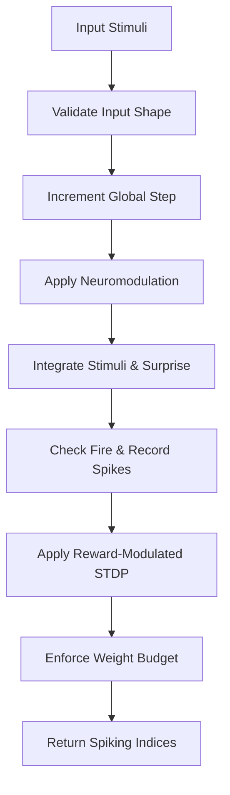
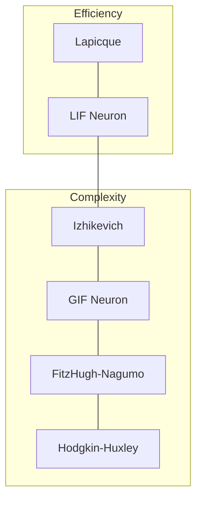
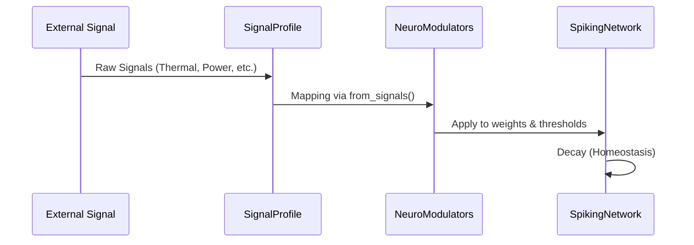

Relevant source files

The following files were used as context for generating this wiki page:

- [README.md](README.md)
- [AGENTS.md](AGENTS.md)
- [src/lib.rs](src/lib.rs)
- [src/engine.rs](src/engine.rs)
- [src/modulators.rs](src/modulators.rs)
- [src/izhikevich.rs](src/izhikevich.rs)
- [src/lif.rs](src/lif.rs)

# Welcome to Neuromod

Neuromod is a high-performance Rust library for Spiking Neural Networks (SNNs), specializing in biologically grounded neuron models, neuromodulation, and foundational plasticity primitives. As a core component of the Limen-Neural ecosystem, it provides a topology-neutral framework that is dynamically sizable at runtime and strict regarding input validation.
Sources: [README.md:1-10](README.md#L1-L10), [AGENTS.md:10-15](AGENTS.md#L10-L15), [Cargo.toml:7-10](Cargo.toml#L7-L10)

The library serves as a foundational layer for neuroscience research and neuromorphic computing, offering a suite of canonical neuron models ranging from simple integrate-and-fire dynamics to complex biophysical simulations. It integrates a sophisticated neuromodulator system—including dopamine, serotonin, acetylcholine, and norepinephrine—to gate learning and adapt network sensitivity dynamically.
Sources: [README.md:13-25](README.md#L13-L25), [src/lib.rs:1-15](src/lib.rs#L1-L15)

## Core Architecture and Engine

The `SpikingNetwork` struct acts as the central execution engine. It manages two primary banks of neurons: Leaky Integrate-and-Fire (LIF) neurons and Izhikevich neurons. The engine is responsible for the synchronous update of neuron states, input spike generation based on stimuli, and the application of Spike-Timing-Dependent Plasticity (STDP).
Sources: [src/engine.rs:17-30](src/engine.rs#L17-L30), [src/lib.rs:37-40](src/lib.rs#L37-L40)

### Network Data Flow
The following diagram illustrates the data flow within a single execution step of the `SpikingNetwork`.

The execution loop ensures that input stimuli are validated against the network's defined `num_channels` before processing. It calculates "surprise" using predictive state tracking and applies neuromodulator effects to firing thresholds and decay rates.
Sources: [src/engine.rs:56-120](src/engine.rs#L56-L120), [README.md:46-52](README.md#L46-L52)

### Components and Data Structures

| Component | Description | File |
|-----------|-------------|------|
| `SpikingNetwork` | Main container for neurons, modulators, and global state. | `src/engine.rs` |
| `StepError` | Enum for handling input shape mismatches. | `src/engine.rs` |
| `LifNeuron` | Fast, reactive leaky integrate-and-fire model. | `src/lif.rs` |
| `IzhikevichNeuron` | Biologically plausible model for complex firing patterns. | `src/izhikevich.rs` |
| `NeuroModulators` | Struct tracking dopamine, serotonin, acetylcholine, and norepinephrine. | `src/modulators.rs` |

Sources: [src/lib.rs:37-55](src/lib.rs#L37-L55), [src/engine.rs:10-15](src/engine.rs#L10-L15)

## Biological Neuron Models

Neuromod implements a diverse range of neuron models to support different levels of computational complexity and biological realism.
Sources: [README.md:19-25](README.md#L19-L25), [src/lib.rs:37-50](src/lib.rs#L37-L50)

### Neuron Model Comparison

Sources: [src/lapicque.rs](src/lapicque.rs), [src/izhikevich.rs](src/izhikevich.rs), [src/gif.rs](src/gif.rs), [src/hodgkin_huxley.rs](src/hodgkin_huxley.rs)

*  **LIF & Lapicque**: Focused on speed and basic integration. Lapicque is the simplest form, while LIF adds a leaky decay rate. Sources: [src/lapicque.rs:7-15](src/lapicque.rs#L7-L15), [src/lif.rs:1-5](src/lif.rs#L1-L5)
*  **Izhikevich**: Capable of reproducing cortical firing patterns like regular spiking, bursting, and chattering using two differential equations. Sources: [src/izhikevich.rs:1-15](src/izhikevich.rs#L1-L15)
*  **Generalized Integrate-and-Fire (GIF)**: Extends LIF with spike-driven adaptation and a soft reset mechanism. Sources: [src/gif.rs:1-10](src/gif.rs#L1-L10)
*  **Hodgkin-Huxley**: The biophysical "gold standard," explicitly modeling sodium, potassium, and leak ion channels. Sources: [src/hodgkin_huxley.rs:1-15](src/hodgkin_huxley.rs#L1-L15)

## Neuromodulation System

The neuromodulation system gates learning and adjusts network dynamics based on external signals. It maps environmental or hardware data into specific modulator levels using a `SignalProfile`.
Sources: [src/modulators.rs:9-25](src/modulators.rs#L9-L25), [CHANGELOG.md:20-25](CHANGELOG.md#L20-L25)

### Modulator Functions
The system tracks four primary modulators, each affecting the network differently:

| Modulator | Effect | CI/API Reference |
|-----------|--------|------------------|
| **Dopamine** | Gates STDP learning and shifts firing thresholds lower. | `add_reward`, `is_rewarded` |
| **Norepinephrine** | Multiplier for stress/arousal; reduces sensitivity and raises thresholds. | `add_norepinephrine`, `is_aroused` |
| **Acetylcholine** | Enhances focus by adjusting the passive decay rate of neurons. | `boost_focus`, `is_focused` |
| **Serotonin** | Provides stability and mood regulation; stabilizes thresholds. | `add_serotonin`, `is_calm` |

Sources: [src/modulators.rs:135-175](src/modulators.rs#L135-L175), [src/engine.rs:77-85](src/engine.rs#L77-L85), [examples/rstdp_demo.rs:120-140](examples/rstdp_demo.rs#L120-L140)

### Interaction Logic

Sources: [src/modulators.rs:100-130](src/modulators.rs#L100-L130), [src/engine.rs:75-80](src/engine.rs#L75-L80)

## Plasticity and Learning

Neuromod provides foundational building blocks for synaptic plasticity, primarily through Spike-Timing-Dependent Plasticity (STDP) and reward-modulated variants (R-STDP).
Sources: [README.md:26-30](README.md#L26-L30), [src/hebbian/classical.rs:1-10](src/hebbian/classical.rs#L1-L10)

*  **Classical STDP**: Implements the Hebbian rule where pre-before-post timing leads to Long-Term Potentiation (LTP) and post-before-pre leads to Long-Term Depression (LTD). Sources: [src/hebbian/classical.rs:44-55](src/hebbian/classical.rs#L44-L55)
*  **Reward-Modulated STDP**: Integrates dopamine as a gating signal. The `SpikingNetwork` uses a `learning_rate` derived from current dopamine levels (0.5 * dopamine) to scale weight updates. Sources: [src/engine.rs:155-180](src/engine.rs#L155-L180), [examples/rstdp_demo.rs:60-75](examples/rstdp_demo.rs#L60-L75)
*  **Weight Budgeting**: The engine enforces an L1 synaptic weight budget (default `WEIGHT_BUDGET = 2.0`) per neuron to maintain stability during learning. Sources: [src/engine.rs:10](src/engine.rs#L10), [src/engine.rs:190-200](src/engine.rs#L190-L200)

## Conclusion
Neuromod provides the essential primitives for building complex spiking neural systems. By decoupling neuron dynamics from specific network topologies and integrating a robust neuromodulation layer, it allows for high-performance neuroscience simulations and adaptive AI development within the Limen-Neural framework.
Sources: [AGENTS.md:10-15](AGENTS.md#L10-L15), [README.md:120-125](README.md#L120-L125)
