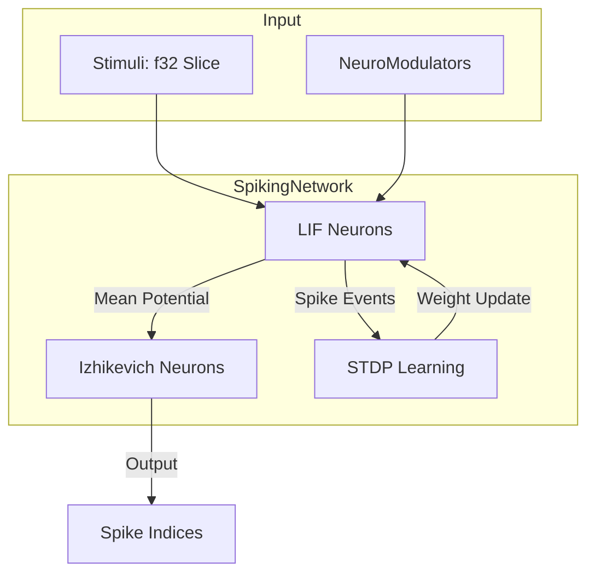
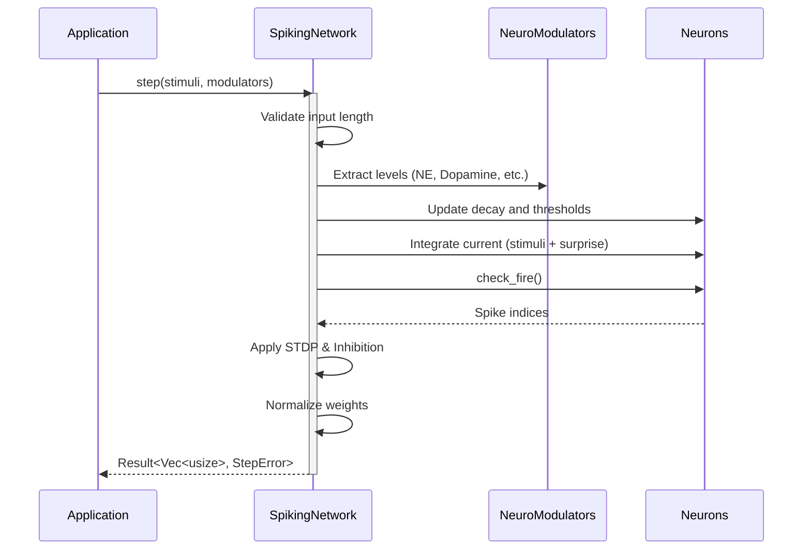

<details>
<summary>Relevant source files</summary>

The following files were used as context for generating this wiki page:

- [README.md](README.md)
- [Cargo.toml](Cargo.toml)
- [src/lib.rs](src/lib.rs)
- [AGENTS.md](AGENTS.md)
- [REVIEW.md](REVIEW.md)
- [examples/basic.rs](examples/basic.rs)
- [src/engine.rs](src/engine.rs)
</details>

# Getting Started

The `neuromod` library is a foundational Rust crate in the Limen-Neural ecosystem designed for Spiking Neural Network (SNN) neuron-dynamics. It provides biologically grounded primitives, including various neuron models, a topology-neutral `SpikingNetwork`, generic neuromodulators, and plasticity building blocks.

Sources: [AGENTS.md:12-16](AGENTS.md#L12-L16), [README.md:1-5](README.md#L1-L5)

## Installation and Setup

To use `neuromod` in your Rust project, add it to your `Cargo.toml` dependencies. The library uses the Rust 2024 edition and requires a specific pinned toolchain for development.

```toml
[dependencies]
neuromod = "0.5.0"
```

### Toolchain Requirements
*  **Rust Edition:** 2024
*  **Pinned Toolchain:** `1.97.1`
*  **Optional Feature Dependencies:** `pkg-config` and `libssl-dev` (required only for the `sentry` feature).

Sources: [Cargo.toml:1-4](Cargo.toml#L1-L4), [AGENTS.md:36-39](AGENTS.md#L36-L39), [README.md:21-23](README.md#L21-L23)

## Core Architecture

The architecture is centered around the `SpikingNetwork` and its interaction with `NeuroModulators`. The network is topology-neutral at initialization and can be dynamically sized.



The diagram shows the data flow during a network step, where stimuli and modulators influence neuron states and plasticity.
Sources: [src/engine.rs:49-145](src/engine.rs#L49-L145), [README.md:7-13](README.md#L7-L13)

### Key Components

| Component | Description | Reference File |
| :--- | :--- | :--- |
| `SpikingNetwork` | The central engine managing neuron banks and global state. | `src/engine.rs` |
| `NeuroModulators` | Handles levels of dopamine, serotonin, acetylcholine, and norepinephrine. | `src/modulators.rs` |
| `LifNeuron` | Fast, reactive leaky integrate-and-fire neuron model. | `src/lif.rs` |
| `IzhikevichNeuron` | Complex, adaptive neuron model for various firing patterns. | `src/izhikevich.rs` |
| `StepError` | Error type for input validation (e.g., length mismatches). | `src/engine.rs` |

Sources: [src/lib.rs:36-49](src/lib.rs#L36-L49), [README.md:95-110](README.md#L95-L110)

## Basic Usage

Implementing a basic spiking network involves initializing the `SpikingNetwork` and providing stimuli along with a `NeuroModulators` state.

```rust
use neuromod::{NeuroModulators, SpikingNetwork};

fn main() {
    // Default: 16 LIF neurons, 5 Izhikevich neurons, 16 channels
    let mut network = SpikingNetwork::new(); 
    let stimuli = [0.5_f32; 16];
    let modulators = NeuroModulators::default();

    // Execute one simulation step
    let spikes = network.step(&stimuli, &modulators).unwrap();
    println!("Spiking neuron indices: {spikes:?}");
}
```

Sources: [examples/basic.rs:4-29](examples/basic.rs#L4-L29), [README.md:27-36](README.md#L27-L36)

### Dynamic Sizing
For custom architectures, use `SpikingNetwork::with_dimensions(num_lif, num_izh, num_channels)`.

```rust
let mut network = SpikingNetwork::with_dimensions(518, 5, 518);
```

Sources: [src/engine.rs:41-58](src/engine.rs#L41-L58), [README.md:43-52](README.md#L43-L52)

## Simulation Lifecycle

The `step` function follows a strict contract and performs several internal operations to simulate biological dynamics.



This sequence illustrates the high-level logic within the `step` method of the engine.
Sources: [src/engine.rs:61-145](src/engine.rs#L61-L145), [README.md:57-69](README.md#L57-L69)

## Development and Verification

Developers should use the following commands to maintain code quality and verify functionality.

*  **Build:** `cargo build --all-features`
*  **Test:** `cargo test --all-features`
*  **Lint:** `cargo clippy --all-targets --all-features -- -D warnings`
*  **Format:** `cargo fmt --check`
*  **Examples:** `cargo run --example basic`

Sources: [AGENTS.md:44-55](AGENTS.md#L44-L55), [REVIEW.md:12-25](REVIEW.md#L12-L25)

## Conclusion

`neuromod` provides a robust framework for SNN research, offering a balance between computational efficiency (LIF) and biological realism (Hodgkin-Huxley, Izhikevich). By leveraging the `SpikingNetwork` engine and `NeuroModulators` API, developers can build complex, adaptive neural systems with built-in support for reward-modulated plasticity.

Sources: [README.md:112-120](README.md#L112-L120), [src/lib.rs:1-13](src/lib.rs#L1-L13)
