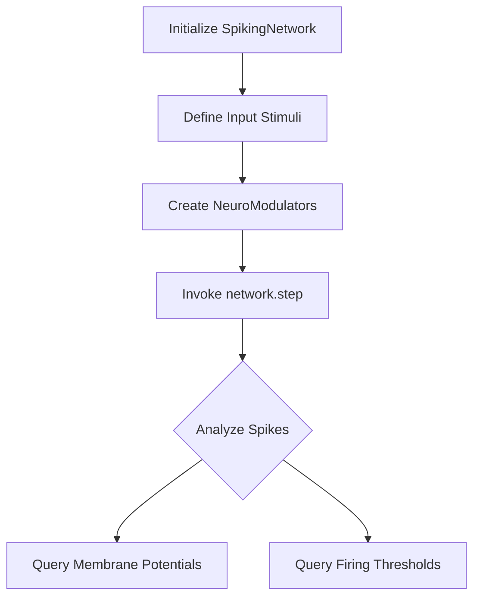
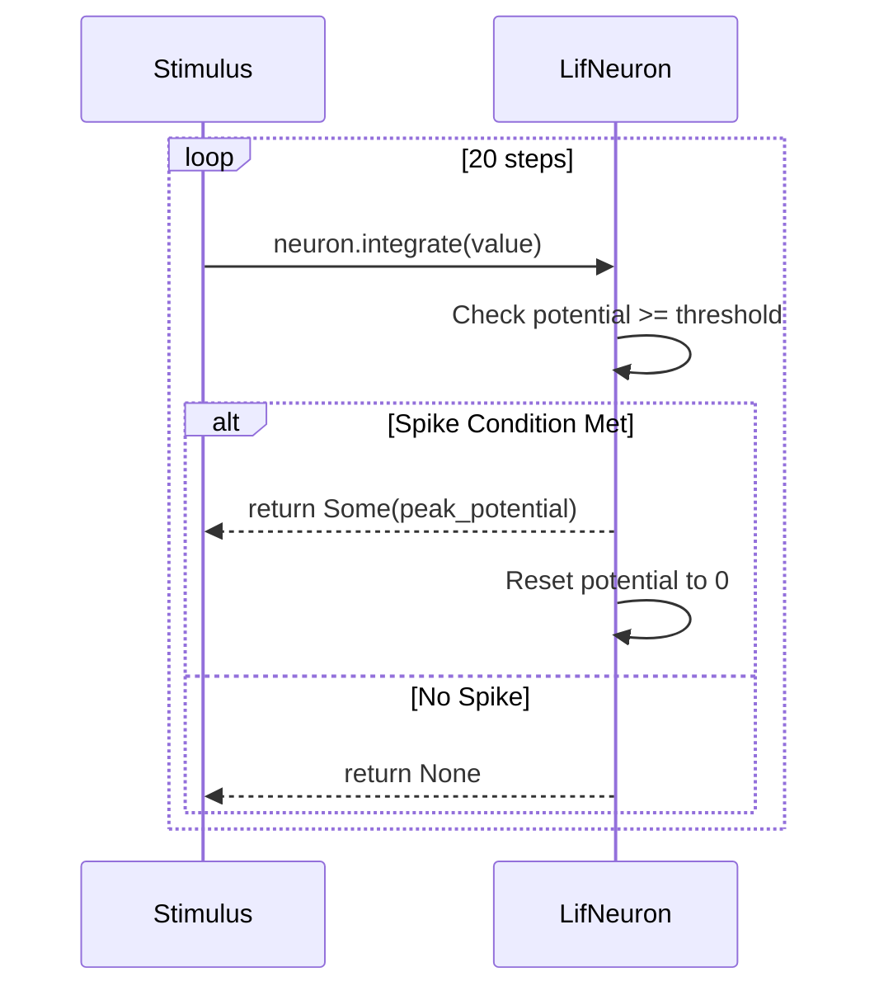
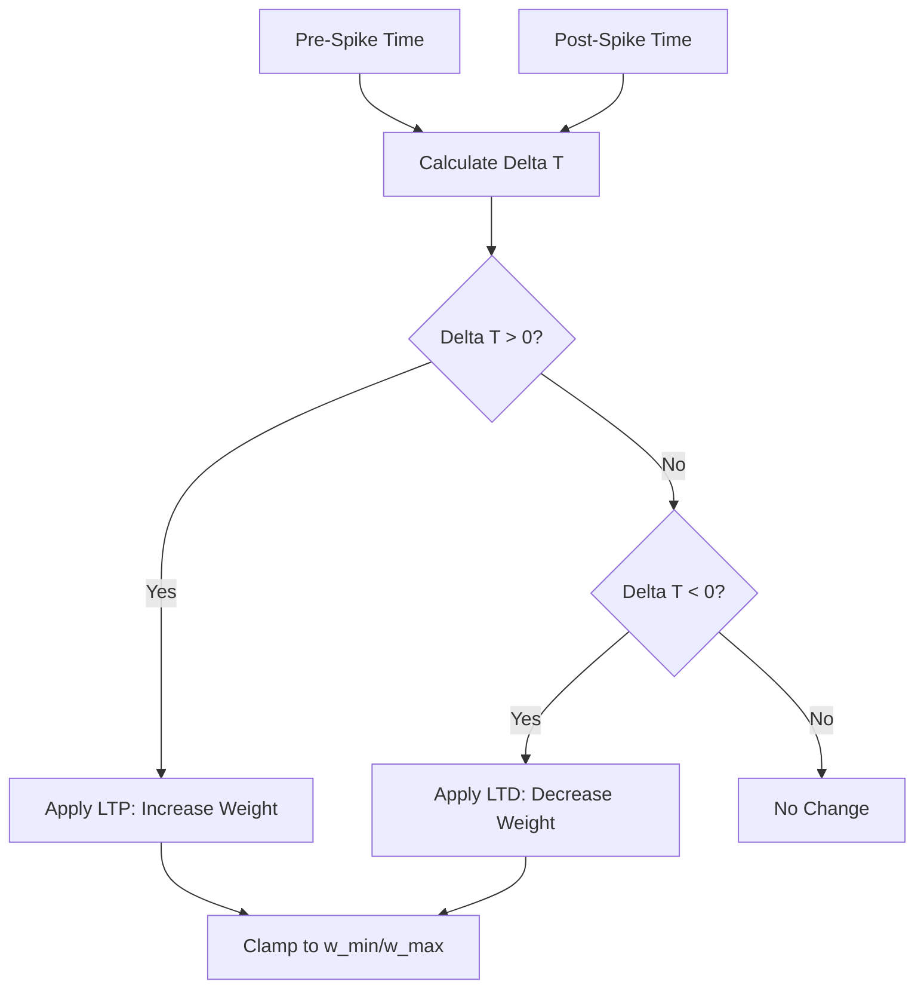

<details>
<summary>Relevant source files</summary>

The following files were used as context for generating this wiki page:

- [examples/basic.rs](examples/basic.rs)
- [examples/basic_lif.rs](examples/basic_lif.rs)
- [examples/hebbian_learning.rs](examples/hebbian_learning.rs)
- [examples/rstdp_demo.rs](examples/rstdp_demo.rs)
- [src/engine.rs](src/engine.rs)
- [src/modulators.rs](src/modulators.rs)
- [src/hebbian/classical.rs](src/hebbian/classical.rs)
</details>

# Examples & Demos

The `neuromod` crate provides a variety of runnable examples designed to demonstrate the core functionality of biologically grounded spiking neural networks (SNNs). These examples range from single-neuron simulations to complex, reward-modulated multi-neuron networks. They serve as a primary resource for developers to understand neuron dynamics, neuromodulation, and plasticity mechanisms such as Spike-Timing-Dependent Plasticity (STDP).

These demos showcase the use of key structures like `SpikingNetwork` and `NeuroModulators`, as well as specific neuron models like Leaky Integrate-and-Fire (LIF) and Lapicque neurons. Each example is designed to be executed via standard Cargo commands (e.g., `cargo run --example basic_lif`).
Sources: [AGENTS.md:37-43](AGENTS.md#L37-L43), [README.md:144-147](README.md#L144-L147)

## Basic Network Integration

The basic examples demonstrate how to initialize and step the core `SpikingNetwork`. By default, the network is initialized with 16 LIF neurons and 5 Izhikevich neurons, accepting 16 input channels.

### SpikingNetwork Flow
The following diagram illustrates the standard data flow in a network step as shown in the basic demos:



The demo uses `network.step(&stimuli, &modulators)` to process a slice of floating-point inputs, returning the indices of neurons that fired during that timestep.
Sources: [examples/basic.rs:4-29](examples/basic.rs#L4-L29), [src/engine.rs:40-42](src/engine.rs#L40-L42)

### Key Components Summary
| Component | Implementation | Description |
|-----------|----------------|-------------|
| `SpikingNetwork` | `SpikingNetwork::new()` | Default constructor with 16 LIF/5 Izh neurons. |
| `NeuroModulators` | `NeuroModulators::default()` | Standard modulator levels (all 0.0 initially). |
| `Input Stimuli` | `[f32; 16]` | Normalized floating point inputs (0.0 to 1.0). |

Sources: [examples/basic.rs:7-18](examples/basic.rs#L7-L18), [src/engine.rs:40-42](src/engine.rs#L40-L42)

## Neuron Dynamics (LIF & Lapicque)

Lower-level examples demonstrate individual neuron models. The `basic_lif` example showcases a single `LifNeuron` integrating input pulses over discrete time steps.

### LIF Simulation Logic
1.  **Integration**: The neuron potential increases based on input stimulus.
2.  **Passive Leak**: The potential decays over time when stimulus is absent.
3.  **Spike/Reset**: If the potential exceeds a threshold, the neuron fires and resets its potential to zero.



Sources: [examples/basic_lif.rs:17-48](examples/basic_lif.rs#L17-L48), [src/lapicque.rs:56-66](src/lapicque.rs#L56-L66)

## Reward-Modulated Plasticity (R-STDP)

The `rstdp_demo` illustrates how `NeuroModulators` (Dopamine, Norepinephrine, Acetylcholine, and Serotonin) influence network behavior and learning rates.

### Modulator Effects
As demonstrated in the demo, different modulator states significantly alter network performance:
*  **Dopamine**: Enables STDP learning. High dopamine results in weight potentiation during correlated spikes.
*  **Norepinephrine**: Represents stress/arousal. It reduces network sensitivity using a stress multiplier `(1.0 - norepinephrine)`.
*  **Acetylcholine**: Modulates focus and memory by adjusting the neuron's decay rate.

```rust
// Scenario 2: Reward State (High Dopamine)
modulators = NeuroModulators {
    dopamine: 0.9,
    norepinephrine: 0.1,
    acetylcholine: 0.7,
    ..Default::default()
};
let spikes = network.step(&stimuli, &modulators).expect("Success");
```

Sources: [examples/rstdp_demo.rs:46-77](examples/rstdp_demo.rs#L46-L77), [src/engine.rs:88-95](src/engine.rs#L88-L95)

### Modulator Signal Mapping
The demos also utilize the `SignalProfile` and `Observation` API to derive modulator levels from external environment signals:
Sources: [src/modulators.rs:114-142](src/modulators.rs#L114-L142), [examples/rstdp_demo.rs:125-131](examples/rstdp_demo.rs#L125-L131)

## Hebbian Learning and Classical STDP

The `hebbian_learning` example focuses on the "neurons that fire together, wire together" principle using `LapicqueNeuron` and `apply_classical_stdp`.

### STDP Update Rule
Synaptic weight change is calculated based on the timing difference ($\Delta t$) between the pre-synaptic spike time and the post-synaptic spike time:
*  **LTP (Long-Term Potentiation)**: Pre-neuron fires before Post-neuron ($\Delta t > 0$).
*  **LTD (Long-Term Depression)**: Post-neuron fires before Pre-neuron ($\Delta t < 0$).



Sources: [src/hebbian/classical.rs:50-62](src/hebbian/classical.rs#L50-L62), [examples/hebbian_learning.rs:67-93](examples/hebbian_learning.rs#L67-L93)

## Summary of Demonstration Scenarios
| Example | Primary Focus | Key Logic |
|---------|---------------|-----------|
| `basic.rs` | Network API | `SpikingNetwork` integration and global stepping. |
| `basic_lif.rs` | Neuron Model | Passive leak and threshold-driven spiking in LIF neurons. |
| `hebbian_learning.rs` | Plasticity | Weight updates using `apply_classical_stdp`. |
| `rstdp_demo.rs` | Neuromodulation | Dopamine-gated learning and arousal-modulated sensitivity. |

These examples highlight the library's ability to handle both simple biophysical simulations and complex, multi-modulated learning scenarios.
Sources: [examples/rstdp_demo.rs:139-145](examples/rstdp_demo.rs#L139-L145), [examples/basic_lif.rs:50-55](examples/basic_lif.rs#L50-L55)
