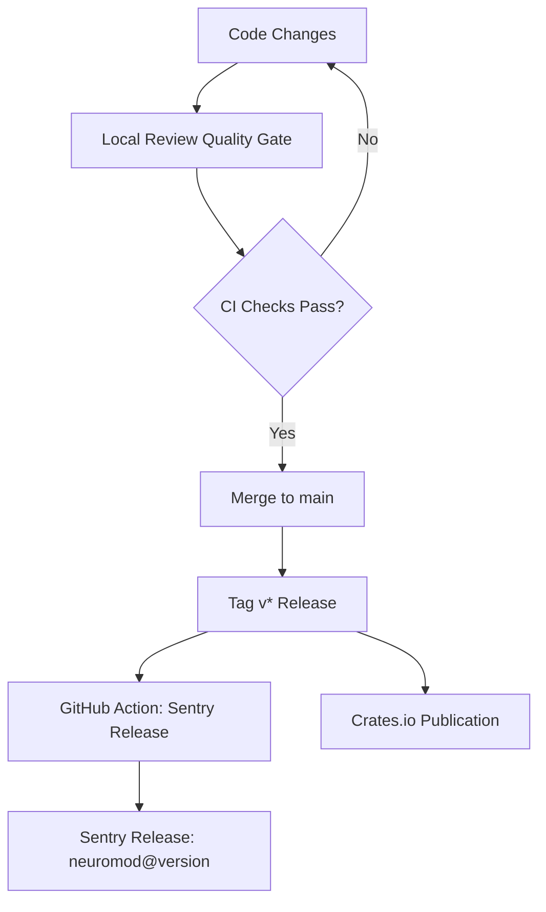

Relevant source files

The following files were used as context for generating this wiki page:

- [CHANGELOG.md](CHANGELOG.md)
- [README.md](README.md)
- [Cargo.toml](Cargo.toml)
- [AGENTS.md](AGENTS.md)
- [REVIEW.md](REVIEW.md)

# Changelog & Version History

The `neuromod` project maintains a structured history of changes to track the evolution of its Spiking Neural Network (SNN) primitives, neuromodulation APIs, and plasticity building blocks. This history serves as a critical reference for developers to understand breaking changes, new feature additions, and architectural shifts within the Limen-Neural ecosystem.

The versioning strategy follows semantic versioning principles, specifically bumping the minor version for breaking public API changes during the pre-1.0 phase (e.g., `0.X.0` to `0.(X+1).0`). Version history is primarily documented in `CHANGELOG.md`, while deployment-related release metadata is managed via GitHub Actions and Sentry integration.

Sources: [CHANGELOG.md:1-5](CHANGELOG.md#L1-L5), [AGENTS.md:12-16](AGENTS.md#L12-L16), [AGENTS.md:104-106](AGENTS.md#L104-L106)

## Version Evolution and Key Milestones

The project has transitioned through several major functional phases, evolving from a basic LIF/Izhikevich implementation to a generalized, biologically grounded library.

### [0.5.0] - 2026-06-20: Modernization and Neutrality
This version represents a significant architectural shift towards domain-neutrality and enhanced neuromodulation capabilities.

*  **API Refinement:** Introduction of the `NeuroModulators` API with specific fields for dopamine, serotonin, acetylcholine, and norepinephrine.
*  **Infrastructure:** Addition of `SignalProfile` for configurable signal mapping and the `GenericReward` trait for downstream reward shaping.
*  **Breaking Changes:** Removal of legacy fields like `cortisol` and `tempo`, and renaming of stress-related functions to biological counterparts (e.g., `add_stress` to `add_norepinephrine`).
*  **Licensing:** Switched from GPL-3.0 to dual MIT/Apache-2.0 to improve ecosystem health.

Sources: [CHANGELOG.md:14-36](CHANGELOG.md#L14-L36), [Cargo.toml:7](Cargo.toml#L7)

### [0.4.0] - 2026-05-01: Topology and Validation
Focused on improving the flexibility of the network engine.
*  **Dynamic Sizing:** Implementation of `SpikingNetwork::with_dimensions` to allow topology-neutral initialization.
*  **Robustness:** Introduction of strict input validation via `StepError::InputLenMismatch`.

Sources: [CHANGELOG.md:43-46](CHANGELOG.md#L43-L46)

### [0.3.0] - 2026-04-01: Biological Expansion
Expanded the library of biological primitives.
*  **Models:** Integration of Lapicque, GIF, Hodgkin-Huxley, and FitzHugh-Nagumo neuron models.
*  **Plasticity:** Added classical Hebbian STDP utilities.

Sources: [CHANGELOG.md:48-51](CHANGELOG.md#L48-L51)

## Release and Versioning Workflow

The project utilizes automated pipelines to ensure quality and consistency across versions.

The diagram shows the progression from local development through quality gates to automated release tracking.
Sources: [REVIEW.md:5-13](REVIEW.md#L5-L13), [README.md:154-162](README.md#L154-L162)

### Versioning Policy
| Type of Change | Version Action | Documentation Required |
| :--- | :--- | :--- |
| **Breaking API Change** | Bump Minor (0.X.0 -> 0.Y.0) | Update README migration notes |
| **New Feature** | Increment Minor/Patch | Add to `CHANGELOG.md` [Added] |
| **Bug Fix** | Increment Patch | Add to `CHANGELOG.md` [Fixed] |
| **Documentation** | No Version Bump | Add to `CHANGELOG.md` [Changed] |

Sources: [AGENTS.md:104-106](AGENTS.md#L104-L106), [CHANGELOG.md:10-53](CHANGELOG.md#L10-L53)

## Release Observability

Versions are tracked not only in source control but also through runtime observability tools.

### Sentry Integration
Release metadata is published to Sentry automatically when a `v*` tag is pushed. The release naming convention follows the pattern `neuromod@{version}`. This allows for correlating runtime issues with specific versions of the library.
Sources: [README.md:162-166](README.md#L162-L166), [README.md:175-177](README.md#L175-L177)

### Quality Gates
Before a version is finalized, it must pass the "Local Review Quality Gate," which includes:
*  **Formatting:** `cargo fmt --check`
*  **Linting:** `cargo clippy --all-targets --all-features -- -D warnings`
*  **Testing:** Unit tests (48), Sentry integration tests (16), and doctests (1).
*  **Domain Hygiene:** Verification that no forbidden terms (e.g., "spikenaut", "hft") exist in the documentation.

Sources: [REVIEW.md:7-19](REVIEW.md#L7-L19), [REVIEW.md:37-39](REVIEW.md#L37-L39)

## Summary of Version History

The `neuromod` version history documents a transition from a specialized spiking tool to a generalized research library. Major updates have consistently prioritized biological realism (adding HH and GIF models) and architectural flexibility (dynamic dimensions and generic reward traits). The move to a dual MIT/Apache-2.0 license in the unreleased/modern branch underscores the project's goal of becoming a foundational core for the Limen-Neural ecosystem.

Sources: [CHANGELOG.md:10-22](CHANGELOG.md#L10-L22), [README.md:120-125](README.md#L120-L125)
