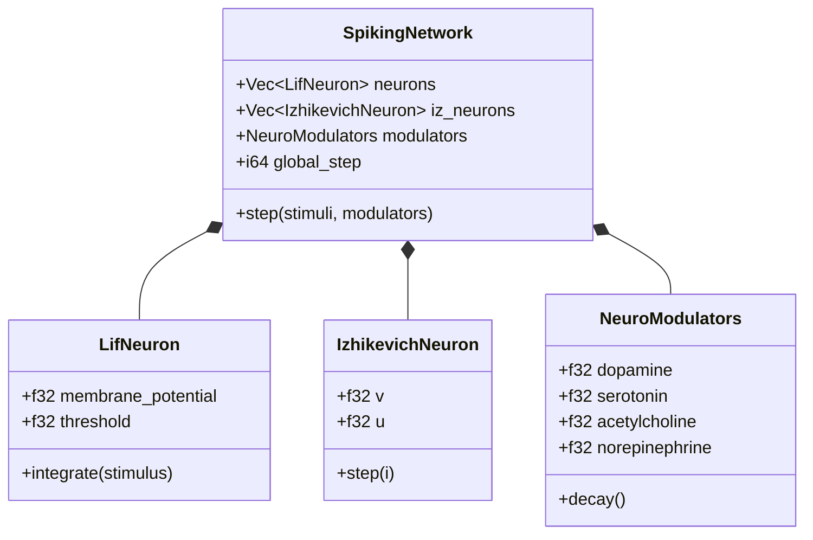
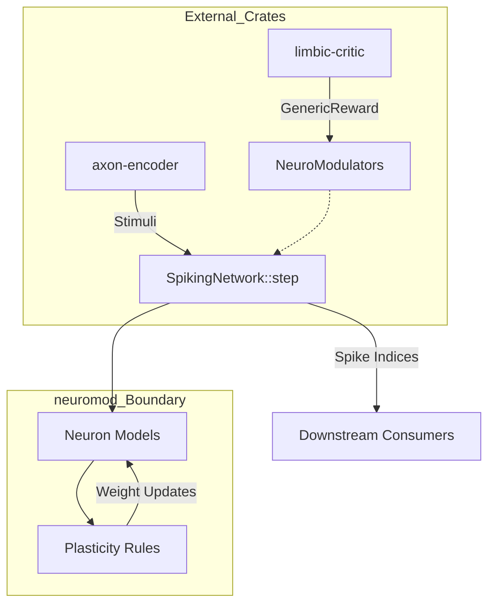

Relevant source files

The following files were used as context for generating this wiki page:

- [AGENTS.md](AGENTS.md)
- [README.md](README.md)
- [CHANGELOG.md](CHANGELOG.md)
- [REVIEW.md](REVIEW.md)
- [src/engine.rs](src/engine.rs)
- [src/modulators.rs](src/modulators.rs)

# Boundary Matrix

The Boundary Matrix defines the architectural and functional scope of the `neuromod` crate within the Limen-Neural ecosystem. It serves as a governance document that delineates ownership, runtime deployment roles, and strict constraints on what the library implements versus what is delegated to downstream or adjacent repositories. As a foundational spiking neural network (SNN) library, `neuromod` focuses exclusively on neuron dynamics, neuromodulation, and plasticity building blocks while remaining topology-neutral and domain-agnostic.

Sources: [AGENTS.md:12-21](AGENTS.md#L12-L21), [README.md:154-159](README.md#L154-L159), [CHANGELOG.md:12-14](CHANGELOG.md#L12-L14)

## Core Ownership and Responsibilities

`neuromod` owns the implementation of biologically grounded neuron models and the generic engine for network stepping. It is responsible for strict input validation, ensuring that the number of stimuli matches the defined network channels during the execution of a `SpikingNetwork::step`.

### Ownership Domains

| Domain | Included Components |
| :--- | :--- |
| **Neuron Models** | Lapicque, LIF, GIF, Izhikevich, FitzHugh-Nagumo, Hodgkin-Huxley |
| **Plasticity** | Classical STDP, Reward-Modulated STDP (R-STDP), Eligibility Traces |
| **Modulation** | Dopamine, Serotonin, Acetylcholine, Norepinephrine |
| **Engine** | `SpikingNetwork` logic, Step validation, global step tracking |

Sources: [AGENTS.md:86-90](AGENTS.md#L86-L90), [README.md:23-38](README.md#L23-L38), [src/engine.rs:40-48](src/engine.rs#L40-L48)

The following diagram illustrates the internal structural relationships within the `neuromod` crate:

This diagram represents the composition of the `SpikingNetwork` as defined in the core engine.
Sources: [src/engine.rs:25-38](src/engine.rs#L25-L38), [src/modulators.rs:88-93](src/modulators.rs#L88-L93)

## External System Boundaries

Per the Limen-Neural modularization standards, `neuromod` maintains hard boundaries against specific domains to preserve its role as a high-performance simulation core.

### Forbidden Domains
The crate explicitly excludes and is forbidden from containing logic for:
*  **Sensory Encoding:** Handled by `axon-encoder`.
*  **Topology/Wiring:** Handled by `synaptic-mesh`.
*  **Reward Shaping:** Domain-specific logic is offloaded to `limbic-critic`, though `neuromod` provides the `GenericReward` trait.
*  **Training Loops:** Managed by `plasticity-lab`.
*  **Hardware Export:** Handled by `silicon-bridge` and `Spikenaut-Hardware`.
*  **Domain Logic:** No async code, networking, or HFT/crypto domain logic is permitted in the core library.

Sources: [AGENTS.md:92-96](AGENTS.md#L92-L96), [README.md:160-165](README.md#L160-L165), [CHANGELOG.md:58-60](CHANGELOG.md#L58-L60)

## Data Flow and Integration

The Boundary Matrix governs how data enters and exits the system. The `SpikingNetwork` acts as a transformer that consumes normalized stimuli and neuromodulatory signals to produce spike indices.

This diagram shows the flow of data across the crate boundary as defined in the project architecture.
Sources: [README.md:154-159](README.md#L154-L159), [src/engine.rs:50-70](src/engine.rs#L50-L70), [src/modulators.rs:163-170](src/modulators.rs#L163-L170)

### Interface Standards
*  **Trait Hosting:** Shared traits (e.g., `GenericReward`) live within `neuromod` to ensure a common interface for downstream reward shaping without coupling the core to specific domains.
*  **Neutral Initialization:** The `SpikingNetwork` is initialized with blank synaptic weights and no hardcoded topology, enforcing that wiring is provided externally.
*  **Validation:** All `step` calls must undergo shape validation. If `stimuli.len()` does not match `num_channels`, the engine returns a `StepError`.

Sources: [README.md:9-14](README.md#L9-L14), [src/engine.rs:55-60](src/engine.rs#L55-L60), [CHANGELOG.md:16-17](CHANGELOG.md#L16-L17)

## Quality and Compliance

The Boundary Matrix is enforced through a mandatory "Local Review Quality Gate." This process ensures that no forbidden terms or domain-specific dependencies (such as HFT or crypto terms) leak into the documentation or code.

### Pass Criteria for Review
1.  **Format and Lint:** Zero warnings from `cargo clippy` and success in `cargo fmt`.
2.  **Domain Agnostic Check:** Documentation is checked via `grep` to ensure no presence of keywords like `spikenaut`, `hft`, or `mining`.
3.  **Feature Matrix:** Success across all features, including the optional `sentry` observability feature.

Sources: [REVIEW.md:7-15](REVIEW.md#L7-L15), [REVIEW.md:46-50](REVIEW.md#L46-L50), [REVIEW.md:65-72](REVIEW.md#L65-L72)
