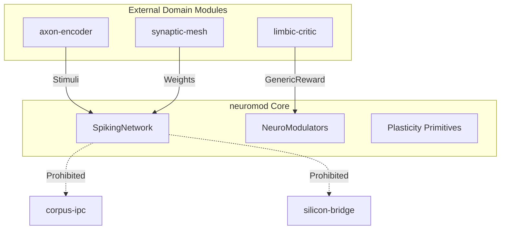
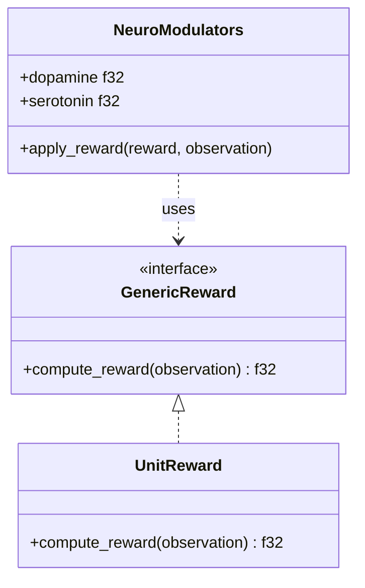
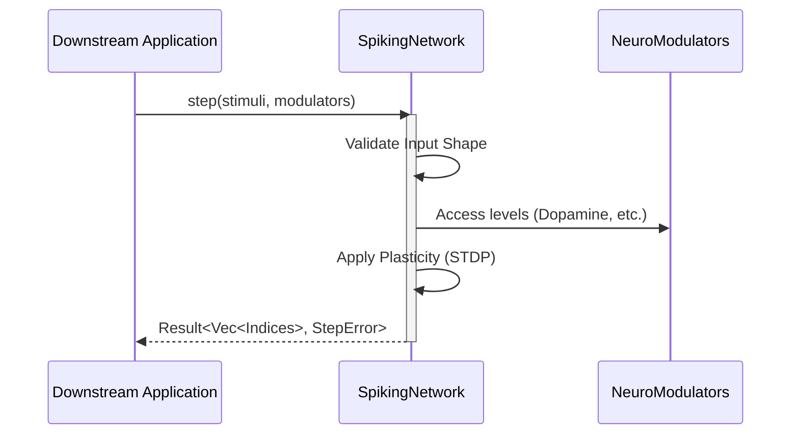

Relevant source files

The following files were used as context for generating this wiki page:

- [AGENTS.md](AGENTS.md)
- [README.md](README.md)
- [CHANGELOG.md](CHANGELOG.md)
- [REVIEW.md](REVIEW.md)
- [src/lib.rs](src/lib.rs)
- [src/modulators.rs](src/modulators.rs)
- [src/engine.rs](src/engine.rs)

# Org Modularization Standards

## Introduction

The Org Modularization Standards define the architectural boundaries, repository conventions, and cross-cutting standards for the Limen-Neural ecosystem. These standards ensure that `neuromod` remains a reusable, topology-neutral core library focused strictly on neuron dynamics and neuromodulation, rather than domain-specific logic.

This modularization effort is indexed under workstreams #35–#43 and enforces strict rules regarding repository ownership, build standards, and "beads" (modular components). It facilitates the separation of core biophysical primitives from downstream applications like sensory encoding, hardware export, or training laboratories.

Sources: [README.md:126-130](README.md#L126-L130), [CHANGELOG.md:8-12](CHANGELOG.md#L8-L12), [AGENTS.md:14-18](AGENTS.md#L14-L18)

---

## Architectural Boundaries

The ecosystem is divided into distinct ownership zones. `neuromod` acts as the foundational layer, providing shared traits and neuron models, but it explicitly forbids inclusion of networking, IPC, or hardware-specific code.

### Ownership Matrix

| Category | Owned by `neuromod` | External (Downstream) |
|----------|-------------------|----------------------|
| **Core Primitives** | Neuron Models (LIF, GIF, HH, etc.) | Sensory Encoding (`axon-encoder`) |
| **Connectivity** | `SpikingNetwork` (Topology-neutral) | Topology/Wiring (`synaptic-mesh`) |
| **Learning** | Plasticity Building Blocks (STDP) | Training Loops (`plasticity-lab`) |
| **Control** | `NeuroModulators` | Reward Shaping (`limbic-critic`) |
| **Runtime** | Basic Step Contract | IPC (`corpus-ipc`), Daemon (`brainstem-daemon`) |
| **Hardware** | Logic Primitives | Hardware Export (`silicon-bridge`) |

Sources: [AGENTS.md:92-97](AGENTS.md#L92-L97), [README.md:131-135](README.md#L131-L135)

### Boundary Logic Flow

The following diagram illustrates how modular boundaries prevent domain-specific logic from entering the core engine:

The diagram shows that while `neuromod` accepts stimuli and rewards from external modules, it does not own the implementation of those modules or the protocols for IPC and hardware communication.

Sources: [AGENTS.md:92-98](AGENTS.md#L92-L98), [README.md:131-135](README.md#L131-L135)

---

## Technical Standards

### Domain Neutrality
A critical standard is "Domain Hygiene." All public documentation, crate-level docs, and metadata must remain domain-agnostic. Specific forbidden domains include crypto, mining, high-frequency trading (HFT), and networking.

Sources: [REVIEW.md:52-56](REVIEW.md#L52-L56), [CHANGELOG.md:46-48](CHANGELOG.md#L46-L48), [AGENTS.md:98-99](AGENTS.md#L98-L99)

### Shared Traits Implementation
As per ADR 001, shared traits that define ecosystem-wide interfaces are hosted within `neuromod`. This allows downstream crates to implement specific logic while maintaining a compatible interface.

*  **`GenericReward`**: A trait for domain-specific reward shaping.
*  **`Observation`**: A generic data structure for passing signal bags to modulators.

Sources: [src/modulators.rs:56-61](src/modulators.rs#L56-L61), [src/lib.rs:43-46](src/lib.rs#L43-L46), [CHANGELOG.md:12](CHANGELOG.md#L12)

This diagram demonstrates the relationship between the generic interface provided by `neuromod` and potential implementations.

Sources: [src/modulators.rs:64-124](src/modulators.rs#L64-L124), [src/lib.rs:43-46](src/lib.rs#L43-L46)

---

## Git & Build Conventions

To maintain stability across the modular ecosystem, specific git and build standards are enforced:

1.  **Pinned Toolchain**: All repositories must use the same pinned Rust toolchain (1.97.1) specified in `rust-toolchain.toml`.
2.  **Conventional Commits**: Use of `feat:`, `fix:`, `docs:`, `chore:`, etc., is required.
3.  **Quality Gates**: PRs must pass a mandatory suite of checks, including:
  *  `cargo fmt --check`
  *  `cargo clippy --all-targets --all-features -- -D warnings`
  *  `cargo hack` for feature-powerset validation.
4.  **Immutable Actions**: Third-party GitHub Actions must be pinned to immutable commit SHAs.

Sources: [AGENTS.md:33-40](AGENTS.md#L33-L40), [AGENTS.md:102-105](AGENTS.md#L102-L105), [REVIEW.md:9-19](REVIEW.md#L9-L19)

---

## Integration Standards

Modular components ("Beads") interact through a strict Step Contract. The core `SpikingNetwork` ensures that data flow remains predictable regardless of the specific neuron models or modulators used.

This flow ensures that external applications interact with the modular core through a validated, error-handling interface.

Sources: [src/engine.rs:56-70](src/engine.rs#L56-L70), [README.md:42-55](README.md#L42-L55)

---

## Summary

The Org Modularization Standards establish `neuromod` as a strictly defined biophysical core. By enforcing boundary matrices, domain neutrality, and shared trait hosting, the ecosystem ensures that improvements to neuron dynamics can be propagated to sensory, training, and hardware modules without architectural friction. These standards are maintained through rigorous local review quality gates and automated CI pipelines.

Sources: [CHANGELOG.md:8-15](CHANGELOG.md#L8-L15), [README.md:126-135](README.md#L126-L135), [REVIEW.md:76-80](REVIEW.md#L76-L80)
