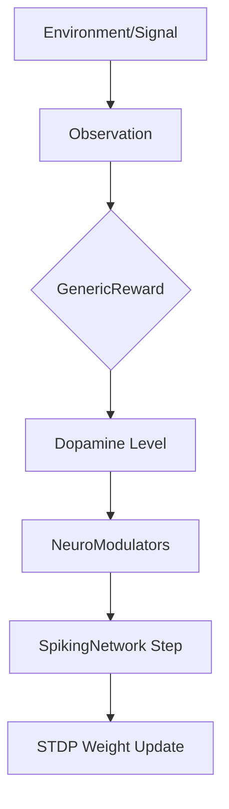
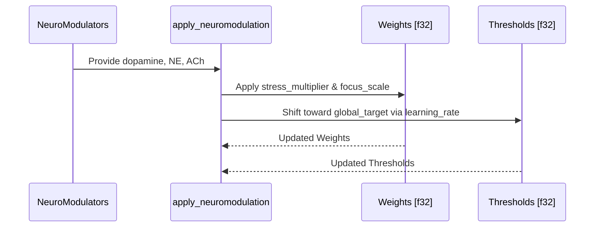

<details>
<summary>Relevant source files</summary>

The following files were used as context for generating this wiki page:

- [CHANGELOG.md](CHANGELOG.md)
- [src/modulators.rs](src/modulators.rs)
- [src/lib.rs](src/lib.rs)
- [README.md](README.md)
- [src/engine.rs](src/engine.rs)
- [AGENTS.md](AGENTS.md)
</details>

# ADR 001: Traits in Neuromod

Architectural Decision Record (ADR) 001 establishes `neuromod` as the central host for shared traits within the Limen-Neural ecosystem. This decision ensures that domain-agnostic interfaces for reward shaping, neuron dynamics, and neuromodulation are centralized to facilitate interoperability between specialized downstream crates like `limbic-critic` or `plasticity-lab`.

The scope of this ADR covers the transition from domain-specific implementations (e.g., hardware-coupled signals) to generic, trait-based abstractions. By hosting these traits in the core `neuromod` crate, the system achieves a "topology-neutral" and "domain-agnostic" architecture suitable for diverse neuroscience research applications.

Sources: [CHANGELOG.md:10-14](CHANGELOG.md#L10-L14), [README.md:95-103](README.md#L95-L103), [AGENTS.md:15-20](AGENTS.md#L15-L20)

## The Generic Reward System

Central to ADR 001 is the introduction of the `GenericReward` trait. This trait allows downstream crates to define how environment observations are translated into reward signals (dopamine) without modifying the core `neuromod` engine.

### GenericReward Interface

The trait defines a single required method, `compute_reward`, which processes an `Observation` bag.

```rust
pub trait GenericReward {
    fn compute_reward(&self, observation: &Observation) -> f32;
}
```

Sources: [src/modulators.rs:64-66](src/modulators.rs#L64-L66)

### Reward Data Flow

The following diagram illustrates how the `GenericReward` trait facilitates the flow of data from environment observations to synaptic updates:



The `Observation` struct acts as a container for raw signal data, which the trait implementation processes to return a normalized `f32` reward value used by the `NeuroModulators` system.

Sources: [src/modulators.rs:52-79](src/modulators.rs#L52-L79), [src/engine.rs:81-85](src/engine.rs#L81-L85)

## Neuromodulator Trait-Like Abstractions

While `NeuroModulators` is currently implemented as a struct, its interaction with the `SignalProfile` and `GenericReward` follows the pattern of providing pluggable logic for biological dynamics.

### Signal Mapping and Scaling

The `SignalProfile` provides the configuration necessary to map external signals (thermal, power, throughput, timing) into the four primary neuromodulators.

| Field | Description | Default |
|-------|-------------|---------|
| `throughput_scale` | Divisor for normalizing dopamine levels. | 1.0 |
| `thermal_threshold` | Value above which stress (norepinephrine) accumulates. | 0.5 |
| `stability_target` | Target throughput for serotonin computation. | 1.0 |
| `timing_scale` | Divisor for normalizing acetylcholine. | 1.0 |

Sources: [src/modulators.rs:10-33](src/modulators.rs#L10-L33)

### Modulator Application Logic

The interaction between modulators and the network is abstracted through the `apply_neuromodulation` function, which acts on generic slices of weights and thresholds.



Sources: [src/modulators.rs:165-185](src/modulators.rs#L165-L185)

## Implementation in the Spiking Engine

The `SpikingNetwork` utilizes these shared traits and structs to maintain a strict "step contract." The engine is neutral at initialization, meaning it does not assume a specific topology, and relies on the `NeuroModulators` passed during the `step` call to drive plasticity.

### Engine Integration Table

| Component | Responsibility | Derived From |
|-----------|----------------|--------------|
| `step` | Validates input shape and updates neuron states. | `src/engine.rs` |
| `apply_stdp` | Uses dopamine-gated logic for weight updates. | `src/engine.rs` |
| `Observation` | Encapsulates signals for reward computation. | `src/modulators.rs` |
| `UnitReward` | Default trait implementation for mean-signal rewards. | `src/modulators.rs` |

Sources: [src/engine.rs:44-55](src/engine.rs#L44-L55), [src/modulators.rs:69-79](src/modulators.rs#L69-L79), [README.md:12-20](README.md#L12-L20)

## Conclusion

By centralizing traits like `GenericReward` in `neuromod`, the architecture ensures that the core SNN dynamics remain decoupled from specific hardware or domain logic. This standardization allows the Limen-Neural ecosystem to scale while maintaining strict input validation and biologically grounded learning rules.

Sources: [CHANGELOG.md:38-45](CHANGELOG.md#L38-L45), [AGENTS.md:85-90](AGENTS.md#L85-L90)
