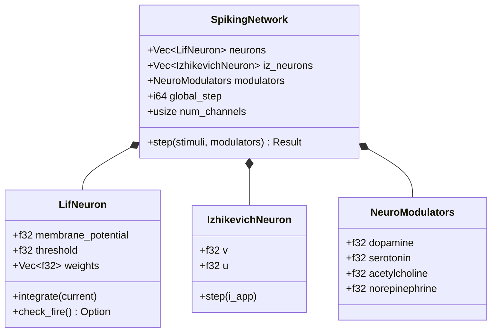
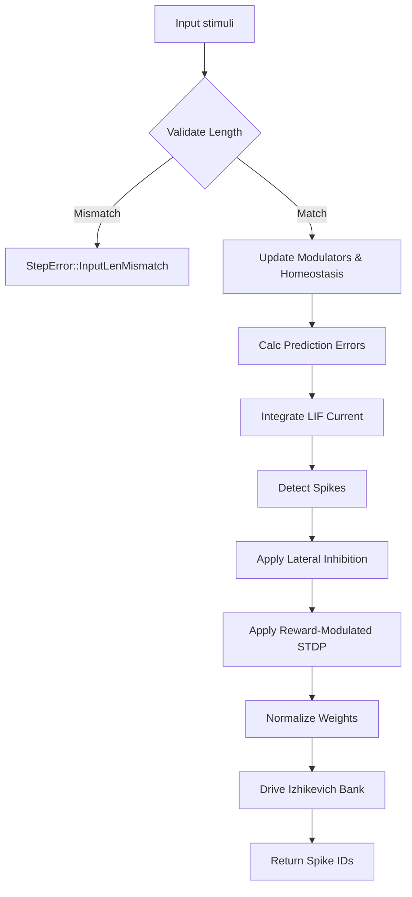
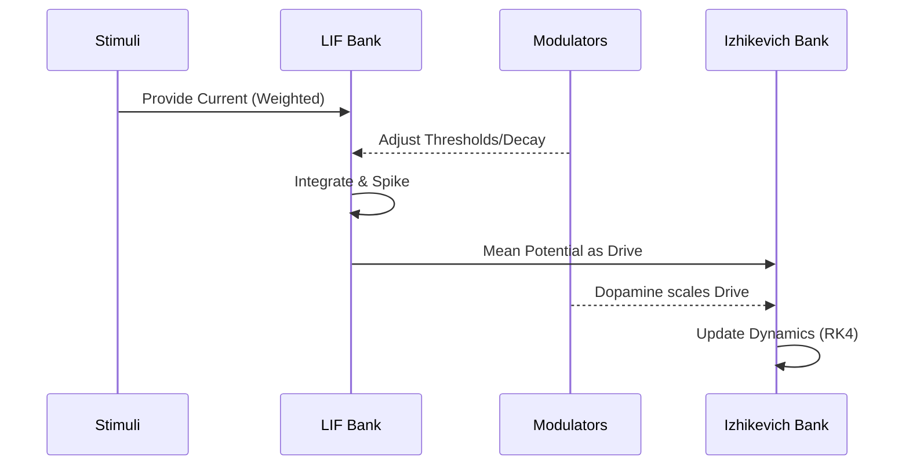

<details>
<summary>Relevant source files</summary>

The following files were used as context for generating this wiki page:

- [src/engine.rs](src/engine.rs)
- [src/lib.rs](src/lib.rs)
- [src/modulators.rs](src/modulators.rs)
- [src/lif.rs](src/lif.rs)
- [src/izhikevich.rs](src/izhikevich.rs)
- [src/rm_stdp.rs](src/rm_stdp.rs)
</details>

# Execution Flow Engine

The Execution Flow Engine is the core computational orchestrator of the `neuromod` library. It manages the lifecycle and interaction of different neuron populations—specifically Leaky Integrate-and-Fire (LIF) and Izhikevich models—while integrating external stimuli, global neuromodulation, and synaptic plasticity.

The engine ensures strict validation of input shapes and handles the sequential progression of network states through a discrete `step` function. This system is designed to be topology-neutral, meaning it provides the underlying dynamics without enforcing a specific domain-specific connectivity at initialization.

Sources: [src/engine.rs:18-35](src/engine.rs#L18-L35), [README.md:1-15](README.md#L1-L15)

## Network Architecture and Components

The engine is encapsulated within the `SpikingNetwork` struct, which maintains the state of the entire system. It organizes neurons into distinct banks and tracks global variables necessary for temporal learning and modulation.

### Core Data Structures

| Field | Type | Description |
| :--- | :--- | :--- |
| `neurons` | `Vec<LifNeuron>` | Bank 1: Fast, reactive Leaky Integrate-and-Fire neurons. |
| `iz_neurons` | `Vec<IzhikevichNeuron>` | Bank 2: Complex, adaptive Izhikevich neurons. |
| `modulators` | `NeuroModulators` | Global levels for Dopamine, Serotonin, Acetylcholine, and Norepinephrine. |
| `global_step` | `i64` | Monotonic counter used for calculating spike-timing differences in STDP. |
| `num_channels` | `usize` | The required length for input stimuli vectors. |
| `predictive_state` | `Vec<f32>` | EMA of input stimuli used for surprise/prediction error calculations. |

Sources: [src/engine.rs:18-32](src/engine.rs#L18-L32), [src/lib.rs:36-49](src/lib.rs#L36-L49)

### Component Relationships

The following diagram illustrates the relationship between the `SpikingNetwork` and its internal components.



This diagram shows the composition of the `SpikingNetwork` and the primary state variables of its child components. 
Sources: [src/engine.rs:18-32](src/engine.rs#L18-L32), [src/modulators.rs:65-70](src/modulators.rs#L65-L70)

## Execution Cycle (The `step` Function)

The execution flow of a single simulation step is handled by the `step` method. This method follows a rigid sequence of validation, modulation adjustment, integration, spike detection, and learning.

### Step-by-Step Logic Flow

1.  **Input Validation**: Checks if the length of provided `stimuli` matches `num_channels`.
2.  **Modulator Update**: Updates the global `NeuroModulators` state and calculates multipliers for learning and stress.
3.  **Neuron Parameter Homeostasis**: Adjusts `decay_rate` and `threshold` for all LIF neurons based on modulator levels.
4.  **Prediction Error Calculation**: Calculates "surprise" by comparing current stimuli to the `predictive_state`.
5.  **Current Integration**: Sums weighted input (including surprise) and integrates it into LIF membrane potentials.
6.  **Spike Detection**: Identifies which LIF neurons crossed their threshold and records spike times.
7.  **Lateral Inhibition**: Applies a global inhibition strength to non-spiking neurons if any neuron fired.
8.  **Plasticity (STDP)**: Updates synaptic weights using Reward-Modulated Spike-Timing-Dependent Plasticity.
9.  **Weight Normalization**: Clamps and scales weights to fit within the `WEIGHT_BUDGET`.
10. **Secondary Bank Drive**: Drives Izhikevich neurons based on the mean activity of the LIF bank.

Sources: [src/engine.rs:56-146](src/engine.rs#L56-L146)

### Flow Diagram: Execution Step



The diagram represents the linear execution flow within the engine's core `step` function.
Sources: [src/engine.rs:56-146](src/engine.rs#L56-L146)

## Synaptic Plasticity and Learning

The engine implements Reward-Modulated STDP (RM-STDP). Learning is primarily driven by the `dopamine` modulator level, which acts as a learning rate multiplier.

### STDP Mechanism
The engine calculates the weight delta ($dw$) based on the temporal difference between pre-synaptic spikes (from input channels) and post-synaptic spikes (from LIF neurons).

-  **LTP (Long-Term Potentiation)**: Occurs when `post_time >= pre_time`.
-  **LTD (Long-Term Depression)**: Occurs when `post_time < pre_time`.

The update is governed by constants defined in the plasticity module:
-  `RM_STDP_A_PLUS` / `RM_STDP_A_MINUS`: Potentiation/Depression amplitudes.
-  `RM_STDP_TAU_PLUS` / `RM_STDP_TAU_MINUS`: Temporal decay constants.

Sources: [src/engine.rs:161-192](src/engine.rs#L161-L192), [src/rm_stdp.rs:1-20](src/rm_stdp.rs#L1-L20)

### Weight Normalization
To prevent runaway excitation, the engine enforces an L1 synaptic weight budget ($2.0$) per neuron. If the sum of weights exceeds this budget, all weights for that neuron are scaled down proportionally.

```rust
const WEIGHT_BUDGET: f32 = 2.0;

// Inside SpikingNetwork::step
for neuron in &mut self.neurons {
    let total: f32 = neuron.weights.iter().sum();
    if total > 1e-6 {
        let scale = WEIGHT_BUDGET / total;
        for w in &mut neuron.weights {
            *w *= scale;
            *w = w.clamp(RM_STDP_W_MIN, RM_STDP_W_MAX);
        }
    }
}
```

Sources: [src/engine.rs:12-13](src/engine.rs#L12-L13), [src/engine.rs:131-141](src/engine.rs#L131-L141)

## Neuromodulatory Control

The engine integrates a `NeuroModulators` system that dynamically alters the behavior of the execution flow.

| Modulator | Effect on Execution Flow |
| :--- | :--- |
| **Dopamine** | Scales the learning rate for STDP and lowers the firing threshold target. |
| **Norepinephrine** | Multiplies integrated current (stress/arousal) and raises the firing threshold target. |
| **Serotonin** | Lowers the firing threshold target (stability/calmness). |
| **Acetylcholine** | Decreases the decay rate of LIF neurons, increasing temporal integration (focus). |

Sources: [src/engine.rs:72-87](src/engine.rs#L72-L87), [src/modulators.rs:145-165](src/modulators.rs#L145-L165)

## Sequence of Neuron Interaction

The engine facilitates a hierarchical interaction where the LIF bank acts as the primary sensory integrator, which then drives the more complex Izhikevich bank.



This diagram shows how information and modulatory signals flow through the different neuron populations during a single step.
Sources: [src/engine.rs:104-146](src/engine.rs#L104-L146)

## Summary

The Execution Flow Engine provides a robust framework for simulating SNN dynamics. By centralizing the orchestration of different neuron models and neuromodulatory signals in the `SpikingNetwork`'s `step` function, it maintains a clean separation between individual neuron physics and global network behavior. The integration of RM-STDP and weight budgeting ensures that the network can adapt to patterns in input stimuli while remaining numerically stable.

Sources: [src/engine.rs:1-150](src/engine.rs#L1-L150), [src/lib.rs:1-30](src/lib.rs#L1-L30)
