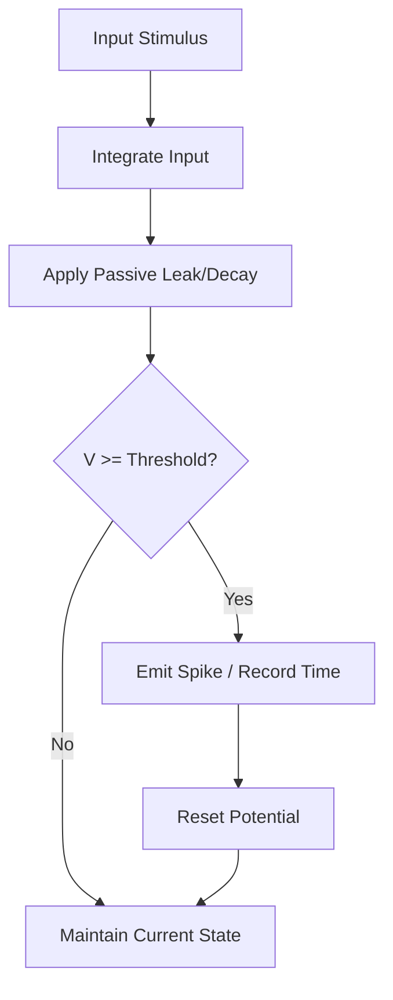
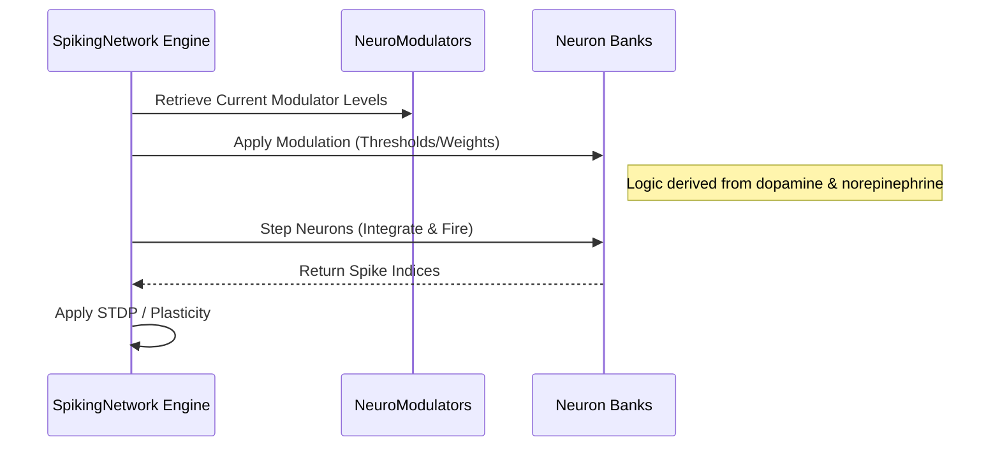

<details>
<summary>Relevant source files</summary>

The following files were used as context for generating this wiki page:

- [src/lib.rs](src/lib.rs)
- [README.md](README.md)
- [src/lif.rs](src/lif.rs)
- [src/izhikevich.rs](src/izhikevich.rs)
- [src/gif.rs](src/gif.rs)
- [src/hodgkin_huxley.rs](src/hodgkin_huxley.rs)
- [src/fitzhugh_nagumo.rs](src/fitzhugh_nagumo.rs)
- [src/lapicque.rs](src/lapicque.rs)
- [src/engine.rs](src/engine.rs)
- [AGENTS.md](AGENTS.md)
</details>

# Neuron Models Overview

## Introduction

`neuromod` provides a comprehensive suite of biologically grounded Spiking Neural Network (SNN) primitives. The library implements a range of neuron models, from simple integrated-and-fire circuits to biophysically detailed conductance-based models. These models serve as the foundational building blocks for the `SpikingNetwork` and are designed for use in neuroscience research and neuromorphic computing.

The project emphasizes modularity and dynamic scaling, allowing for topology-neutral initialization and runtime adjustments. Each neuron model captures specific physiological characteristics, such as membrane potential decay, refractory periods, adaptation mechanisms, and ionic channel dynamics. These components are integrated with a global neuromodulation system that adjusts learning rates and thresholds based on chemical signals like dopamine and norepinephrine.

Sources: [README.md:1-20](README.md#L1-L20), [AGENTS.md:9-15](AGENTS.md#L9-L15), [src/lib.rs:1-15](src/lib.rs#L1-L15)

## Core Neuron Architectures

The library includes several canonical neuron models, each offering a different balance between computational efficiency and biological realism.

### Leaky Integrate-and-Fire (LIF)
The `LifNeuron` is the most common model, simulating an RC circuit. It integrates input stimuli into a membrane potential, which decays over time according to a `decay_rate`. When the potential crosses a `threshold`, the neuron emits a spike and undergoes a "hard reset" to zero.

Sources: [src/lif.rs:48-75](src/lif.rs#L48-L75), [src/lif.rs:90-112](src/lif.rs#L90-L112)

### Lapicque Neuron
The `LapicqueNeuron` represents the simplest integrate-and-fire model. It integrates input current and leaks toward rest. Like the LIF model, it resets immediately upon crossing a threshold.

Sources: [src/lapicque.rs:1-35](src/lapicque.rs#L1-L35)

### Generalized Integrate-and-Fire (GIF)
The `GifNeuron` extends basic dynamics with spike-triggered adaptation. It utilizes a "soft reset"—subtracting a fraction of the threshold rather than clamping to zero—which preserves supra-threshold drive across consecutive spikes.

Sources: [src/gif.rs:1-30](src/gif.rs#L1-L30), [src/gif.rs:114-135](src/gif.rs#L114-L135)

### Izhikevich Model
The `IzhikevichNeuron` is a computationally efficient model capable of reproducing diverse firing patterns (regular spiking, bursting, chattering) using two differential equations and four parameters (`a`, `b`, `c`, `d`).

Sources: [src/izhikevich.rs:8-30](src/izhikevich.rs#L8-L30), [src/izhikevich.rs:100-117](src/izhikevich.rs#L100-L117)

### Summary Table of Neuron Models

| Model | Complexity | Key Feature | Data Structure |
| :--- | :--- | :--- | :--- |
| **Lapicque** | Low | Historical integrate-and-fire | `LapicqueNeuron` |
| **LIF** | Low | RC circuit analogy, passive leak | `LifNeuron` |
| **GIF** | Medium | Adaptation variable, soft reset | `GifNeuron` |
| **Izhikevich** | Medium | Programmable firing patterns | `IzhikevichNeuron` |
| **FitzHugh-Nagumo** | High | 2D relaxation oscillator | `FitzHughNagumoNeuron` |
| **Hodgkin-Huxley** | Extreme | Conductance-based ionic channels | `HodgkinHuxleyNeuron` |

Sources: [README.md:50-65](README.md#L50-L65), [src/lib.rs:35-45](src/lib.rs#L35-L45), [benches/README.md:40-55](benches/README.md#L40-L55)

## Biophysical Dynamics

For high-fidelity research, `neuromod` implements detailed oscillators and conductance models.

### Hodgkin-Huxley (HH)
The `HodgkinHuxleyNeuron` is the biophysical "gold standard." It explicitly models Sodium (Na⁺), Potassium (K⁺), and Leak currents. It uses gating variables (`m`, `h`, `n`) and 4th-order Runge-Kutta (RK4) integration for numerical stability.

Sources: [src/hodgkin_huxley.rs:1-30](src/hodgkin_huxley.rs#L1-L30), [src/hodgkin_huxley.rs:170-200](src/hodgkin_huxley.rs#L170-L200)

### FitzHugh-Nagumo (FHN)
The `FitzHughNagumoNeuron` is a 2D reduction of the HH model. It uses a fast activator `v` (potential) and a slow recovery variable `w` to exhibit threshold behavior and refractoriness.

Sources: [src/fitzhugh_nagumo.rs:1-25](src/fitzhugh_nagumo.rs#L1-L25), [src/fitzhugh_nagumo.rs:115-145](src/fitzhugh_nagumo.rs#L115-L145)

### Neuron Simulation Flow
The following diagram illustrates the standard integration and spike detection flow used across most models.



The integration process adds stimulus to the membrane potential, applies a decay factor, and triggers a reset only if the firing threshold is exceeded. 
Sources: [src/lif.rs:98-112](src/lif.rs#L98-L112), [src/gif.rs:114-135](src/gif.rs#L114-L135), [src/lapicque.rs:58-85](src/lapicque.rs#L58-L85)

## Network Integration and Neuromodulation

Neuron models are managed by the `SpikingNetwork` engine, which handles the interaction between individual neurons and global chemical modulators.

### Data Flow in SpikingNetwork



The engine coordinates the influence of neuromodulators on neuron properties before executing the integration step.
Sources: [src/engine.rs:60-120](src/engine.rs#L60-L120), [src/modulators.rs:190-210](src/modulators.rs#L190-L210)

### Neuromodulator Impact on Neurons
Neuromodulators directly alter the physiological parameters of the neurons during each network step:
*  **Dopamine:** Influences the learning rate for plasticity and adjusts neuron thresholds toward a global target.
*  **Norepinephrine:** Acts as a stress multiplier, scaling total input current and increasing thresholds.
*  **Acetylcholine:** Adjusts the decay rate (leaks) and scales weights for focused processing.
*  **Serotonin:** Contributes to the stability of the global target threshold.

Sources: [src/engine.rs:82-100](src/engine.rs#L82-L100), [src/modulators.rs:190-207](src/modulators.rs#L190-L207)

## Implementation Details

### Data Structures
Most neuron models implement `Clone`, `Serialize`, and `Deserialize` to allow for network state persistence and transfer.

```rust
// Example: IzhikevichNeuron State (src/izhikevich.rs)
pub struct IzhikevichNeuron {
    pub v: f32, // Membrane potential (mV)
    pub u: f32, // Membrane recovery variable
    pub last_spike_time: i64,
    pub a: f32, // Timescale of recovery
    pub b: f32, // Sensitivity to fluctuations
    pub c: f32, // After-spike reset v
    pub d: f32, // After-spike reset u
}
```

Sources: [src/izhikevich.rs:15-28](src/izhikevich.rs#L15-L28), [src/lif.rs:56-75](src/lif.rs#L56-L75)

### Input Validation
The network engine enforces strict input shape validation. The `step` function returns a `StepError::InputLenMismatch` if the provided stimuli slice does not match the expected `num_channels`.

Sources: [src/engine.rs:15-18](src/engine.rs#L15-L18), [src/engine.rs:70-76](src/engine.rs#L70-L76)

## Conclusion
The neuron models in `neuromod` range from efficient abstractions for large-scale SNNs to high-fidelity biophysical simulations. By integrating these models with a centralized `SpikingNetwork` engine and `NeuroModulators` system, the library provides a flexible framework for exploring biologically inspired learning and dynamics.

Sources: [README.md:120-135](README.md#L120-L135), [AGENTS.md:9-15](AGENTS.md#L9-L15)
