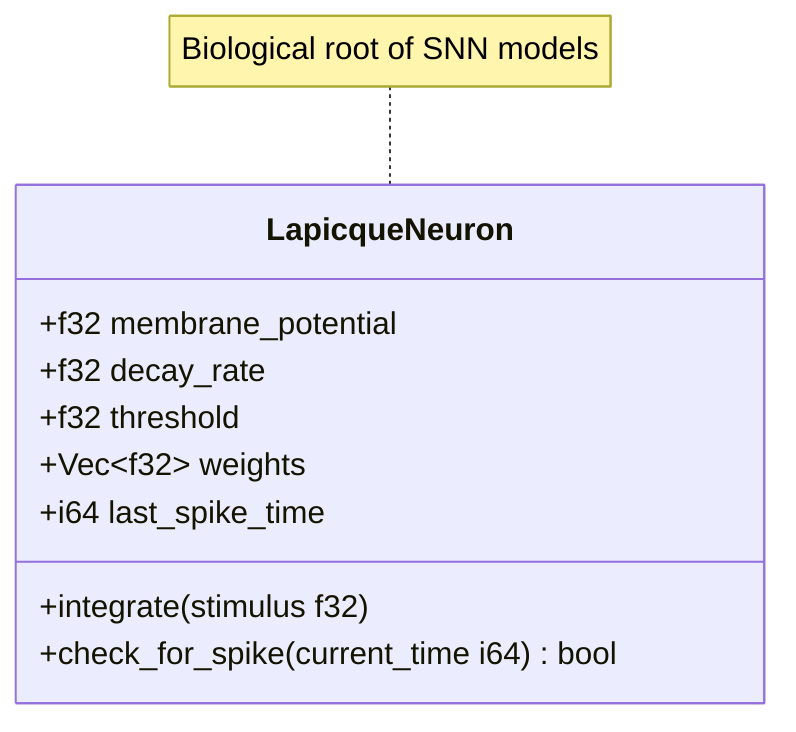
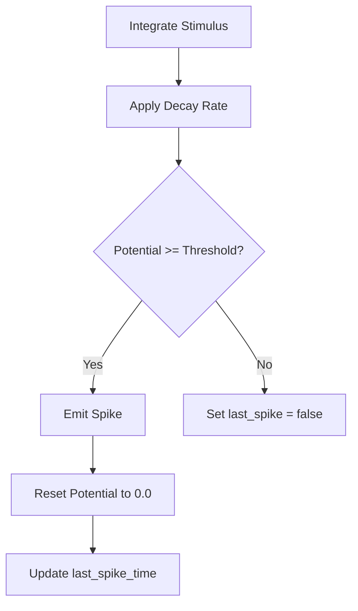
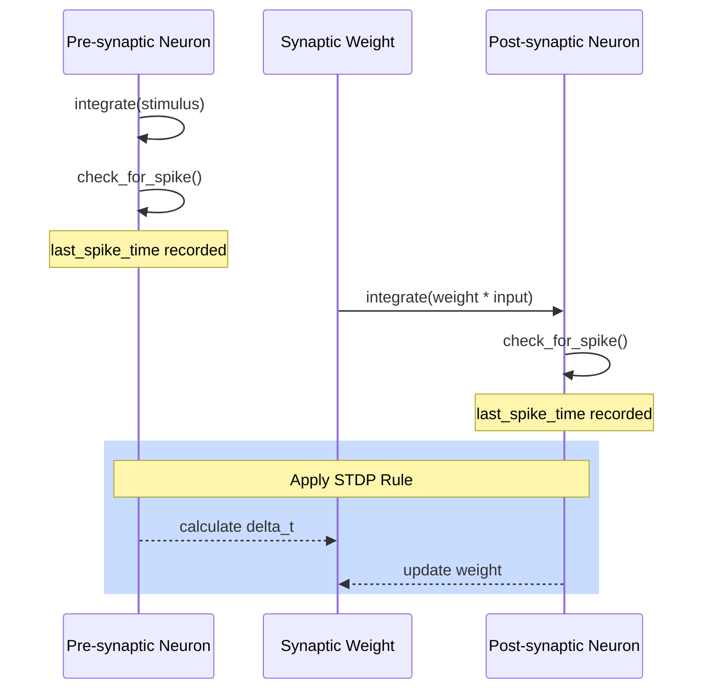

<details>
<summary>Relevant source files</summary>

The following files were used as context for generating this wiki page:

- [src/lapicque.rs](src/lapicque.rs)
- [src/lib.rs](src/lib.rs)
- [examples/hebbian_learning.rs](examples/hebbian_learning.rs)
- [benches/neuron_bench.rs](benches/neuron_bench.rs)
- [benches/memory_bench.rs](benches/memory_bench.rs)
- [README.md](README.md)
</details>

# Lapicque Neuron Model

The Lapicque Neuron Model (1907) is the biological root of all spiking neuron models within the `neuromod` crate. It represents the simplest implementation of "integrate-and-fire" behavior, where the membrane potential integrates incoming current, leaks toward a resting state, and fires a spike upon crossing a defined threshold. Sources: [src/lapicque.rs:1-12](src/lapicque.rs#L1-L12), [README.md:16](README.md#L16)

In the context of the `neuromod` ecosystem, this model serves as a foundational building block for exploring neural dynamics and plasticity, such as Hebbian learning. It is utilized alongside more complex models like [LIF](#lif-neuron-model) and [Izhikevich](#izhikevich-neuron-model) to provide a spectrum of biophysical realism. Sources: [src/lib.rs:24](src/lib.rs#L24), [examples/hebbian_learning.rs:7-10](examples/hebbian_learning.rs#L7-L10)

## Architecture and Data Structures

The model is encapsulated in the `LapicqueNeuron` struct. It maintains state through a single variable—the membrane potential—and several parameters governing its integration and firing logic. Sources: [src/lapicque.rs:20-35](src/lapicque.rs#L20-L35)

### Data Model

| Field | Type | Description |
| :--- | :--- | :--- |
| `membrane_potential` | `f32` | Current dimensionless potential. |
| `decay_rate` | `f32` | Passive leak rate per step (fraction lost). |
| `threshold` | `f32` | Active firing threshold. |
| `base_threshold` | `f32` | Resting threshold used for modulation. |
| `last_spike` | `bool` | Flag indicating a spike in the previous step. |
| `weights` | `Vec<f32>` | Synaptic weights for input channels. |
| `last_spike_time` | `i64` | Timestep of the most recent spike (-1 if never). |

Sources: [src/lapicque.rs:23-35](src/lapicque.rs#L23-L35)

### State Hierarchy
The following diagram illustrates the relationship between the `LapicqueNeuron` and the broader `neuromod` library.



Sources: [src/lapicque.rs:20-74](src/lapicque.rs#L20-L74), [src/lib.rs:38](src/lib.rs#L38)

## Core Logic and Integration

The neuron operates through two primary phases: integration of stimulus and spike detection. Sources: [src/lapicque.rs:55-74](src/lapicque.rs#L55-L74)

### Integration Phase
The model implements a discrete approximation of the equation `dv/dt = -v/τ + I(t)`. In every step, the stimulus is added to the potential, followed by a reduction based on the `decay_rate`. Sources: [src/lapicque.rs:10-12](src/lapicque.rs#L10-L12), [src/lapicque.rs:58-61](src/lapicque.rs#L58-L61)

```rust
pub fn integrate(&mut self, stimulus: f32) {
    self.membrane_potential += stimulus;
    self.membrane_potential *= 1.0 - self.decay_rate;
}
```

Sources: [src/lapicque.rs:58-61](src/lapicque.rs#L58-L61)

### Firing Logic
If the `membrane_potential` reaches or exceeds the `threshold`, the neuron triggers a spike. This results in the potential being reset to `0.0` and the current time being recorded. Sources: [src/lapicque.rs:67-74](src/lapicque.rs#L67-L74)



Sources: [src/lapicque.rs:58-74](src/lapicque.rs#L58-L74)

## Usage in Plasticity

The Lapicque model is frequently used to demonstrate Hebbian Spike-Timing-Dependent Plasticity (STDP). In these scenarios, the `last_spike_time` field is critical for calculating the time difference ($\Delta t$) between pre-synaptic and post-synaptic events to determine Long-Term Potentiation (LTP) or Long-Term Depression (LTD). Sources: [examples/hebbian_learning.rs:34-80](examples/hebbian_learning.rs#L34-L80)

### Learning Workflow
The interaction between two Lapicque neurons in a learning trial follows a specific sequence.



Sources: [examples/hebbian_learning.rs:52-85](examples/hebbian_learning.rs#L52-L85)

## Performance and Memory

The Lapicque neuron is optimized for high-performance simulations. In benchmarks, it is categorized alongside other neuron models to compare integration and spike-detection speeds. Sources: [benches/neuron_bench.rs:53-62](benches/neuron_bench.rs#L53-L62), [benches/memory_bench.rs:25-30](benches/memory_bench.rs#L25-L30)

*  **Memory Footprint:** The size of a `LapicqueNeuron` is measured via `std::mem::size_of_val` in memory benchmarks to ensure low overhead in large-scale networks. Sources: [benches/memory_bench.rs:25-30](benches/memory_bench.rs#L25-L30)
*  **Computational Speed:** It is typically faster than biophysically detailed models like [Hodgkin-Huxley](#hodgkin-huxley) because it avoids complex differential equations, requiring only basic arithmetic for its state updates. Sources: [benches/neuron_bench.rs:100-108](benches/neuron_bench.rs#L100-L108)

## Summary

The Lapicque Neuron Model provides a computationally efficient yet biologically grounded foundation for the `neuromod` crate. By capturing the essential integrate-and-fire dynamics, it enables the simulation of complex phenomena like Hebbian learning while maintaining the performance required for large-scale spiking neural networks. Sources: [src/lapicque.rs:1-12](src/lapicque.rs#L1-L12), [examples/hebbian_learning.rs:90-95](examples/hebbian_learning.rs#L90-L95)
