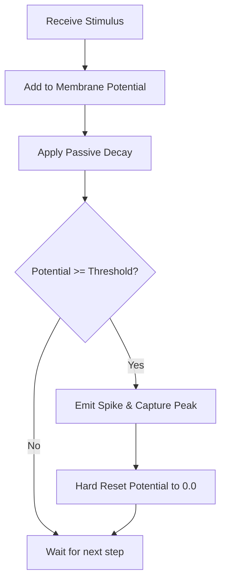
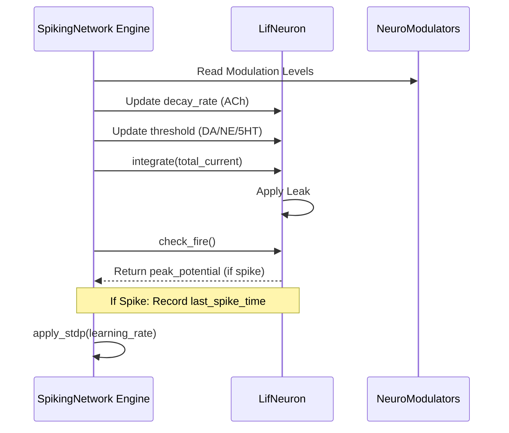

<details>
<summary>Relevant source files</summary>

The following files were used as context for generating this wiki page:

- [src/lif.rs](src/lif.rs)
- [examples/basic_lif.rs](examples/basic_lif.rs)
- [src/engine.rs](src/engine.rs)
- [src/lib.rs](src/lib.rs)
- [benches/neuron_bench.rs](benches/neuron_bench.rs)
- [README.md](README.md)
</details>

# Leaky Integrate-and-Fire (LIF) Model

The Leaky Integrate-and-Fire (LIF) model in the `neuromod` crate is a foundational spiking neural network (SNN) primitive designed to simulate the physical properties of biological neurons. It operates as a reactive computational unit that integrates incoming stimuli, applies a passive leak (decay) over time, and generates a discrete spike when the membrane potential exceeds a specific threshold. 

Sources: [src/lif.rs:46-51](src/lif.rs#L46-L51), [src/lib.rs:5-10](src/lib.rs#L5-L10), [README.md:92-96](README.md#L92-L96)

Within the `neuromod` architecture, the LIF model serves as the primary processing bank for the `SpikingNetwork`. It is utilized for fast, reactive dynamics and is highly susceptible to reward-modulated plasticity (STDP) and neuromodulation, allowing the network to adapt its firing thresholds and synaptic weights based on environmental signals like dopamine and acetylcholine.

Sources: [src/engine.rs:21-23](src/engine.rs#L21-L23), [src/engine.rs:77-90](src/engine.rs#L77-L90), [README.md:10-18](README.md#L10-L18)

## Core Architecture and Data Structure

The LIF model is implemented via the `LifNeuron` struct. It follows an RC circuit analogy where the membrane potential acts as a capacitor, the decay rate represents current leakage through a resistor, and the threshold simulates a breakdown voltage.

### LifNeuron Data Fields

| Field | Type | Description |
| :--- | :--- | :--- |
| `membrane_potential` | `f32` | The current accumulated charge state of the neuron. |
| `decay_rate` | `f32` | The fraction of potential lost per step (passive leak). |
| `threshold` | `f32` | The limit required to trigger an action potential. |
| `base_threshold` | `f32` | The resting threshold baseline used for dynamic modulation. |
| `last_spike` | `bool` | Boolean flag indicating if a spike occurred in the previous step. |
| `weights` | `Vec<f32>` | Synaptic weights for each input channel, learned via STDP. |
| `last_spike_time` | `i64` | The global timestep of the most recent spike event. |

Sources: [src/lif.rs:52-67](src/lif.rs#L52-L67), [src/engine.rs:77-90](src/engine.rs#L77-L90)

## Functional Logic and Dynamics

The LIF neuron operates through two primary phases: **Integration** and **Firing Check**. During integration, the neuron adds input stimuli (modified by synaptic weights and neuromodulators) to its current membrane potential and then applies a decay factor.

### The Integration Step
The logic follows the formula: `v = (v + stimulus) * (1 - decay_rate)`. In the `SpikingNetwork` engine, this stimulus is further influenced by predictive errors and a "stress multiplier" derived from norepinephrine levels.

Sources: [src/lif.rs:88-97](src/lif.rs#L88-L97), [src/engine.rs:114-126](src/engine.rs#L114-L126)

### Firing and Reset
A spike is detected if `membrane_potential >= threshold`. Upon firing, the neuron performs a **Hard Reset**, setting the `membrane_potential` back to `0.0`. This mimics the biological refractory period.



The diagram illustrates the standard lifecycle of a `LifNeuron` during a single simulation step.
Sources: [src/lif.rs:103-111](src/lif.rs#L103-L111), [examples/basic_lif.rs:37-55](examples/basic_lif.rs#L37-L55)

## Network Integration and Neuromodulation

In a `SpikingNetwork`, multiple `LifNeuron` instances are managed in a bank. The network engine dynamically adjusts LIF parameters every step based on the state of `NeuroModulators`.

### Modulator Effects on LIF
| Modulator | Target Parameter | Effect |
| :--- | :--- | :--- |
| **Acetylcholine** | `decay_rate` | High levels reduce decay, increasing temporal integration. |
| **Dopamine** | `threshold` / `weights` | Lowers global target threshold and scales STDP learning rate. |
| **Norepinephrine** | `threshold` | Increases global target threshold (arousal/stress response). |
| **Serotonin** | `threshold` | Lowers global target threshold. |

Sources: [src/engine.rs:81-90](src/engine.rs#L81-L90), [src/engine.rs:205-230](src/engine.rs#L205-L230)

### Sequence of Operation
The following sequence diagram shows how the `SpikingNetwork` engine interacts with `LifNeuron` during the `step` function.



Sources: [src/engine.rs:71-150](src/engine.rs#L71-L150), [src/lib.rs:25-30](src/lib.rs#L25-L30)

## Performance Benchmarking

Performance of the LIF model is critical for large-scale simulations. The `neuron_bench` suite measures specific operations to ensure the model remains the fastest available primitive in the crate.

*  **lif_integrate**: Measures the overhead of charge addition and leak calculation.
*  **lif_check_fire**: Measures threshold comparison and reset logic.
*  **lif_full_step**: Benchmarks the combined integration and firing cycle.

LIF neurons are significantly faster than biophysically detailed models like Hodgkin-Huxley due to their simplified linear dynamics.

Sources: [benches/neuron_bench.rs:7-46](benches/neuron_bench.rs#L7-L46), [benches/README.md:65-75](benches/README.md#L65-L75)

## Usage Example

The following snippet demonstrates manual interaction with a `LifNeuron` outside of the network engine.

```rust
use neuromod::LifNeuron;

let mut neuron = LifNeuron::new();
// Simulate a pulsed input
let stimulus = 0.08; 
neuron.integrate(stimulus);

if let Some(peak) = neuron.check_fire() {
    println!("SPIKE! Peak potential: {}", peak);
} else {
    println!("Potential: {}", neuron.membrane_potential);
}
```

Sources: [examples/basic_lif.rs:12-45](examples/basic_lif.rs#L12-L45)

The Leaky Integrate-and-Fire model provides a balance between computational efficiency and biological plausibility, serving as the workhorse for high-performance spiking neural network simulations within the `neuromod` ecosystem.
