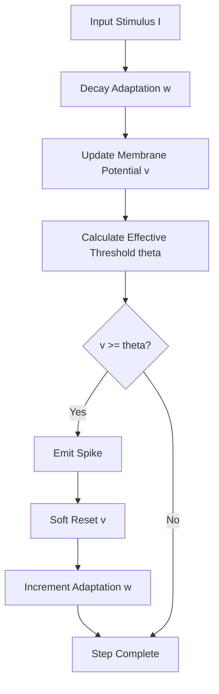
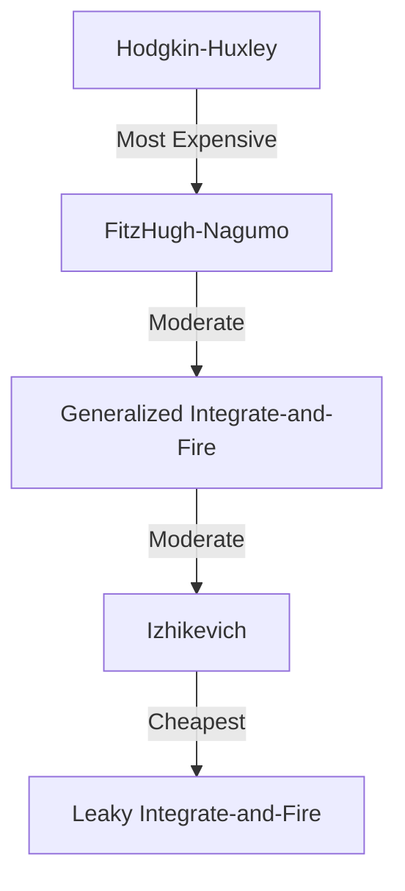

<details>
<summary>Relevant source files</summary>

The following files were used as context for generating this wiki page:

- [src/gif.rs](src/gif.rs)
- [src/lib.rs](src/lib.rs)
- [README.md](README.md)
- [AGENTS.md](AGENTS.md)
- [benches/README.md](benches/README.md)
- [CHANGELOG.md](CHANGELOG.md)
</details>

# Generalized Integrate-and-Fire (GIF) Model

The Generalized Integrate-and-Fire (GIF) model is a biologically grounded spiking neuron primitive within the `neuromod` library. It extends classical Leaky Integrate-and-Fire (LIF) dynamics by incorporating a spike-driven adaptation variable. This mechanism enables the model to simulate complex neuronal behaviors such as spike-frequency adaptation by dynamically raising the firing threshold and exerting a hyperpolarizing pull on the membrane potential.

Within the project, the GIF model serves as a core component for building spiking neural networks (SNNs) that require more detailed temporal dynamics than basic integrate-and-fire models. It is designed to be topology-neutral, allowing it to be integrated into various network architectures via the `SpikingNetwork` engine.

Sources: [src/gif.rs:1-12](src/gif.rs#L1-L12), [README.md:1-15](README.md#L1-L15), [AGENTS.md:12-20](AGENTS.md#L12-L20)

## Architecture and Dynamics

The GIF model is implemented as the `GifNeuron` struct. It manages several state variables and parameters that govern its integration and spiking logic. Unlike simpler models, the GIF neuron uses a "soft reset" mechanism: when a spike occurs, a fraction of the effective threshold is subtracted from the membrane potential rather than clamping it to a hard zero. This preserves supra-threshold drive across spikes.

### Mathematical Logic
The discrete-step integration logic follows these equations:
1.  **Adaptation Decay**: $w \leftarrow w \cdot \text{adaptation\_decay}$
2.  **Membrane Update**: $v \leftarrow v \cdot \text{leak} + I \cdot \text{drive\_scale} - w \cdot \text{adaptation\_coupling}$
3.  **Effective Threshold**: $\theta_{eff} = \text{base\_threshold} + w \cdot \text{adaptation\_scale}$
4.  **Spike Condition**: If $v \geq \theta_{eff}$, a spike is emitted, and the state is updated:
  *  $v \leftarrow v - \theta_{eff} \cdot \text{reset\_ratio}$
  *  $w \leftarrow w + \text{adaptation\_increment}$

Sources: [src/gif.rs:12-25](src/gif.rs#L12-L25), [src/gif.rs:114-124](src/gif.rs#L114-L124)

### Data Flow Diagram

The following diagram illustrates the internal processing loop of a single GIF neuron step.



This diagram represents the logic found in the `integrate` and `check_for_spike` methods.
Sources: [src/gif.rs:113-138](src/gif.rs#L113-L138)

## Data Structures and Configuration

The `GifNeuron` struct contains the full state and parameterization for the model. It implements `Default`, `Serialize`, and `Deserialize`, allowing for persistent state and standard configuration.

### GifNeuron Fields
| Field | Type | Description |
| :--- | :--- | :--- |
| `membrane_potential` | `f32` | Current membrane potential `v`. |
| `adaptation` | `f32` | Spike-triggered adaptation variable `w`. |
| `leak` | `f32` | Passive membrane retention per step. |
| `drive_scale` | `f32` | Scaling factor for incoming stimulus. |
| `threshold` | `f32` | Runtime-mutable effective firing threshold. |
| `base_threshold` | `f32` | Baseline resting threshold $\theta_0$. |
| `adaptation_scale` | `f32` | Magnitude of threshold inflation by `w`. |
| `adaptation_decay` | `f32` | Exponential decay rate for `w`. |
| `adaptation_coupling`| `f32` | Hyperpolarizing pull strength on `v` by `w`. |
| `adaptation_increment`| `f32` | Jump added to `w` per spike. |
| `reset_ratio` | `f32` | Fraction of $\theta_{eff}$ subtracted on spike (0.0 to 1.0). |
| `weights` | `Vec<f32>` | Synaptic weights for input channels. |

Sources: [src/gif.rs:36-70](src/gif.rs#L36-L70)

### Default Parameters
The default configuration is tuned for ternary-spike driven hidden layers, mirroring configurations from production pipelines.

```rust
// src/gif.rs:73-88
impl Default for GifNeuron {
    fn default() -> Self {
        Self {
            membrane_potential: 0.0,
            adaptation: 0.0,
            leak: 0.92,
            drive_scale: 0.75,
            threshold: 0.65,
            base_threshold: 0.65,
            adaptation_scale: 0.22,
            adaptation_decay: 0.94,
            adaptation_coupling: 0.05,
            adaptation_increment: 1.0,
            reset_ratio: 0.35,
            last_spike: false,
            weights: Vec::new(),
            last_spike_time: -1,
        }
    }
}
```

Sources: [src/gif.rs:73-88](src/gif.rs#L73-L88), [src/gif.rs:29-33](src/gif.rs#L29-L33)

## Key Implementation Methods

The GIF model exposes three primary methods to the `neuromod` engine and external callers.

### integrate(stimulus: f32)
Handles the temporal decay of adaptation and the integration of input current into the membrane potential. This method implements the passive dynamics of the neuron.
Sources: [src/gif.rs:113-118](src/gif.rs#L113-L118)

### check_for_spike(current_time: i64) -> bool
Performs the threshold comparison. If the membrane potential exceeds the effective threshold (which is the base threshold plus a component scaled by the current adaptation level), it triggers the soft reset and records the spike time.
Sources: [src/gif.rs:123-136](src/gif.rs#L123-L136)

### reset()
Clears the dynamic state variables (`membrane_potential` and `adaptation`) to zero while maintaining learned weights and calibrated threshold parameters.
Sources: [src/gif.rs:139-143](src/gif.rs#L139-L143)

## Performance Characteristics

Based on the project's benchmarking documentation, the GIF model represents a middle ground in computational complexity.



The GIF model is more computationally intensive than the standard `LifNeuron` due to the additional adaptation variable $w$ and the calculation of the dynamic effective threshold $\theta_{eff}$, but remains significantly faster than biophysically detailed models like Hodgkin-Huxley.

Sources: [benches/README.md:100-115](benches/README.md#L100-L115), [CHANGELOG.md:46-48](CHANGELOG.md#L46-L48)

## Integration Summary

The `GifNeuron` is integrated into the crate's root namespace and is available for use within the `SpikingNetwork` engine. It supports neuromodulation via the `threshold` field, which can be dynamically adjusted at runtime by neuromodulator signals such as dopamine or norepinephrine to affect firing sensitivity.

Sources: [src/lib.rs:37-45](src/lib.rs#L37-L45), [README.md:80-95](README.md#L80-L95)
