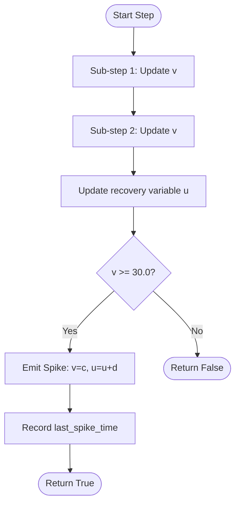
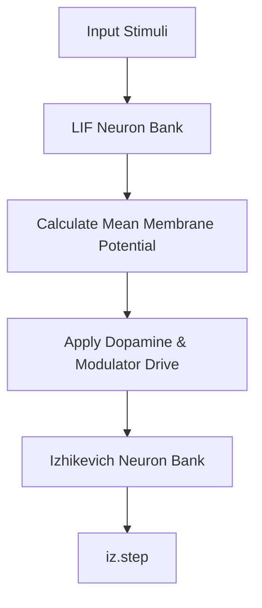

Relevant source files

The following files were used as context for generating this wiki page:

- [src/izhikevich.rs](src/izhikevich.rs)
- [src/engine.rs](src/engine.rs)
- [src/hebbian/classical.rs](src/hebbian/classical.rs)
- [src/lib.rs](src/lib.rs)
- [README.md](README.md)
- [benches/README.md](benches/README.md)

# Izhikevich Neuron Model

The Izhikevich Neuron Model within the `neuromod` crate is a biologically plausible implementation based on Eugene M. Izhikevich's 2003 research. It is designed to reproduce a wide variety of firing patterns—such as regular spiking, bursting, and chattering—using only two differential equations and four primary parameters. In the context of the `neuromod` library, it serves as a sophisticated adaptive alternative to simpler models like the [Lapicque Neuron Model](#lapicque-neuron-model) or standard Leaky Integrate-and-Fire (LIF) neurons.

Sources: [src/izhikevich.rs:1-8](src/izhikevich.rs#L1-L8), [src/lib.rs:1-12](src/lib.rs#L1-L12), [README.md:14-25](README.md#L14-L25)

## Mathematical Dynamics and State

The model acts as a programmable oscillator where the interaction between membrane potential ($v$) and a recovery variable ($u$) dictates the spike timing and adaptation. The implementation uses a half-step Euler method (two sub-steps per 1ms) to ensure numerical stability.

### State Variables and Parameters

The `IzhikevichNeuron` struct maintains the following state and parameters:

| Field | Type | Description |
| :--- | :--- | :--- |
| `v` | `f32` | Membrane potential in millivolts (mV). |
| `u` | `f32` | Membrane recovery variable providing negative feedback. |
| `last_spike_time` | `i64` | The global timestep of the most recent action potential. |
| `a` | `f32` | Time scale of the recovery variable `u`. |
| `b` | `f32` | Sensitivity of `u` to subthreshold fluctuations of `v`. |
| `c` | `f32` | After-spike reset value of membrane potential `v`. |
| `d` | `f32` | After-spike reset of recovery variable `u`. |

Sources: [src/izhikevich.rs:13-26](src/izhikevich.rs#L13-L26), [src/izhikevich.rs:105-110](src/izhikevich.rs#L105-L110)

### Logic Flow

The following diagram illustrates the numerical integration and spike detection logic within a single simulation step.

The update for `v` follows the equation: $v = v + 0.04v^2 + 5v + 140 - u + I$.
Sources: [src/izhikevich.rs:101-118](src/izhikevich.rs#L101-L118)

## Neuron Variants and Firing Patterns

The implementation provides several pre-configured constructors to mimic specific biological neuron types found in the cortex.

### Configuration Table

| Neuron Type | Parameter `a` | Parameter `b` | Parameter `c` | Parameter `d` | Description |
| :--- | :--- | :--- | :--- | :--- | :--- |
| **Regular Spiking (RS)** | 0.02 | 0.2 | -65.0 | 8.0 | Typical excitatory neuron with adaptation. |
| **Intrinsically Bursting (IB)** | 0.02 | 0.2 | -55.0 | 4.0 | Fires initial bursts; useful for pattern detection. |
| **Fast Spiking (FS)** | 0.1 | 0.2 | -65.0 | 2.0 | High-frequency inhibitory interneuron; no adaptation. |
| **Chattering (CH)** | 0.02 | 0.2 | -50.0 | 2.0 | Rhythmic high-frequency bursts. |
| **Low-Threshold (LTS)** | 0.02 | 0.25 | -65.0 | 2.0 | High sensitivity; good for anomaly detection. |

Sources: [src/izhikevich.rs:30-97](src/izhikevich.rs#L30-L97)

## Integration with SpikingNetwork

In the `neuromod` engine, Izhikevich neurons are typically managed in a secondary bank (`iz_neurons`) and are driven by the mean membrane potential of the primary LIF neuron bank combined with neuromodulatory signals.

The drive for Izhikevich neurons is calculated as: `(lif_mean * 20.0 + dopamine * 5.0).clamp(0.0, 15.0)`.
Sources: [src/engine.rs:32-34](src/engine.rs#L32-L34), [src/engine.rs:145-150](src/engine.rs#L145-L150)

## Plasticity and STDP

Izhikevich neurons are compatible with the classical Hebbian Spike-Timing-Dependent Plasticity (STDP) module. The `HebbianIzhikevichNetwork` structure manages a fully-connected matrix of these neurons, using `last_spike_time` to calculate $\Delta t$ for weight updates.

*  **Long-Term Potentiation (LTP):** Occurs when the pre-synaptic neuron fires before the post-synaptic neuron ($\Delta t > 0$).
*  **Long-Term Depression (LTD):** Occurs when the post-synaptic neuron fires before the pre-synaptic neuron ($\Delta t < 0$).

Sources: [src/hebbian/classical.rs:10-25](src/hebbian/classical.rs#L10-L25), [src/hebbian/classical.rs:55-75](src/hebbian/classical.rs#L55-L75)

## Performance Characteristics

Benchmark data indicates that while Izhikevich neurons are more computationally expensive than simple LIF models, they remain significantly faster than biophysically detailed models like Hodgkin-Huxley.

*  **Memory Footprint:** Each neuron struct occupies approximately 32 bytes of state.
*  **Step Complexity:** Requires two sub-step iterations for stability, resulting in an "intermediate" performance profile.
*  **Target Performance:** Designed to stay under 500 ns per step.

Sources: [benches/README.md:25-35](benches/README.md#L25-L35), [benches/README.md:75-90](benches/README.md#L75-L90)

## Summary

The Izhikevich Neuron Model provides the `neuromod` library with a flexible, adaptive substrate capable of complex temporal coding. By exposing the `a`, `b`, `c`, and `d` parameters, it allows the `SpikingNetwork` to simulate diverse cortical behaviors while maintaining high performance through efficient numerical integration. Its native support for `last_spike_time` makes it a primary candidate for projects requiring unsupervised learning via Hebbian STDP.

Sources: [src/izhikevich.rs:1-12](src/izhikevich.rs#L1-L12), [src/engine.rs:145-155](src/engine.rs#L145-L155)
