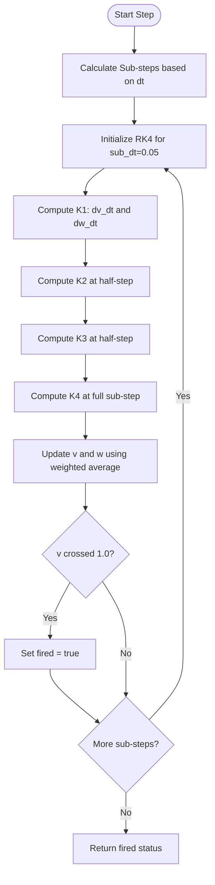
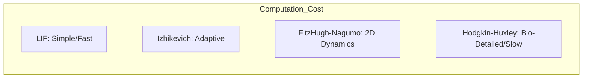

<details>
<summary>Relevant source files</summary>

The following files were used as context for generating this wiki page:

- [src/fitzhugh_nagumo.rs](src/fitzhugh_nagumo.rs)
- [src/lib.rs](src/lib.rs)
- [README.md](README.md)
- [AGENTS.md](AGENTS.md)
- [benches/neuron_bench.rs](benches/neuron_bench.rs)
- [benches/README.md](benches/README.md)
- [CHANGELOG.md](CHANGELOG.md)
</details>

# FitzHugh-Nagumo Model

The FitzHugh-Nagumo (FHN) model is a classic 2D relaxation oscillator implemented in the `neuromod` crate as a simplified reduction of the [Hodgkin-Huxley Model](#hodgkin-huxley-model). It captures essential excitable dynamics—such as threshold behavior, refractoriness, and oscillatory firing—using only two dimensionless variables. This makes it computationally more efficient than the biophysically detailed Hodgkin-Huxley model while remaining more biologically grounded than simpler models like the [Leaky Integrate-and-Fire (LIF)](#lif-neuron).

Within the `neuromod` project, the FHN model serves as a biologically plausible neuron primitive for spiking neural networks (SNNs). It is exposed through the `FitzHughNagumoNeuron` struct, providing developers with a middle-ground option for simulations that require qualitative neuronal dynamics without the high computational cost of full ionic current modeling.
Sources: [src/fitzhugh_nagumo.rs:1-12](src/fitzhugh_nagumo.rs#L1-L12), [src/lib.rs:18](src/lib.rs#L18), [README.md:16](README.md#L16), [AGENTS.md:14](AGENTS.md#L14)

## Model Architecture and Dynamics

The FHN model is defined by two coupled ordinary differential equations (ODEs). The first variable, `v`, represents a fast voltage-like activator, while the second, `w`, represents a slow recovery variable responsible for adaptation and refractoriness.
Sources: [src/fitzhugh_nagumo.rs:5-10](src/fitzhugh_nagumo.rs#L5-L10)

### Mathematical Equations
The implementation utilizes the following equations to update the neuron state:
- **Activator Update:** `dv/dt = v − v³/3 − w + I_app`
- **Recovery Update:** `dw/dt = ε · (v + a − b · w)`

Where:
- `v`: Membrane potential (fast activator).
- `w`: Recovery variable (slow adaptation).
- `I_app`: Applied input current.
- `a`, `b`: Nullcline parameters defining the stability and geometry of the phase plane.
- `ε` (epsilon): Timescale separation between the fast and slow variables.
Sources: [src/fitzhugh_nagumo.rs:12-38](src/fitzhugh_nagumo.rs#L12-L38)

### State Transitions
The following flowchart illustrates the internal logic for a single simulation step using 4th-order Runge-Kutta (RK4) integration.



The `step` function internally subdivides the provided `dt` into sub-steps of `0.05` for numerical stability. A spike is registered if the membrane potential `v` crosses the threshold of `+1.0` from below.
Sources: [src/fitzhugh_nagumo.rs:114-150](src/fitzhugh_nagumo.rs#L114-L150)

## Configuration and Regimes

The `FitzHughNagumoNeuron` can be configured into different operational regimes by adjusting its parameters, primarily `a`, `b`, and `epsilon`.

### Neuron Configurations
| Regime | Method | Parameters | Description |
| :--- | :--- | :--- | :--- |
| **Excitable** | `new()` | a=0.7, b=0.8, ε=0.08 | Stable fixed point; fires only when driven above threshold. |
| **Oscillatory** | `new_oscillatory()` | a=-0.1, b=0.5, ε=0.08 | Unstable fixed point; produces spontaneous limit-cycle oscillations. |
| **Adaptive** | `new_adaptive()` | a=0.7, b=0.5, ε=0.12 | Faster recovery (higher ε) and stronger adaptation. |

Sources: [src/fitzhugh_nagumo.rs:46-96](src/fitzhugh_nagumo.rs#L46-L96)

### Data Structure

```rust
#[derive(Clone, Serialize, Deserialize, Debug)]
pub struct FitzHughNagumoNeuron {
    pub v: f32,       // Membrane potential
    pub w: f32,       // Recovery variable
    pub epsilon: f32, // Timescale separation
    pub a: f32,       // Recovery nullcline shift
    pub b: f32,       // Recovery nullcline slope
}
```

Sources: [src/fitzhugh_nagumo.rs:26-38](src/fitzhugh_nagumo.rs#L26-L38)

## Analysis Utilities

The implementation provides several methods for analyzing the neuron's state and behavior within the phase plane.

### Nullcline Calculations
Nullclines are the sets of points where the derivatives are zero. Their intersection defines the fixed point (resting state) of the system.
- **v-nullcline:** `w = v − v³/3 + I`
- **w-nullcline:** `w = (v + a) / b`

The resting state is computed using Newton's method (50 iterations) to find the intersection of these nullclines at zero input.
Sources: [src/fitzhugh_nagumo.rs:99-112](src/fitzhugh_nagumo.rs#L99-L112), [src/fitzhugh_nagumo.rs:162-171](src/fitzhugh_nagumo.rs#L162-L171)

### Regime Detection and Firing Rates
The model includes automated checks for excitability based on the Hopf bifurcation condition:

```rust
pub fn is_excitable(&self) -> bool {
    let (v_fp, _) = Self::resting_state(self.a, self.b, 0.0);
    v_fp * v_fp > 1.0 - self.epsilon * self.b
}
```

Developers can also approximate the firing frequency under constant input current using the `firing_rate` method, which simulates the neuron over a specified `total_time` and counts threshold crossings.
Sources: [src/fitzhugh_nagumo.rs:176-193](src/fitzhugh_nagumo.rs#L176-L193)

## Performance Benchmarking

The FitzHugh-Nagumo model is benchmarked alongside other neuron models in the `neuromod` crate to quantify its computational efficiency. It is positioned as a "middle ground" between simple LIF models and complex Hodgkin-Huxley models.
Sources: [benches/neuron_bench.rs:80-87](benches/neuron_bench.rs#L80-L87), [benches/README.md:95-98](benches/README.md#L95-L98)



Sources: [benches/README.md:95-98](benches/README.md#L95-L98)

The benchmark suite includes `fitzhugh_nagumo_step`, which measures the time taken for a single call to `step` with standard parameters.
Sources: [benches/neuron_bench.rs:80-87](benches/neuron_bench.rs#L80-L87)

## Integration in SpikingNetwork

While individual FHN neurons can be used independently, they are integrated into the broader `neuromod` ecosystem. The crate's `SpikingNetwork` can include FHN neurons as primitives, allowing for heterogeneous networks where different dynamics are required for different neural layers.
Sources: [src/lib.rs:32](src/lib.rs#L32), [README.md:89](README.md#L89), [AGENTS.md:14](AGENTS.md#L14)

The FitzHugh-Nagumo model provides a critical balance for the `neuromod` crate: it offers more sophisticated phase-plane dynamics than integrate-and-fire models while maintaining the mathematical simplicity required for scaling neural simulations.
Sources: [src/fitzhugh_nagumo.rs:1-10](src/fitzhugh_nagumo.rs#L1-L10), [CHANGELOG.md:59](CHANGELOG.md#L59)
