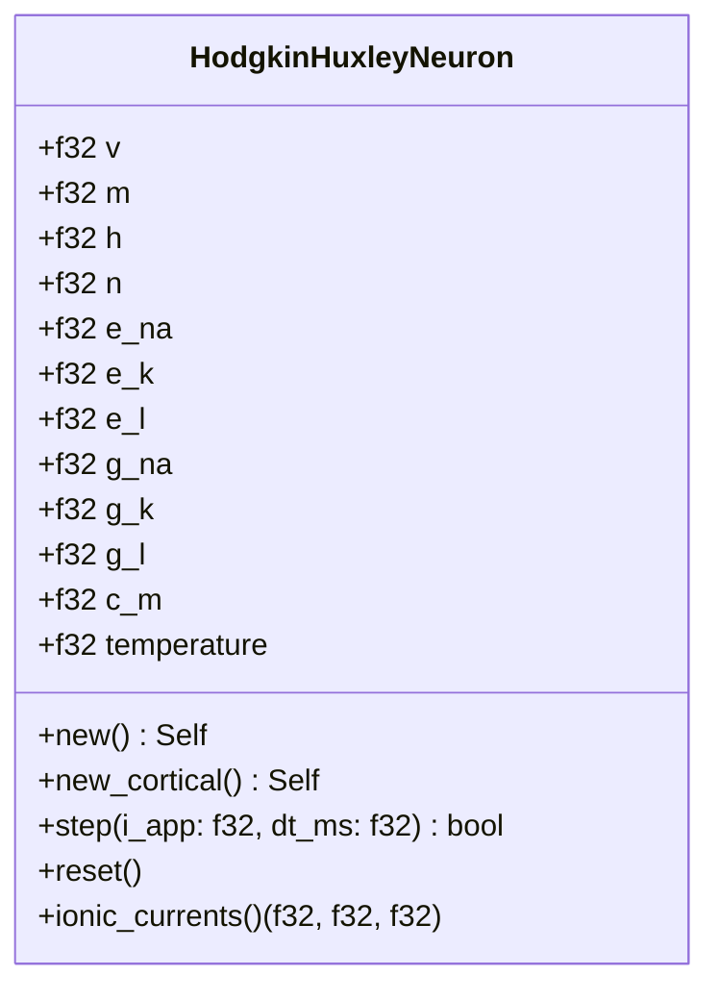
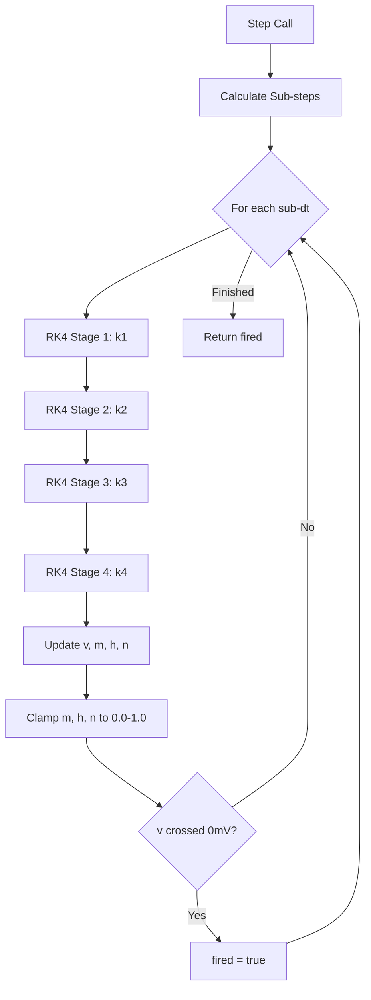

<details>
<summary>Relevant source files</summary>

The following files were used as context for generating this wiki page:

- [src/hodgkin\_huxley.rs](src/hodgkin_huxley.rs)
- [src/lib.rs](src/lib.rs)
- [README.md](README.md)
- [AGENTS.md](AGENTS.md)
- [benches/README.md](benches/README.md)
- [CHANGELOG.md](CHANGELOG.md)
</details>

# Hodgkin-Huxley Model

The Hodgkin-Huxley (HH) model implementation in the `neuromod` crate represents the biophysical gold standard for neuron dynamics. It explicitly models the ionic currents of sodium ($Na^+$), potassium ($K^+$), and leak channels using voltage-gated gating variables based on the original 1952 squid giant axon experiments. Within the `neuromod` ecosystem, the HH model serves as a high-fidelity primitive for spiking neural networks (SNNs), capturing complex action potential dynamics such as rapid upstroke, repolarization, and refractory periods.

Sources: [src/hodgkin\_huxley.rs:1-15](src/hodgkin\_huxley.rs#L1-L15), [AGENTS.md:12-16](AGENTS.md#L12-L16), [README.md:123-130](README.md#L123-L130)

## Architecture and Data Structures

The HH model is encapsulated within the `HodgkinHuxleyNeuron` struct. It maintains state variables for membrane potential and three gating variables ($m, h, n$), alongside biophysical parameters like reversal potentials and maximum conductances.

### The HodgkinHuxleyNeuron Struct

```rust
pub struct HodgkinHuxleyNeuron {
    pub v: f32,           // Membrane potential (mV)
    pub m: f32,           // Na+ activation (fast)
    pub h: f32,           // Na+ inactivation (slow)
    pub n: f32,           // K+ activation (slow)
    pub e_na: f32,        // Na+ reversal potential
    pub e_k: f32,         // K+ reversal potential
    pub e_l: f32,         // Leak reversal potential
    pub g_na: f32,        // Max Na+ conductance
    pub g_k: f32,         // Max K+ conductance
    pub g_l: f32,         // Leak conductance
    pub c_m: f32,         // Membrane capacitance
    pub temperature: f32, // Temperature (Celsius)
}
```

Sources: [src/hodgkin\_huxley.rs:55-83](src/hodgkin\_huxley.rs#L55-L83)

### Class Diagram
The following diagram illustrates the attributes and core methods of the `HodgkinHuxleyNeuron` implementation.



Sources: [src/hodgkin\_huxley.rs:55-325](src/hodgkin\_huxley.rs#L55-L325)

## Mathematical Foundations

The model solves the fundamental membrane current equation:
$C_m \cdot \frac{dV}{dt} = I_{app} - g_{Na} \cdot m^3 \cdot h \cdot (V - E_{Na}) - g_K \cdot n^4 \cdot (V - E_K) - g_L \cdot (V - E_L)$

Gating variables evolve according to:
$\frac{dx}{dt} = \phi \cdot (\alpha_x(V) \cdot (1 - x) - \beta_x(V) \cdot x)$ where $x \in \{m, h, n\}$ and $\phi$ is a $Q_{10}$ temperature scaling factor.

Sources: [src/hodgkin\_huxley.rs:18-25](src/hodgkin\_huxley.rs#L18-L25), [src/hodgkin\_huxley.rs:142-146](src/hodgkin\_huxley.rs#L142-L146)

### Rate Functions
The model implements the standard $\alpha$ and $\beta$ rate functions for squid axon kinetics:
- **$\alpha_m, \beta_m$**: Control sodium activation.
- **$\alpha_h, \beta_h$**: Control sodium inactivation.
- **$\alpha_n, \beta_n$**: Control potassium activation.

Sources: [src/hodgkin\_huxley.rs:154-206](src/hodgkin\_huxley.rs#L154-L206)

## Simulation Logic

The `step` function performs numerical integration using the 4th-order Runge-Kutta (RK4) method. To maintain stability with the "stiff" dynamics of the HH equations, the system internally subdivides the requested timestep into $0.01$ ms sub-steps.

### Integration Flow



Sources: [src/hodgkin\_huxley.rs:247-295](src/hodgkin\_huxley.rs#L247-L295)

## Configuration and Variants

The implementation provides two primary initialization paths to support different biological contexts.

| Parameter | Squid Giant Axon (`new`) | Mammalian Cortical (`new_cortical`) |
| :--- | :--- | :--- |
| **Resting $V$** | 0.0 mV (relative) | -65.0 mV (absolute) |
| **$E_{Na}$** | 115.0 mV (relative) | 50.0 mV (absolute) |
| **$E_{K}$** | -12.0 mV (relative) | -77.0 mV (absolute) |
| **$E_{L}$** | 10.6 mV (relative) | -54.387 mV (absolute) |
| **Temperature** | 6.3 °C | 37.0 °C |
| **$Q_{10}$ Factor** | 3.0 | 2.3 |

Sources: [src/hodgkin\_huxley.rs:89-110](src/hodgkin\_huxley.rs#L89-L110), [src/hodgkin\_huxley.rs:120-136](src/hodgkin\_huxley.rs#L120-L136), [src/hodgkin\_huxley.rs:222-225](src/hodgkin\_huxley.rs#L222-L225)

## Performance Characteristics

As the most biophysically detailed model in the `neuromod` library, the HH neuron is computationally expensive compared to simpler models like Leaky Integrate-and-Fire (LIF).

- **Complexity**: High (multiple gating variables and RK4 integration).
- **Memory Overhead**: Approximately 120 bytes per neuron.
- **Optimization**: Targeted for < 5% modulation overhead in network simulations.

Sources: [benches/README.md:30-45](benches/README.md#L30-L45), [benches/README.md:95-105](benches/README.md#L95-L105)

## Conclusion

The Hodgkin-Huxley model provides `neuromod` with the capability to simulate neurons with maximum biophysical realism. By separating the core neuron dynamics in `src/hodgkin_huxley.rs` from learning rules (like STDP) and network topology, the crate allows for high-fidelity research into the effects of ion channel kinetics and temperature on neural computation.

Sources: [src/hodgkin\_huxley.rs:30-50](src/hodgkin\_huxley.rs#L30-L50), [CHANGELOG.md:46-50](CHANGELOG.md#L46-L50)
