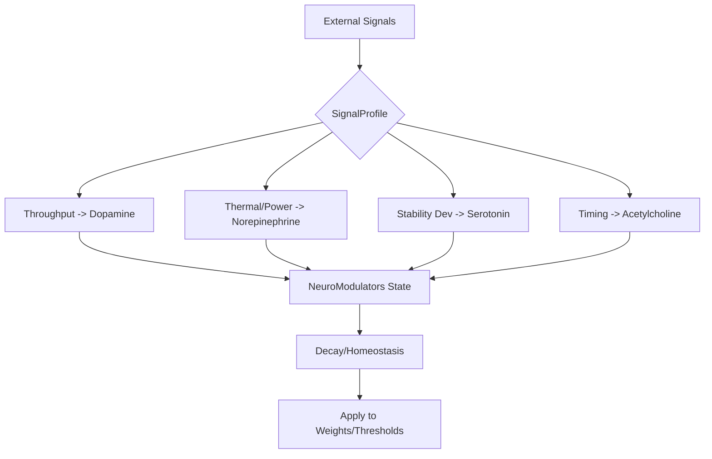
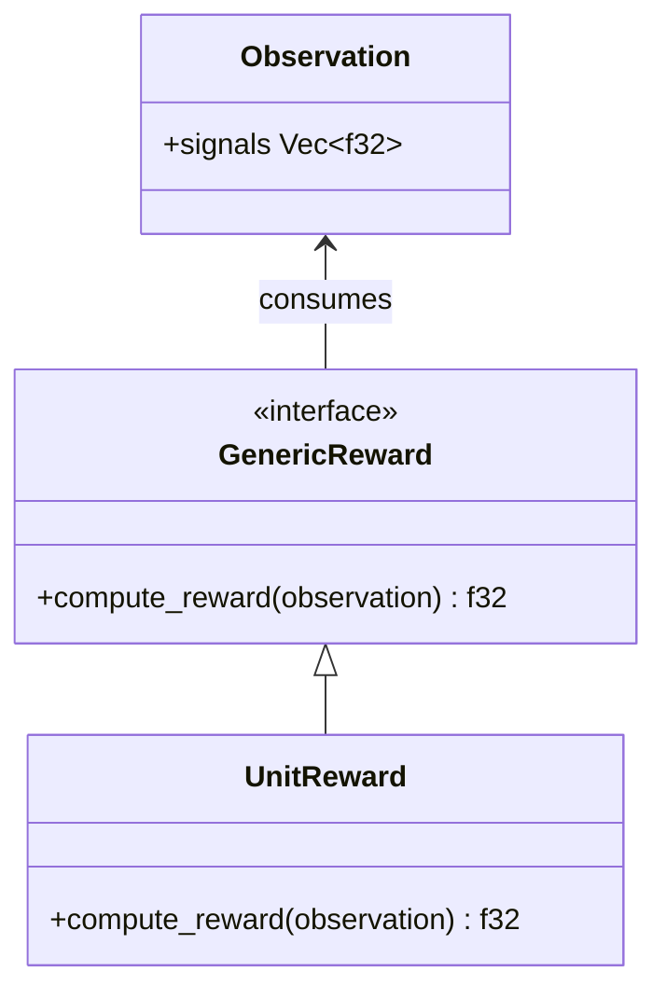

<details>
<summary>Relevant source files</summary>

The following files were used as context for generating this wiki page:

- [src/modulators.rs](src/modulators.rs)
- [README.md](README.md)
- [src/engine.rs](src/engine.rs)
- [CHANGELOG.md](CHANGELOG.md)
- [examples/rstdp_demo.rs](examples/rstdp_demo.rs)
- [src/lib.rs](src/lib.rs)
</details>

# Neuromodulators API

The Neuromodulators API within the `neuromod` crate provides a biologically grounded system for controlling network dynamics through four primary chemical signals: dopamine, serotonin, acetylcholine, and norepinephrine. This system enables reward-modulated learning, focus-based decay adjustment, and stress-responsive threshold scaling across the various [Neuron Models](src/lib.rs).

The API facilitates the mapping of external environmental or hardware signals into internal modulator levels, which then influence synaptic weights and firing thresholds during the network's execution cycle. It acts as the core interface for domain-specific reward shaping and homeostatic regulation within the spiking neural network.

Sources: [src/modulators.rs:1-125](src/modulators.rs#L1-L125), [README.md:100-125](README.md#L100-L125), [AGENTS.md:15-25](AGENTS.md#L15-L25)

## Core Data Structures

### NeuroModulators
The central structure representing the chemical state of the system. It tracks the levels of four key neuromodulators, typically clamped between 0.0 and 1.0.

| Field | Type | Description |
|-------|------|-------------|
| `dopamine` | `f32` | Primary reward signal; enables STDP learning and adjusts thresholds. |
| `serotonin` | `f32` | Stability/mood signal; computed from stability targets. |
| `acetylcholine` | `f32` | Focus signal; adjusts neuron decay rates. |
| `norepinephrine` | `f32` | Arousal/stress signal; reduces sensitivity and increases thresholds. |

Sources: [src/modulators.rs:85-94](src/modulators.rs#L85-L94), [src/engine.rs:60-75](src/engine.rs#L60-L75)

### SignalProfile
Defines the scaling and normalization factors used to convert raw input signals (such as thermal or power data) into neuromodulator levels.

```rust
pub struct SignalProfile {
    pub throughput_scale: f32,
    pub thermal_threshold: f32,
    pub power_baseline: f32,
    pub power_scale: f32,
    pub timing_scale: f32,
    pub stability_target: f32,
}
```

Sources: [src/modulators.rs:10-21](src/modulators.rs#L10-L21)

## Modulator Dynamics and Flow

The neuromodulation process involves converting external observations into chemical levels, applying homeostatic decay, and then using those levels to modify the physical parameters of the network.

### Signal Processing Flow
The following diagram illustrates how raw signals are transformed into the `NeuroModulators` state.



Sources: [src/modulators.rs:105-140](src/modulators.rs#L105-L140), [src/engine.rs:80-100](src/engine.rs#L80-L100)

### Homeostatic Decay
Modulators naturally decay over time to simulate biological homeostasis. Each modulator has a specific constant defined in the system.

| Modulator | Decay Constant | Source File |
|-----------|----------------|-------------|
| Dopamine | 0.95 | `src/modulators.rs:3` |
| Serotonin | 0.92 | `src/modulators.rs:4` |
| Acetylcholine | 0.99 | `src/modulators.rs:5` |
| Norepinephrine | 0.90 | `src/modulators.rs:6` |

Sources: [src/modulators.rs:3-6](src/modulators.rs#L3-L6), [src/modulators.rs:142-148](src/modulators.rs#L142-L148)

## Reward Shaping Interface

The API provides a generic interface for downstream crates to implement domain-specific reward logic.

### GenericReward and Observation
The `GenericReward` trait allows the system to compute dopamine increments from an `Observation` bag.



Sources: [src/modulators.rs:64-83](src/modulators.rs#L64-L83)

## Integration with SpikingNetwork

The `SpikingNetwork` uses the `NeuroModulators` state during every `step()` to dynamically adjust neuron behavior.

1.  **Decay Rate Tuning**: Acetylcholine reduces the `decay_rate` of LIF neurons (Target = $0.15 - 0.05 \times \text{Ach}$).
2.  **Threshold Modulation**: The firing threshold is influenced by all modulators to reach a `global_target`.
  *  $\text{Target} = 0.20 - (0.05 \times \text{Dopamine}) + (0.15 \times \text{Norepinephrine}) - (0.05 \times \text{Serotonin})$
3.  **STDP Gating**: Dopamine acts as a multiplier for the learning rate. If dopamine is below $1e-6$, STDP is effectively disabled.
4.  **Sensitivity**: High Norepinephrine applies a `stress_multiplier` that reduces the effectiveness of incoming current.

Sources: [src/engine.rs:88-110](src/engine.rs#L88-L110), [src/engine.rs:168-175](src/engine.rs#L168-L175), [examples/rstdp_demo.rs:60-100](examples/rstdp_demo.rs#L60-L100)

## API Methods Summary

| Method | Description |
|--------|-------------|
| `from_signals(profile, ...)` | Initializes modulators from raw f32 signals using a profile. |
| `add_reward(amount)` | Manually increments dopamine level (capped at 1.0). |
| `decay()` | Applies one step of homeostatic decay to all levels. |
| `apply_reward(reward, obs)` | Computes and adds reward via the `GenericReward` trait. |
| `is_aroused()` | Returns true if norepinephrine > 0.7. |
| `is_rewarded()` | Returns true if dopamine >= 0.5. |
| `is_focused()` | Returns true if acetylcholine > 0.6. |

Sources: [src/modulators.rs:105-185](src/modulators.rs#L105-L185), [CHANGELOG.md:38-45](CHANGELOG.md#L38-L45)

## Conclusion
The Neuromodulators API provides the chemical "context" necessary for adaptive behavior in the `neuromod` ecosystem. By abstracting biological chemical signals into a generic `NeuroModulators` structure, the library allows for complex interactions between environmental feedback (rewards), internal focus states, and external stress factors, directly influencing the underlying mathematical models of neuron integration and synaptic plasticity.
