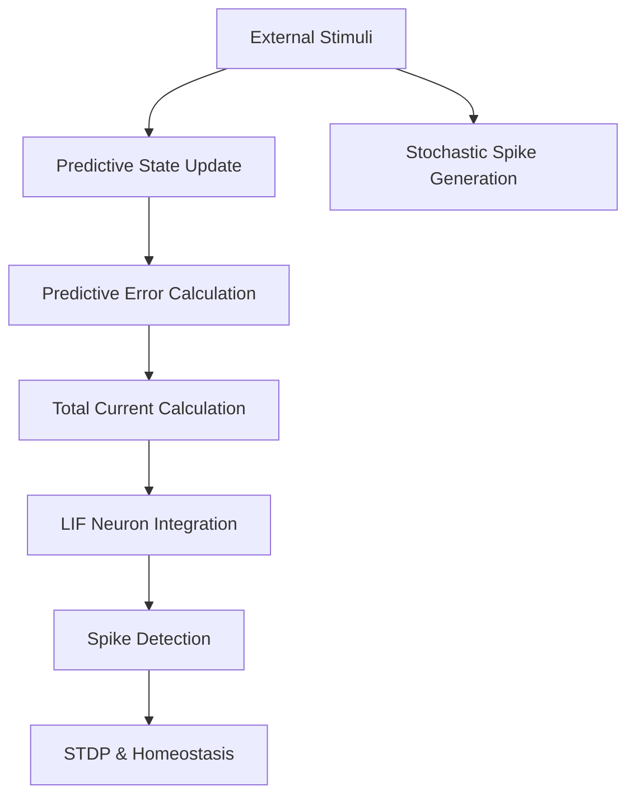
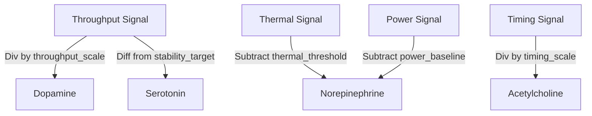

<details>
<summary>Relevant source files</summary>

The following files were used as context for generating this wiki page:

- [src/modulators.rs](src/modulators.rs)
- [src/engine.rs](src/engine.rs)
- [src/lib.rs](src/lib.rs)
- [src/hodgkin_huxley.rs](src/hodgkin_huxley.rs)
- [examples/rstdp_demo.rs](examples/rstdp_demo.rs)
- [README.md](README.md)
</details>

# Signal Processing

## Introduction

Signal Processing in the `neuromod` crate refers to the multi-stage transformation of external stimuli into neuronal activity and the subsequent translation of system signals into neuromodulatory states. This system bridges the gap between raw input data and biologically grounded neural dynamics, utilizing specialized structures to handle normalization, predictive error calculation, and reward shaping.

The pipeline involves mapping raw signals—such as thermal, power, and throughput data—into specific neuromodulator levels (dopamine, serotonin, acetylcholine, and norepinephrine) using a `SignalProfile`. Within the `SpikingNetwork` engine, these signals are further processed to calculate "surprise" (predictive error) and determine spike timing, which ultimately modulates synaptic weights and firing thresholds.

Sources: [src/modulators.rs:96-136](src/modulators.rs#L96-L136), [src/engine.rs:88-112](src/engine.rs#L88-L112), [README.md:16-25](README.md#L16-L25)

## Signal Normalization and Profiles

External signals are normalized using the `SignalProfile` structure. This configuration allows the system to scale domain-specific metrics (e.g., hardware throughput or timing) into the [0.0, 1.0] range required for the `NeuroModulators` system.

### Configuration Parameters

| Field | Description | Default |
|-------|-------------|---------|
| `throughput_scale` | Normalization divisor for dopamine levels. | 1.0 |
| `thermal_threshold` | Value above which thermal signals contribute to stress (norepinephrine). | 0.5 |
| `power_baseline` | Baseline load signal subtracted before stress scaling. | 0.0 |
| `power_scale` | Normalization divisor for power-based stress. | 1.0 |
| `timing_scale` | Normalization divisor for acetylcholine (focus). | 1.0 |
| `stability_target` | Target level for serotonin (stability) computation. | 1.0 |

Sources: [src/modulators.rs:9-24](src/modulators.rs#L9-L24), [src/modulators.rs:27-36](src/modulators.rs#L27-L36)

### Hardware Calibration

The system supports a legacy `hardware_calibrated()` profile for specific hardware environments, featuring non-standard scaling factors for thermal thresholds (83.0) and timing (2640.0).

Sources: [src/modulators.rs:40-49](src/modulators.rs#L40-L49)

## The Processing Pipeline

Signal processing occurs primarily during the `step` function of the `SpikingNetwork`. The flow converts stimuli into membrane currents and predictive states.



This diagram shows how input stimuli are processed through prediction and stochastic channels before affecting neuron integration. 
Sources: [src/engine.rs:88-142](src/engine.rs#L88-L142)

### Predictive State and Surprise

The engine maintains a `predictive_state` for each channel using an exponential moving average (EMA). Signal "surprise" or predictive error is calculated as the absolute difference between the current stimulus and the predicted state.

*  **Alpha (Smoothing):** 0.1
*  **Error Weight:** 0.5
*  **Formula:** `Total_Current = weights * (stimulus + (0.5 * surprise))`

Sources: [src/engine.rs:107-116](src/engine.rs#L107-L116), [src/engine.rs:128-132](src/engine.rs#L128-L132)

### Stochastic Signal Encoding

Stimuli are converted into temporal spikes using a stochastic process. If the absolute value of a stimulus exceeds 0.01, the engine generates a spike based on a random roll against the signal intensity. This time-stamps the input for Spike-Timing-Dependent Plasticity (STDP) calculations.

Sources: [src/engine.rs:118-124](src/engine.rs#L118-L124)

## Neuromodulator Mapping

Signals are mapped to internal modulators through specific logic defined in `NeuroModulators::from_signals`.



The logic translates environmental performance metrics into biological signals.
Sources: [src/modulators.rs:103-128](src/modulators.rs#L103-L128)

### Modulation Logic

1.  **Dopamine:** Derived from normalized throughput.
2.  **Norepinephrine (Stress):** Represents the maximum of thermal stress and power stress.
3.  **Serotonin (Stability):** Inversely proportional to the deviation from the `stability_target`.
4.  **Acetylcholine (Focus):** Derived from normalized timing signals.

Sources: [src/modulators.rs:115-126](src/modulators.rs#L115-L126)

## Reward Processing and Observations

The `Observation` struct acts as a container for signal batches processed by a `GenericReward` implementation. This allows downstream crates to define custom signal processing logic for reward shaping.

```rust
pub trait GenericReward {
    fn compute_reward(&self, observation: &Observation) -> f32;
}
```

The `UnitReward` implementation provides a standard signal processing baseline by calculating the mean of all values in an `Observation`.

Sources: [src/modulators.rs:52-81](src/modulators.rs#L52-L81), [src/lib.rs:43-46](src/lib.rs#L43-L46)

## Biophysical Signal Integration (Hodgkin-Huxley)

In high-fidelity models like the `HodgkinHuxleyNeuron`, signal processing involves calculating ionic currents based on voltage-gated dynamics.

| Current Component | Calculation Logic |
|-------------------|-------------------|
| **Sodium (Na⁺)**  | $g_{Na} \cdot m^3 \cdot h \cdot (V - E_{Na})$ |
| **Potassium (K⁺)**| $g_K \cdot n^4 \cdot (V - E_K)$ |
| **Leak**  | $g_L \cdot (V - E_L)$ |

These currents are processed using 4th-order Runge-Kutta (RK4) integration to resolve the stiff differential equations governing the action potential.

Sources: [src/hodgkin_huxley.rs:188-193](src/hodgkin_huxley.rs#L188-L193), [src/hodgkin_huxley.rs:207-228](src/hodgkin_huxley.rs#L207-L228)

## Conclusion

Signal processing in `neuromod` is a hierarchical system. At the entry level, raw data is normalized via `SignalProfile`. In the core engine, signals are transformed into predictive errors and stochastic spikes. Finally, these processed signals drive the biophysical dynamics of neurons and modulate the learning rate of the network through the `NeuroModulators` system. This architecture ensures that the network's plasticity and firing behavior are tightly coupled to the input signal characteristics.
