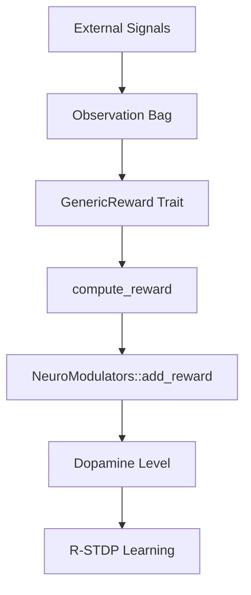
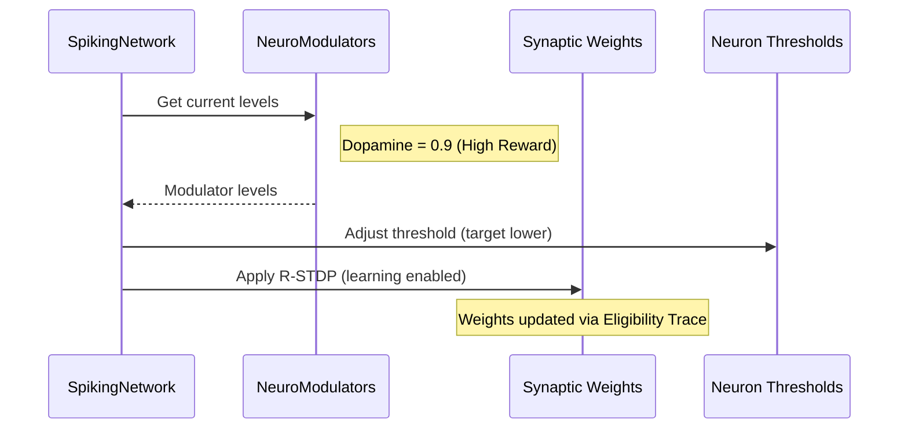

<details>
<summary>Relevant source files</summary>

The following files were used as context for generating this wiki page:

- [src/modulators.rs](src/modulators.rs)
- [README.md](README.md)
- [CHANGELOG.md](CHANGELOG.md)
- [src/engine.rs](src/engine.rs)
- [examples/rstdp_demo.rs](examples/rstdp_demo.rs)
- [src/rm_stdp.rs](src/rm_stdp.rs)
- [src/lib.rs](src/lib.rs)
</details>

# Reward Shaping Interfaces

The **Reward Shaping Interfaces** in `neuromod` provide a domain-agnostic framework for computing and injecting reinforcement signals into spiking neural networks. The system bridges external environment observations with internal neuromodulator levels—primarily dopamine—which in turn gates synaptic plasticity via Reward-Modulated Spike-Timing-Dependent Plasticity (R-STDP). This modular approach allows downstream crates to define specific reward logic while the core library handles the physiological application of those rewards to neuron dynamics.

Sources: [src/lib.rs:1-15](src/lib.rs#L1-L15), [src/modulators.rs:64-75](src/modulators.rs#L64-L75), [README.md:14-25](README.md#L14-L25)

## Core Data Structures and Traits

The reward system relies on three primary components: a container for environmental data (`Observation`), a trait for reward logic (`GenericReward`), and the primary modulation system (`NeuroModulators`).

### The Observation Bag
The `Observation` struct acts as a domain-agnostic "bag" for environmental signals. It contains a vector of floating-point values representing the current state of the external environment or task.

Sources: [src/modulators.rs:46-56](src/modulators.rs#L46-L56)

### GenericReward Trait
The `GenericReward` trait is the primary interface for reward shaping. It requires the implementation of a single method, `compute_reward`, which transforms an `Observation` into a scalar reward value (f32). This design allows the core engine to remain neutral regarding specific task topologies or reward criteria.

Sources: [src/modulators.rs:59-62](src/modulators.rs#L59-L62), [CHANGELOG.md:36-40](CHANGELOG.md#L36-L40)

### UnitReward
`UnitReward` is a standard implementation of `GenericReward` used for testing and baseline pipelines. It calculates the reward as the mean of all signals present in an `Observation`.

Sources: [src/modulators.rs:65-75](src/modulators.rs#L65-L75)

| Component | Description | Primary File |
| :--- | :--- | :--- |
| `Observation` | A container for external signal vectors used in reward calculation. | `src/modulators.rs` |
| `GenericReward` | A trait for defining domain-specific reward logic. | `src/modulators.rs` |
| `UnitReward` | A default implementation that computes the mean of signals. | `src/modulators.rs` |
| `NeuroModulators` | Manages levels of dopamine, serotonin, acetylcholine, and norepinephrine. | `src/modulators.rs` |

## Reward Processing Flow

The flow of information moves from external signals through the reward shaping interface and into the neuromodulator system. The `NeuroModulators` struct provides methods to directly apply rewards calculated via `GenericReward`.



The diagram above illustrates how environmental signals are transformed into dopamine levels to drive synaptic learning. 

Sources: [src/modulators.rs:136-138](src/modulators.rs#L136-L138), [examples/rstdp_demo.rs:125-132](examples/rstdp_demo.rs#L125-L132)

### Modulator Integration
Rewards are integrated into the `NeuroModulators` system through the `apply_reward` method. This method takes a generic implementation of `GenericReward` and an `Observation`, computes the resulting value, and increments the internal `dopamine` field (clamped at 1.0).

```rust
pub fn apply_reward<R: GenericReward>(&mut self, reward: &R, observation: &Observation) {
    self.add_reward(reward.compute_reward(observation));
}
```

Sources: [src/modulators.rs:123-126](src/modulators.rs#L123-L126), [src/modulators.rs:136-138](src/modulators.rs#L136-L138)

## Impact on Neuron Dynamics

Reward shaping directly influences network behavior through two mechanisms: synaptic weight updates and threshold stabilization.

### R-STDP and Dopamine Gating
Dopamine levels act as a learning rate multiplier. In the `SpikingNetwork::step` function, the `learning_rate` is calculated as `0.5 * self.modulators.dopamine`. If the dopamine level is low, eligibility traces (spikes recorded in `input_spike_times`) are not converted into permanent weight changes.

Sources: [src/engine.rs:72-73](src/engine.rs#L72-L73), [src/engine.rs:166-170](src/engine.rs#L166-L170), [src/rm_stdp.rs:8-15](src/rm_stdp.rs#L8-L15)

### Threshold Modulation
Neuromodulators also shift the firing thresholds of neurons. The `global_target` for a neuron's threshold is adjusted based on the current levels of dopamine, norepinephrine, and serotonin.

Sources: [src/engine.rs:79-82](src/engine.rs#L79-L82), [src/modulators.rs:160-165](src/modulators.rs#L160-L165)



The sequence above shows the internal network reaction to a high reward state provided by the interface.

Sources: [src/engine.rs:76-85](src/engine.rs#L76-L85), [examples/rstdp_demo.rs:65-75](examples/rstdp_demo.rs#L65-L75)

## Homeostasis and Signal Scaling

To prevent runaway excitation and maintain stability, the interface includes mechanisms for natural decay and signal normalization via `SignalProfile`.

### SignalProfile Parameters
The `SignalProfile` struct defines how external signals are normalized before they contribute to modulator levels.

| Parameter | Default | Description |
| :--- | :--- | :--- |
| `throughput_scale` | 1.0 | Divisor for normalizing throughput into dopamine. |
| `stability_target` | 1.0 | Target level for serotonin (stability) computation. |
| `thermal_threshold` | 0.5 | Threshold above which thermal signals contribute to stress (norepinephrine). |

Sources: [src/modulators.rs:11-23](src/modulators.rs#L11-L23)

### Modulator Decay
The `decay` method applies natural homeostasis to all modulator levels at every simulation step, ensuring that reward signals are transient.
*  **Dopamine Decay:** 0.95
*  **Serotonin Decay:** 0.92
*  **Acetylcholine Decay:** 0.99
*  **Norepinephrine Decay:** 0.90

Sources: [src/modulators.rs:3-6](src/modulators.rs#L3-L6), [src/modulators.rs:113-118](src/modulators.rs#L113-L118)

## Summary

The Reward Shaping Interfaces enable `neuromod` to function as a flexible, task-agnostic engine for spiking neural networks. By decoupling the environmental observation logic (`Observation`, `GenericReward`) from the physiological impact logic (`NeuroModulators`, `apply_neuromodulation`), the project provides a clean boundary for implementing reinforcement learning across various domains without modifying the core neural dynamics.

Sources: [README.md:104-112](README.md#L104-L112), [CHANGELOG.md:14-20](CHANGELOG.md#L14-L20)
