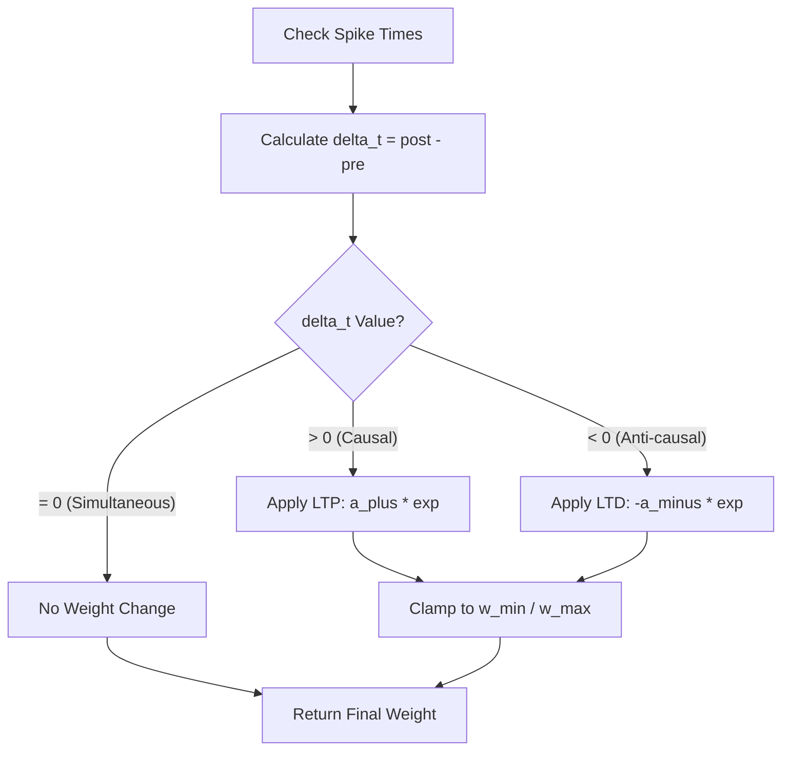
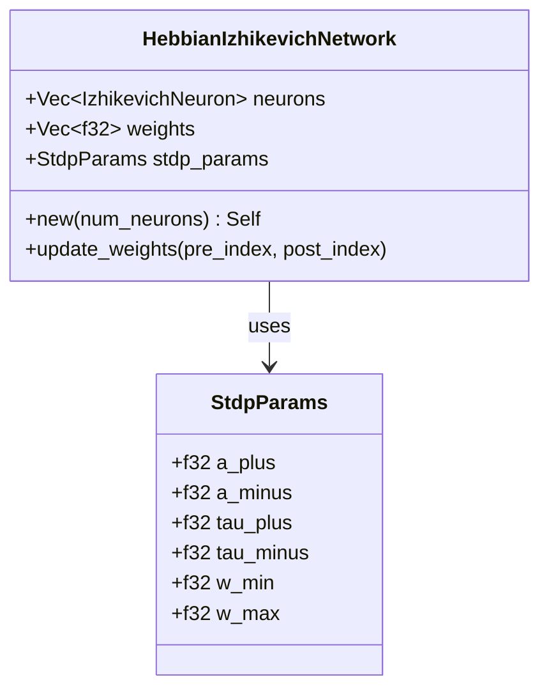

<details>
<summary>Relevant source files</summary>

The following files were used as context for generating this wiki page:

- [src/hebbian/classical.rs](src/hebbian/classical.rs)
- [src/hebbian/mod.rs](src/hebbian/mod.rs)
- [examples/hebbian_learning.rs](examples/hebbian_learning.rs)
- [src/rm_stdp.rs](src/rm_stdp.rs)
- [src/lib.rs](src/lib.rs)
- [benches/stdp_bench.rs](benches/stdp_bench.rs)
</details>

# Classical Hebbian STDP

Classical Hebbian Spike-Timing-Dependent Plasticity (STDP) in the `neuromod` library serves as the unmodulated foundation for synaptic learning. Based on Donald Hebb's 1949 principle that "neurons that fire together wire together," this module implements the mathematical rules for adjusting synaptic weights based on the precise millisecond-level timing of pre-synaptic and post-synaptic spikes. 

The implementation provides the core logic for Long-Term Potentiation (LTP) and Long-Term Depression (LTD) without the gating effects of neuromodulators like dopamine. It acts as the building block for more complex systems like [Reward-Modulated STDP](#rm-stdp).
Sources: [src/hebbian/classical.rs:1-15](src/hebbian/classical.rs#L1-L15), [src/hebbian/mod.rs:1-6](src/hebbian/mod.rs#L1-L6)

## Architecture and Core Logic

The system is centered around the calculation of `delta_t`, defined as the difference between the post-synaptic spike time and the pre-synaptic spike time ($ \Delta t = t_{post} - t_{pre} $).

### Synaptic Plasticity Rules
The weight change is determined by the following logic:
*  **Long-Term Potentiation (LTP):** Occurs when the pre-synaptic neuron fires shortly before the post-synaptic neuron ($\Delta t > 0$). This causal relationship increases synaptic efficiency.
*  **Long-Term Depression (LTD):** Occurs when the post-synaptic neuron fires before the pre-synaptic neuron ($\Delta t < 0$). This anti-causal relationship decreases synaptic efficiency.
*  **Clamping:** Weights are strictly maintained within defined minimum and maximum bounds to prevent runaway excitation or complete silencing.

Sources: [src/hebbian/classical.rs:47-60](src/hebbian/classical.rs#L47-L60), [examples/hebbian_learning.rs:88-100](examples/hebbian_learning.rs#L88-L100)

### Logic Flow Diagram



The diagram illustrates the decision matrix for synaptic weight updates based on spike timing.
Sources: [src/hebbian/classical.rs:56-66](src/hebbian/classical.rs#L56-L66)

## Components and Data Structures

### StdpParams
The `StdpParams` struct defines the hyperparameters governing the learning curve.

| Parameter | Type | Default Value | Description |
| :--- | :--- | :--- | :--- |
| `a_plus` | `f32` | 0.01 | Maximum amplitude for LTP (potentiation). |
| `a_minus` | `f32` | 0.012 | Maximum amplitude for LTD (depression). |
| `tau_plus` | `f32` | 20.0 | Time constant for LTP decay (in steps). |
| `tau_minus` | `f32` | 20.0 | Time constant for LTD decay (in steps). |
| `w_min` | `f32` | 0.0 | Minimum allowable synaptic weight. |
| `w_max` | `f32` | 2.0 | Maximum allowable synaptic weight. |

Sources: [src/hebbian/classical.rs:19-42](src/hebbian/classical.rs#L19-L42), [src/rm_stdp.rs:12-17](src/rm_stdp.rs#L12-L17)

### HebbianIzhikevichNetwork
A demonstration implementation that integrates classical STDP into a network of Izhikevich neurons. It maintains a flat synaptic weight matrix and tracks the `last_spike_time` for each neuron to perform updates.
Sources: [src/hebbian/classical.rs:72-78](src/hebbian/classical.rs#L72-L78)



The relationship between the network container and the plasticity hyperparameters.
Sources: [src/hebbian/classical.rs:72-88](src/hebbian/classical.rs#L72-L88)

## Implementation Details

The primary interface for applying plasticity is the `apply_classical_stdp` function. It calculates the exponential decay of the timing effect based on the provided time constants.

```rust
pub fn apply_classical_stdp(
    pre_spike_time: i64,
    post_spike_time: i64,
    current_weight: f32,
    params: &StdpParams,
) -> f32 {
    let delta_t = post_spike_time - pre_spike_time;
    let weight_change = if delta_t > 0 {
        params.a_plus * (-delta_t as f32 / params.tau_plus).exp()
    } else if delta_t < 0 {
        -params.a_minus * (delta_t as f32 / params.tau_minus).exp()
    } else {
        0.0
    };
    (current_weight + weight_change).clamp(params.w_min, params.w_max)
}
```

Sources: [src/hebbian/classical.rs:52-66](src/hebbian/classical.rs#L52-L66)

## Integration and Performance

Classical Hebbian STDP serves as the basis for the crate's more advanced reward-modulated learning. In reward-modulated scenarios, an `EligibilityTrace` is often used to store the potential weight change, which is only committed when a reward signal (e.g., dopamine) is present.

### Benchmark Analysis
Performance is critical as STDP updates scale quadratically ($O(N^2)$) in fully connected networks. Benchmarks indicate that LTP and LTD operations are typically sub-microsecond tasks.

*  **LTP/LTD Updates:** Calculated using exponential functions.
*  **Network Scaling:** Benchmarked across sizes of 10, 50, 100, and 200 neurons.
*  **Homeostasis:** The system supports weight budgeting where total synaptic weight sum is scaled to a target budget (e.g., 2.0).

Sources: [benches/stdp_bench.rs:8-91](benches/stdp_bench.rs#L8-L91), [src/engine.rs:166-175](src/engine.rs#L166-L175), [benches/README.md:65-71](benches/README.md#L65-L71)

## Summary
Classical Hebbian STDP provides the fundamental biological "wiring" rule for the `neuromod` crate. By quantifying the temporal relationship between spikes, it enables the network to learn causal patterns. While unmodulated on its own, its deterministic nature ensures stable LTP/LTD dynamics that can be safely extended by neuromodulation layers.
