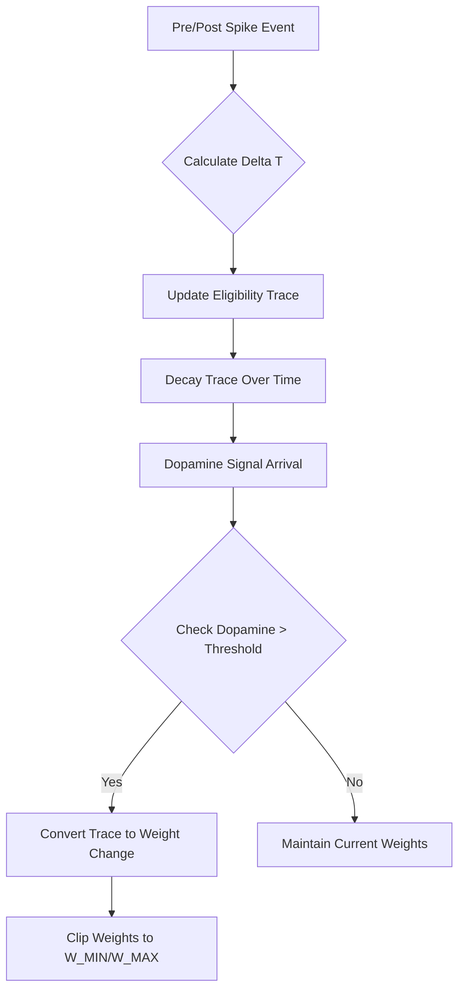
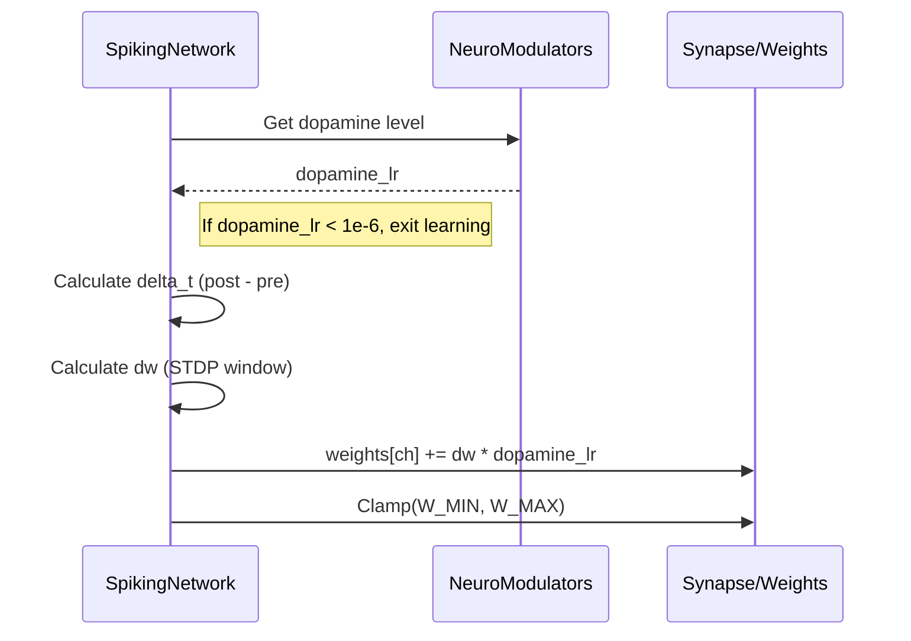

<details>
<summary>Relevant source files</summary>

The following files were used as context for generating this wiki page:

- [src/rm_stdp.rs](src/rm_stdp.rs)
- [examples/rstdp_demo.rs](examples/rstdp_demo.rs)
- [src/engine.rs](src/engine.rs)
- [src/modulators.rs](src/modulators.rs)
- [src/hebbian/classical.rs](src/hebbian/classical.rs)
- [src/lib.rs](src/lib.rs)
</details>

# Reward-Modulated STDP

Reward-Modulated Spike-Timing-Dependent Plasticity (R-STDP) is a reinforcement learning mechanism within the `neuromod` crate that gates synaptic changes based on third-factor neuromodulatory signals, primarily dopamine. Unlike classical [Hebbian STDP](#hebbian-classicalrs), which updates weights directly based on the timing of pre- and post-synaptic spikes, R-STDP utilizes an eligibility trace to bridge the temporal gap between neural activity and the arrival of a reward signal.

Sources: [src/rm_stdp.rs:1-10](src/rm_stdp.rs#L1-L10), [src/lib.rs:7-12](src/lib.rs#L7-L12)

## Core Architecture and Logic

The R-STDP system functions by decoupling spike-timing events from weight updates. When a pre-synaptic spike occurs shortly before a post-synaptic spike, it generates a potential for Long-Term Potentiation (LTP); conversely, the reverse timing generates potential for Long-Term Depression (LTD). These potentials are stored in an `EligibilityTrace` that decays over time.

The final weight change is only applied when the system's `NeuroModulators` reflect a reward state (dopamine levels). The magnitude of the update is proportional to the current eligibility trace value and the dopamine concentration.

Sources: [src/rm_stdp.rs:5-10](src/rm_stdp.rs#L5-L10), [src/engine.rs:136-160](src/engine.rs#L136-L160)

### The Learning Workflow

The process of learning via R-STDP follows a specific sequence of observation, trace accumulation, and modulated application:



*This diagram illustrates how spike timing events are cached in traces before being gated by dopamine signals.*

Sources: [src/rm_stdp.rs:5-10](src/rm_stdp.rs#L5-L10), [src/engine.rs:136-165](src/engine.rs#L136-L165), [examples/rstdp_demo.rs:56-75](examples/rstdp_demo.rs#L56-L75)

## Key Components

### Data Structures
The implementation relies on several specific structures to manage hyperparameters and temporal state:

| Component | Description |
| :--- | :--- |
| `EligibilityTrace` | Tracks the accumulated potential for weight change at a synapse. |
| `RmStdpConfig` | Configuration for hyperparameters like reward learning rate and clipping bounds. |
| `NeuroModulators` | The state of the system's global neuromodulators (Dopamine, Serotonin, etc.). |

Sources: [src/rm_stdp.rs:20-40](src/rm_stdp.rs#L20-L40), [src/modulators.rs:88-93](src/modulators.rs#L88-L93)

### Hyperparameters
The `neuromod` crate defines standard constants for R-STDP dynamics to ensure biological plausibility and network stability.

| Constant | Value | Description |
| :--- | :--- | :--- |
| `RM_STDP_TAU_PLUS` | 20.0 | LTP time constant (ms/steps). |
| `RM_STDP_TAU_MINUS` | 20.0 | LTD time constant (ms/steps). |
| `RM_STDP_A_PLUS` | 0.01 | Maximum LTP amplitude. |
| `RM_STDP_A_MINUS` | 0.012 | Maximum LTD amplitude (slightly stronger for stability). |
| `RM_STDP_W_MIN` | 0.0 | Minimum weight (prevents negative/inhibitory weights). |
| `RM_STDP_W_MAX` | 2.0 | Maximum weight (prevents runaway excitation). |

Sources: [src/rm_stdp.rs:12-17](src/rm_stdp.rs#L12-L17)

## Implementation Details

### Eligibility Trace Dynamics
The `EligibilityTrace` decays exponentially at each simulation step to prevent ancient spike events from influencing current rewards. This is managed by the `decay` method.

```rust
// src/rm_stdp.rs:43-51
impl EligibilityTrace {
    pub fn decay(&mut self) {
        let tau = self.tau.max(f32::EPSILON);
        self.value *= (-1.0 / tau).exp(); 
    }
}
```

Sources: [src/rm_stdp.rs:43-51](src/rm_stdp.rs#L43-L51)

### Modulated Weight Application
In the `SpikingNetwork::step` function, the `apply_stdp` method uses the dopamine learning rate to scale weight updates. If `dopamine_lr` is below a threshold (1e-6), the learning process is skipped entirely, representing a lack of reinforcement.



*Sequence of weight modulation during a network step.*

Sources: [src/engine.rs:136-160](src/engine.rs#L136-L160), [examples/rstdp_demo.rs:55-70](examples/rstdp_demo.rs#L55-L70)

## Integration with Neuromodulators

R-STDP is one part of a broader modulation system. While dopamine controls the gating of STDP, other modulators affect the physical properties of the neurons during the learning process:

*  **Dopamine**: Enables STDP learning and adjusts firing thresholds.
*  **Norepinephrine**: Reduces network sensitivity (stress response) by multiplying current and adjusting thresholds.
*  **Acetylcholine**: Adjusts decay rates (focus/memory) for LIF neurons.
*  **Serotonin**: Stabilizes firing thresholds.

Sources: [src/engine.rs:60-75](src/engine.rs#L60-L75), [src/modulators.rs:188-205](src/modulators.rs#L188-L205), [examples/rstdp_demo.rs:146-155](examples/rstdp_demo.rs#L146-L155)

## Summary

Reward-Modulated STDP in the `neuromod` crate provides a biologically grounded method for credit assignment. By utilizing eligibility traces and dopamine gating, it allows the network to learn which specific spike timings contributed to a successful outcome, even when the reward signal is delayed relative to the neural activity. This module is essential for implementing reinforcement learning in spiking neural architectures.

Sources: [src/rm_stdp.rs:5-10](src/rm_stdp.rs#L5-L10), [examples/rstdp_demo.rs:146-155](examples/rstdp_demo.rs#L146-L155)
