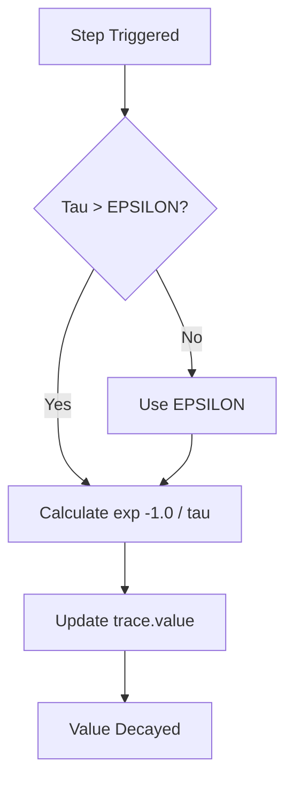
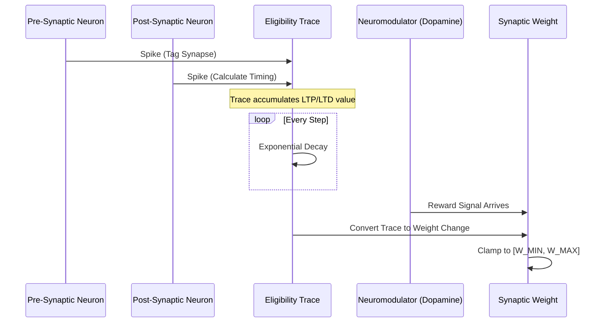

Relevant source files

The following files were used as context for generating this wiki page:

- [src/rm_stdp.rs](src/rm_stdp.rs)
- [src/engine.rs](src/engine.rs)
- [src/modulators.rs](src/modulators.rs)
- [benches/stdp_bench.rs](benches/stdp_bench.rs)
- [src/hebbian/classical.rs](src/hebbian/classical.rs)
- [README.md](README.md)

# Eligibility Traces

Eligibility Traces serve as a temporary memory mechanism within the `neuromod` library to bridge the temporal gap between neural activity and reward signals. In the context of Reward-Modulated Spike-Timing-Dependent Plasticity (R-STDP), synaptic weights do not update immediately upon a spike. Instead, the network records a trace of activity that "tags" a synapse as eligible for future modification. Sources: [src/rm_stdp.rs:4-7](src/rm_stdp.rs#L4-L7), [README.md:104](README.md#L104)

When a neuromodulatory reward signal (such as dopamine) subsequently arrives, these accumulated eligibility traces are converted into actual changes in synaptic weights. This mechanism allows the system to perform credit assignment, effectively "learning" which past actions led to a current reward. Sources: [src/rm_stdp.rs:7-8](src/rm_stdp.rs#L7-L8), [src/engine.rs:166-168](src/engine.rs#L166-L168)

## Core Data Structures

The system defines specific structures to track synaptic state and manage hyperparameters for modulated learning.

### EligibilityTrace Struct
The `EligibilityTrace` struct tracks the state of a single synapse. It accumulates values based on pre- and post-synaptic spike timing, where positive values typically represent potential Long-Term Potentiation (LTP) and negative values represent potential Long-Term Depression (LTD). Sources: [src/rm_stdp.rs:20-27](src/rm_stdp.rs#L20-L27)

| Field | Type | Description |
| :--- | :--- | :--- |
| `value` | `f32` | The current accumulation of the trace (positive for LTP, negative for LTD). |
| `tau` | `f32` | The time constant determining the rate of exponential decay (typically 50-100ms). |

Sources: [src/rm_stdp.rs:21-25](src/rm_stdp.rs#L21-L25)

### RmStdpConfig Struct
This configuration struct holds the hyperparameters required for R-STDP and eligibility trace management across the network. Sources: [src/rm_stdp.rs:30-40](src/rm_stdp.rs#L30-L40)

| Parameter | Type | Description |
| :--- | :--- | :--- |
| `tau_eligibility` | `f32` | Determines how long a trace lasts before decaying to zero. |
| `reward_lr` | `f32` | The learning rate for converting traces to weight changes upon reward. |
| `w_min` | `f32` | The lower bound for synaptic weights (default 0.0). |
| `w_max` | `f32` | The upper bound for synaptic weights (default 2.0). |

Sources: [src/rm_stdp.rs:32-39](src/rm_stdp.rs#L32-L39)

## Functional Logic and Dynamics

The eligibility trace follows an exponential decay model, ensuring that older neural events have a diminishing impact on current learning.

### Temporal Decay
The `decay` method must be called at each time step to reduce the trace value. It uses an exponential decay formula: $Value_{t} = Value_{t-1} \times e^{-1/\tau}$. To prevent numerical instability, the system ensures `tau` is at least `f32::EPSILON`. Sources: [src/rm_stdp.rs:44-51](src/rm_stdp.rs#L44-L51)

The diagram shows the logical flow of the `decay()` method ensuring mathematical safety before applying exponential decay. Sources: [src/rm_stdp.rs:46-50](src/rm_stdp.rs#L46-L50)

### Reward Conversion
While the `EligibilityTrace` struct maintains the memory, the actual weight update occurs in the `SpikingNetwork` engine. The engine checks the current level of dopamine (reward). If `dopamine_lr` is below a threshold ($1e^{-6}$), no learning occurs. If a reward is present, the accumulated timing data is used to adjust weights, clamped between `RM_STDP_W_MIN` and `RM_STDP_W_MAX`. Sources: [src/engine.rs:166-172](src/engine.rs#L166-L172), [src/rm_stdp.rs:16-17](src/rm_stdp.rs#L16-L17)

## Relationship to Classical STDP

Eligibility traces are the modulated extension of classical Hebbian learning. While classical STDP calculates immediate weight changes ($dw$) based on $\Delta t$ (post-spike time minus pre-spike time), the eligibility trace system holds this $dw$ in a buffer. Sources: [src/hebbian/classical.rs:56-66](src/hebbian/classical.rs#L56-L66), [src/rm_stdp.rs:6-8](src/rm_stdp.rs#L6-L8)

### Performance Benchmarking
Synaptic plasticity operations, specifically eligibility trace decay, are optimized for performance. Benchmarks indicate that trace decay is a simple multiplication operation designed to be sub-microsecond even in large-scale networks. Sources: [benches/stdp_bench.rs:31-40](benches/stdp_bench.rs#L31-L40), [benches/README.md:104-106](benches/README.md#L104-L106)

This diagram illustrates the lifecycle of an eligibility trace, from initial spike tagging to final weight modification gated by a neuromodulator. Sources: [src/rm_stdp.rs:4-8](src/rm_stdp.rs#L4-L8), [src/engine.rs:166-192](src/engine.rs#L166-L192), [src/modulators.rs:136-138](src/modulators.rs#L136-L138)

## Summary
Eligibility Traces provide the necessary temporal buffer for biologically plausible reinforcement learning in `neuromod`. By decoupling the discovery of a "good" synaptic timing from the actual reinforcement signal, the library enables complex credit assignment across spiking neural networks. Sources: [src/rm_stdp.rs:4-8](src/rm_stdp.rs#L4-L8), [examples/rstdp_demo.rs:165-170](examples/rstdp_demo.rs#L165-L170)
