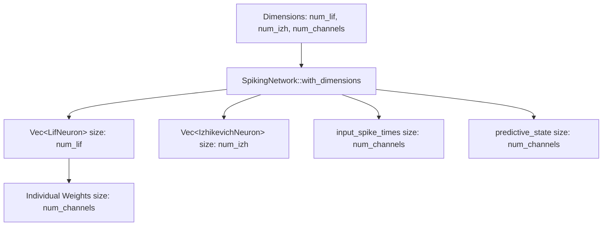

<details>
<summary>Relevant source files</summary>

The following files were used as context for generating this wiki page:

- [src/engine.rs](src/engine.rs)
- [README.md](README.md)
- [CHANGELOG.md](CHANGELOG.md)
- [src/lib.rs](src/lib.rs)
- [benches/memory_bench.rs](benches/memory_bench.rs)
- [tests/sentry_integration.rs](tests/sentry_integration.rs)
</details>

# Dynamic Network Sizing

Dynamic Network Sizing is a core architectural feature of the `neuromod` library that allows for the creation of spiking neural networks with arbitrary dimensions at runtime. Unlike static models, this system enables developers to define the number of neurons and input channels programmatically, facilitating research into varying network scales and topologies.

The feature was introduced in version 0.4.0 to move away from hardcoded domain topologies toward a topology-neutral initialization. This flexibility is achieved through specific constructor methods that allocate resources based on user-defined parameters rather than relying on library-wide constants.
Sources: [README.md:9-12](README.md#L9-L12), [CHANGELOG.md:46-47](CHANGELOG.md#L46-L47)

## Core Implementation

The primary entry point for dynamic sizing is the `SpikingNetwork::with_dimensions` function. This constructor initializes the network's internal banks of neurons and input buffers based on the requested counts for Leaky Integrate-and-Fire (LIF) neurons, Izhikevich neurons, and external input channels.

### Network Components Scaling
When a network is initialized dynamically, the following structures are sized accordingly:
*  **Neuron Banks**: The `neurons` (LIF) and `iz_neurons` (Izhikevich) vectors are populated to match the requested sizes.
*  **Synaptic Weights**: Each LIF neuron is initialized with a weight vector exactly matching the number of input channels.
*  **Input Buffers**: `input_spike_times` and `predictive_state` vectors are allocated to match the number of input channels.

Sources: [src/engine.rs:42-63](src/engine.rs#L42-L63), [src/engine.rs:24-37](src/engine.rs#L24-L37)

### Architecture Diagram
The following diagram illustrates how dimension parameters propagate through the `SpikingNetwork` structure during initialization.



The diagram shows the 1-to-N relationship between the network dimensions and its internal data structures.
Sources: [src/engine.rs:42-63](src/engine.rs#L42-L63)

## Initialization Methods

The library provides two ways to instantiate a network: a backward-compatible default and a fully dynamic constructor.

| Method | Parameters | Description |
| :--- | :--- | :--- |
| `new()` | None | Creates a network with 16 LIF neurons, 5 Izhikevich neurons, and 16 channels. |
| `with_dimensions(num_lif, num_izh, num_channels)` | `usize, usize, usize` | Allocates a network with specific counts for each component. |

Sources: [src/engine.rs:39-44](src/engine.rs#L39-L44), [README.md:10](README.md#L10), [tests/sentry_integration.rs:56-62](tests/sentry_integration.rs#L56-L62)

### Default vs. Dynamic Allocation
The default constructor `SpikingNetwork::new()` internally calls `with_dimensions` using the constant `crate::NUM_INPUT_CHANNELS` (defaulting to 16) for the channel count.
Sources: [src/engine.rs:40-42](src/engine.rs#L40-L42), [src/lib.rs:48-49](src/lib.rs#L48-L49)

## Validation and Safety

Dynamic sizing introduces the requirement for strict input validation during the simulation cycle. Because the network's input buffers and neuron weight vectors are sized at creation, the `step` function must verify that incoming stimuli match the expected dimensions.

### Step Contract
The `SpikingNetwork::step` function enforces a contract where `stimuli.len()` must equal `self.num_channels`. If a mismatch occurs, the system returns a `StepError::InputLenMismatch`. This ensures that the network does not attempt out-of-bounds memory access during the integration phase.

```rust
// Implementation of shape validation in src/engine.rs
if stimuli.len() != self.num_channels {
    return Err(StepError::InputLenMismatch {
        expected: self.num_channels,
        got: stimuli.len(),
    });
}
```

Sources: [src/engine.rs:69-75](src/engine.rs#L69-L75), [README.md:38-51](README.md#L38-L51)

### Data Flow and Validation Sequence
The sequence diagram below describes the validation process during a network update.

```mermaid
sequenceDiagram
    participant User as "User Code"
    participant Net as "SpikingNetwork"
    participant Engine as "Engine Logic"

    User->>Net: step(stimuli, modulators)
    Net->>Net: Check stimuli.len() == num_channels
    alt Length Mismatch
        Net-->>User: return Err(StepError)
    else Length Valid
        Net->>Engine: Process integration
        Engine-->>Net: Resulting spikes
        Net-->>User: return Ok(Vec&lt;usize&gt;)
    end
```

This diagram outlines the priority of dimension validation before any neural computation occurs.
Sources: [src/engine.rs:69-75](src/engine.rs#L69-L75), [tests/sentry_integration.rs:94-110](tests/sentry_integration.rs#L94-L110)

## Memory and Performance Considerations

Dynamic allocation impact is tracked via benchmarks to ensure scalability. Memory overhead is primarily determined by the weight matrices stored within each neuron, which scale linearly with the number of input channels.

*  **Weight Allocation**: Benchmarks show that weight vectors (e.g., 16 to 1024 elements) are a significant part of the memory footprint.
*  **Neuron Scaling**: Vector allocation for neurons (e.g., up to 1000 neurons) scales predictably during `with_dimensions` calls.

Sources: [benches/memory_bench.rs:66-93](benches/memory_bench.rs#L66-L93), [README.md:27-36](README.md#L27-L36)

### Summary of Sizing Impacts
| Component | Scaling Factor | Dependency |
| :--- | :--- | :--- |
| `SpikingNetwork::neurons` | O(N) | `num_lif` |
| `LifNeuron::weights` | O(C) | `num_channels` |
| `input_spike_times` | O(C) | `num_channels` |
| `global_step` | O(1) | Constant (i64) |

Sources: [src/engine.rs:24-37](src/engine.rs#L24-L37), [benches/memory_bench.rs:82-93](benches/memory_bench.rs#L82-L93)

## Conclusion

Dynamic Network Sizing transforms `neuromod` from a fixed-function simulator into a flexible research tool. By decoupling network geometry from the library's core logic and enforcing strict dimensional contracts, the system maintains high performance and safety while supporting diverse neural architectures. This capability is foundational for downstream crates in the Limen-Neural ecosystem that require specific topological configurations.
Sources: [README.md:6-12](README.md#L6-L12), [AGENTS.md:14-17](AGENTS.md#L14-L17)
