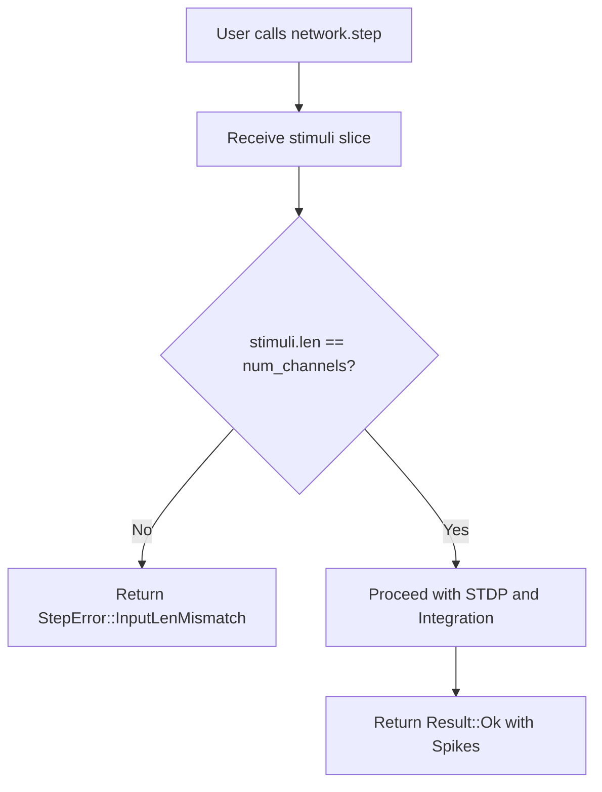
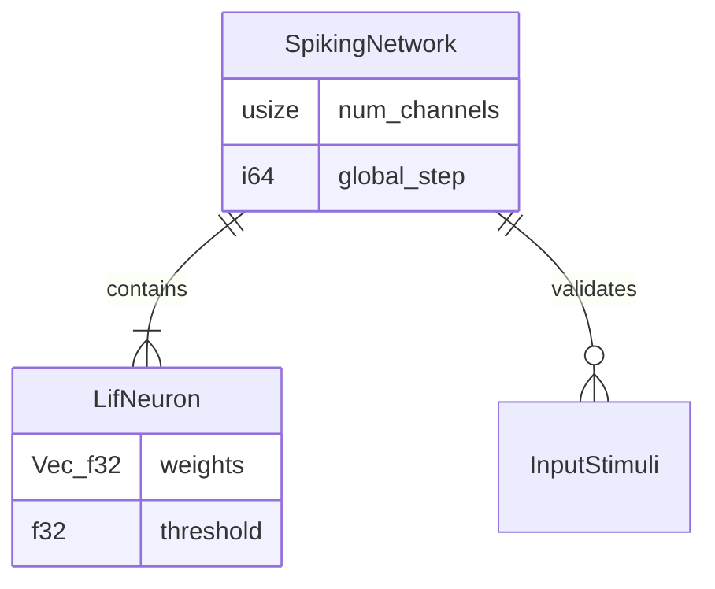

<details>
<summary>Relevant source files</summary>

The following files were used as context for generating this wiki page:

- [src/engine.rs](src/engine.rs)
- [README.md](README.md)
- [src/lib.rs](src/lib.rs)
- [src/modulators.rs](src/modulators.rs)
- [tests/sentry_integration.rs](tests/sentry_integration.rs)
- [CHANGELOG.md](CHANGELOG.md)
- [examples/basic.rs](examples/basic.rs)
</details>

# Step Contract & Shape Validation

The **Step Contract** is a fundamental operational protocol in the `neuromod` crate that ensures structural integrity and mathematical consistency during the execution of Spiking Neural Networks (SNNs). This system enforces strict shape validation between external input stimuli and the internal network configuration, specifically the number of defined input channels.

By validating data shapes at the entry point of the network's simulation loop, the system prevents runtime panics and undefined behavior resulting from index out-of-bounds errors or mismatched matrix operations. This validation is critical for the library's "topology-neutral" architecture, where networks can be dynamically sized at initialization.

Sources: [README.md:6-10](README.md#L6-L10), [src/engine.rs:49-53](src/engine.rs#L49-L53), [CHANGELOG.md:43-44](CHANGELOG.md#L43-L44)

## Input Shape Enforcement

The primary mechanism for shape validation is the `step` method within the `SpikingNetwork` struct. Every time the network processes a time step, it compares the length of the provided stimuli slice against the pre-configured `num_channels` attribute.

### Validation Logic Flow

When a user calls the `step` function, the engine performs an immediate check. If the lengths do not match, the function returns a `StepError` instead of proceeding with the simulation.



The diagram above illustrates the synchronous validation check that serves as a gatekeeper for the core SNN engine.

Sources: [src/engine.rs:55-62](src/engine.rs#L55-L62), [README.md:45-56](README.md#L45-L56)

### The StepError Enum

Errors are explicitly handled through a specialized enumeration, ensuring that callers can programmatically respond to validation failures.

| Error Variant | Field(s) | Description |
| :--- | :--- | :--- |
| `InputLenMismatch` | `expected: usize`, `got: usize` | Triggered when the input stimuli slice length does not match the network's defined input channels. |

Sources: [src/engine.rs:13-16](src/engine.rs#L13-L16), [README.md:52-56](README.md#L52-L56)

## Dynamic Dimensions and Initialization

Shape validation is tightly coupled with how a `SpikingNetwork` is initialized. Because `neuromod` supports dynamic sizing, the "expected" shape is established during the construction phase.

### Configuration Methods

A network's shape requirements are set using one of two primary constructors:

*  **`SpikingNetwork::new()`**: Initializes a default shape consisting of 16 LIF neurons, 5 Izhikevich neurons, and 16 input channels.
*  **`SpikingNetwork::with_dimensions(...)`**: Allows explicit definition of the number of LIF neurons, Izhikevich neurons, and input channels.

When using `with_dimensions`, the internal `neurons` vector is populated with LIF neurons whose individual weight vectors are initialized to the exact length of the `num_channels` parameter. This ensures that every neuron in the bank has a synaptic connection point for every validated input stimulus.

Sources: [src/engine.rs:35-53](src/engine.rs#L35-L53), [src/lib.rs:36-36](src/lib.rs#L36), [README.md:32-41](README.md#L32-L41)

### Data Structure Schema

The relationship between the validation attributes and the neuron banks is structured as follows:



This relationship shows that `num_channels` in the network must correspond exactly to the size of the `weights` vector in every `LifNeuron`.

Sources: [src/engine.rs:19-33](src/engine.rs#L19-L33), [src/engine.rs:43-48](src/engine.rs#L43-L48)

## Implementation Details

The implementation ensures that even if a validation error occurs, the internal state of the network (such as the `global_step` counter or `predictive_state`) remains unchanged, maintaining transactional integrity.

### Integration Logic Code Snippet
The following snippet from `src/engine.rs` demonstrates the exact point of validation:

```rust
// src/engine.rs:55-62
pub fn step(
    &mut self,
    stimuli: &[f32],
    modulators: &NeuroModulators,
) -> Result<Vec<usize>, StepError> {
    if stimuli.len() != self.num_channels {
        return Err(StepError::InputLenMismatch {
            expected: self.num_channels,
            got: stimuli.len(),
        });
    }
    // ... remainder of simulation logic
```

Sources: [src/engine.rs:55-62](src/engine.rs#L55-L62), [tests/sentry_integration.rs:90-110](tests/sentry_integration.rs#L90-L110)

## Validation in Integration Testing

The project maintains strict testing standards to ensure the step contract is never violated during feature updates. Tests specifically target the boundary conditions of the `step` function, including:
*  Correct length stimuli (Success).
*  Short length stimuli (Error).
*  Long length stimuli (Error).
*  Empty stimuli (Error, unless `num_channels` is 0).

Sources: [tests/sentry_integration.rs:90-110](tests/sentry_integration.rs#L90-L110), [examples/basic.rs:25-30](examples/basic.rs#L25-L30)

## Summary

Step Contract & Shape Validation provides a robust safety layer for the `neuromod` engine. By enforcing that `stimuli.len() == num_channels`, the library guarantees that the internal synaptic weight matrices of the neurons can safely process incoming data without runtime errors. This contract is the foundation for the library's reliability in dynamic neuroscience research and simulation environments.
