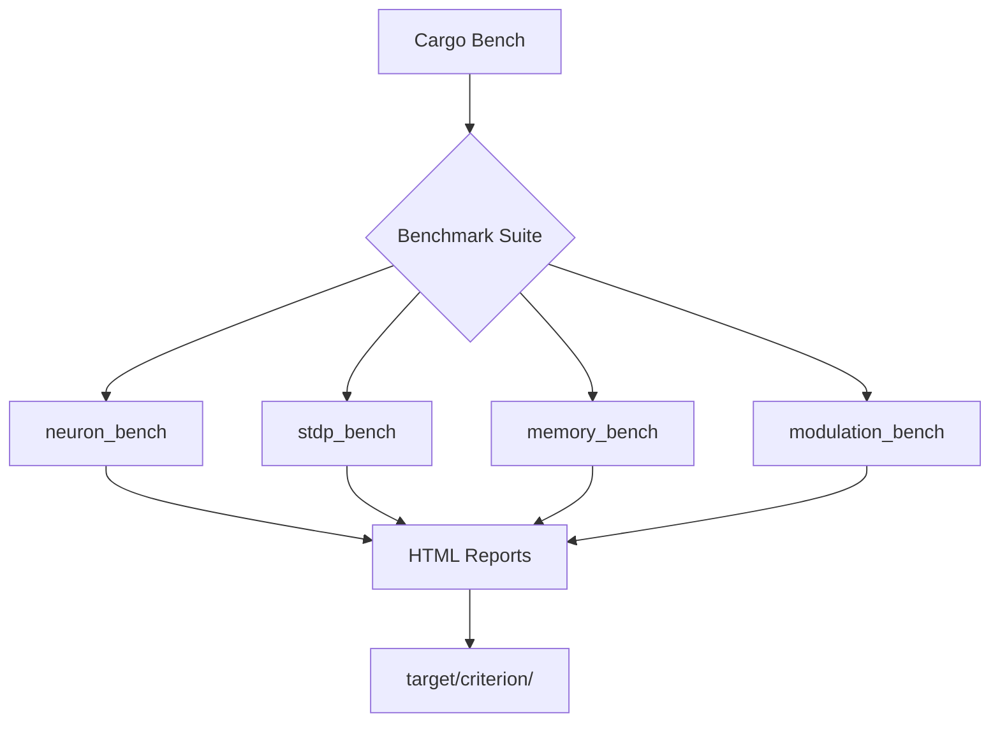
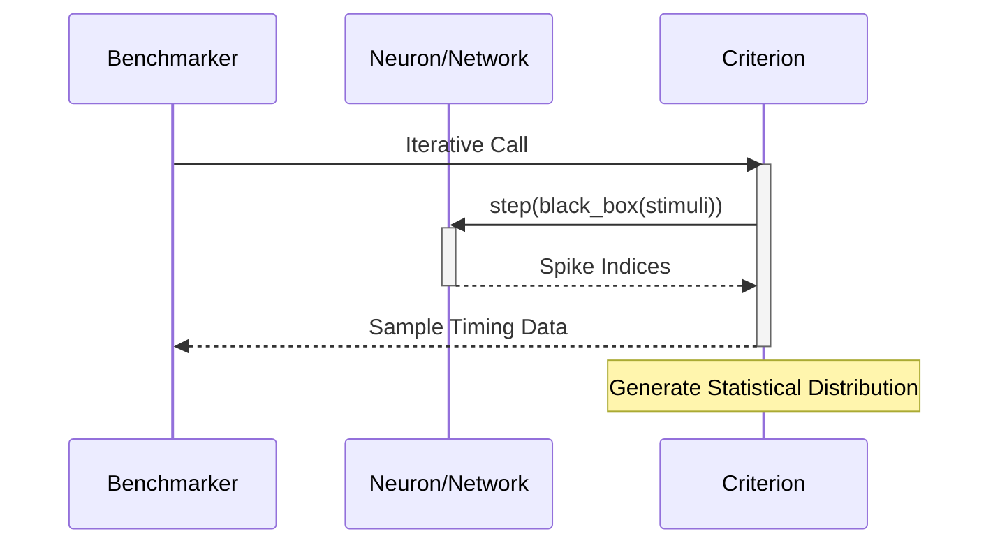

Relevant source files

The following files were used as context for generating this wiki page:

- [benches/README.md](benches/README.md)
- [benches/memory\_bench.rs](benches/memory_bench.rs)
- [benches/neuron\_bench.rs](benches/neuron_bench.rs)
- [benches/modulation\_bench.rs](benches/modulation_bench.rs)
- [benches/stdp\_bench.rs](benches/stdp_bench.rs)
- [Cargo.toml](Cargo.toml)
- [REVIEW.md](REVIEW.md)

# Criterion Benchmarking Suite

The Criterion Benchmarking Suite provides a comprehensive performance analysis framework for the `neuromod` library. It is designed to answer critical questions regarding the computational efficiency and memory overhead of Spiking Neural Network (SNN) training, plasticity, and neuromodulation. The suite utilizes the `criterion` crate to provide stable, statistically significant measurements and generates HTML reports for visual performance tracking.

Sources: [benches/README.md:1-5](benches/README.md#L1-L5), [Cargo.toml:25-27](Cargo.toml#L25-L27)

## Suite Architecture and Configuration

The benchmarking suite is integrated directly into the Cargo build system as a set of separate benchmark targets. Each target focuses on a specific domain of the library, allowing developers to run isolated tests or the entire suite to detect performance regressions.

### Execution and Tooling

Benchmarks are executed via `cargo bench`. To ensure accuracy, the suite utilizes `black_box` to prevent compiler optimizations from eliding code under test. The suite supports baseline comparisons to track performance changes over time.

The diagram above shows the relationship between the Cargo bench command, the four primary benchmark targets, and the resulting HTML report generation.

Sources: [benches/README.md:7-19](benches/README.md#L7-L19), [Cargo.toml:34-48](Cargo.toml#L34-L48), [REVIEW.md:52-54](REVIEW.md#L52-L54)

### Suite Components

| Suite Target | Primary Focus | Key Metrics |
| :--- | :--- | :--- |
| `neuron_bench` | Individual neuron model performance | Execution time per integration/spike check |
| `stdp_bench` | Synaptic plasticity operations | LTP/LTD update speed and scaling |
| `memory_bench` | Memory overhead and allocation | Struct sizes and allocation scaling |
| `modulation_bench` | Neuromodulator impact | Overhead of modulators on network steps |

Sources: [benches/README.md:21-65](benches/README.md#L21-L65)

## Detailed Benchmark Targets

### Neuron Performance (`neuron_bench.rs`)
This suite measures the speed of single neuron steps across various biologically grounded models. It compares lightweight models like Leaky Integrate-and-Fire (LIF) against computationally expensive biophysical models like Hodgkin-Huxley.

*  **LIF Neuron**: Benchmarks `integrate`, `check_fire`, and `full_step`.
*  **Complex Models**: Measures `izhikevich_step`, `lapicque_step`, `hodgkin_huxley_step`, and `fitzhugh_nagumo_step`.
*  **Comparison Group**: A `neuron_types` benchmark group provides a direct performance comparison between LIF, Izhikevich, and Lapicque models.

Sources: [benches/neuron_bench.rs:8-112](benches/neuron_bench.rs#L8-L112), [benches/README.md:23-31](benches/README.md#L23-L31)

### Plasticity and STDP (`stdp_bench.rs`)
Focuses on the computational cost of Spike-Timing-Dependent Plasticity. It evaluates both classical Hebbian updates and reward-modulated components.

*  **Timing Operations**: Measures LTP (pre-before-post) and LTD (post-before-pre) speeds.
*  **Scaling Analysis**: Uses a benchmark group `stdp_network_size` to measure how STDP updates scale with neuron counts of 10, 50, 100, and 200.
*  **Components**: Individual benchmarks for `eligibility_trace_decay` and `stdp_delta_t_calculation`.

Sources: [benches/stdp_bench.rs:8-103](benches/stdp_bench.rs#L8-L103), [benches/README.md:33-41](benches/README.md#L33-L41)

### Memory and Allocation (`memory_bench.rs`)
Analyzes the spatial complexity of the library's data structures using `std::mem::size_of_val`.

*  **Static Sizes**: Measures the footprint of `LifNeuron`, `IzhikevichNeuron`, `LapicqueNeuron`, `HodgkinHuxleyNeuron`, `FitzHughNagumoNeuron`, and the `NeuroModulators` struct.
*  **Dynamic Allocation**: Benchmarks `neuron_vector_allocation` and `weights_allocation` across various sizes (e.g., 10 to 1000 neurons, 16 to 1024 weights).

Sources: [benches/memory_bench.rs:8-85](benches/memory_bench.rs#L8-L85), [benches/README.md:43-51](benches/README.md#L43-L51)

### Neuromodulation Impact (`modulation_bench.rs`)
Evaluates the overhead introduced by the neuromodulator system on the core `SpikingNetwork::step` function.

*  **Baseline vs. Modulated**: Compares the network step speed with no modulators against steps with high dopamine, norepinephrine, or acetylcholine levels.
*  **Scaling**: The `dopamine_scaling` group tests performance across dopamine levels from 0.0 to 1.0.
*  **Logic Operations**: Benchmarks internal modulator functions like `decay`, `add_reward`, and `boost_focus`.

Sources: [benches/modulation_bench.rs:5-181](benches/modulation_bench.rs#L5-L181), [benches/README.md:53-65](benches/README.md#L53-L65)

## Performance Targets and Interpretation

The suite defines specific targets for a production-ready SNN implementation. LIF neurons are expected to be the fastest (<100 ns), while Hodgkin-Huxley represents the computational upper bound due to its biophysical detail.

This sequence illustrates the iteration loop used by Criterion to collect timing samples while preventing compiler elision.

Sources: [benches/README.md:67-93](benches/README.md#L67-L93), [benches/neuron_bench.rs:16-20](benches/neuron_bench.rs#L16-L20)

### Key Performance Targets

| Operation | Target Performance |
| :--- | :--- |
| **LIF Neuron Step** | < 100 ns |
| **Izhikevich Step** | < 500 ns |
| **STDP Update** | < 50 ns per synapse |
| **Network Step** | < 1 µs per neuron (inc. STDP) |
| **Modulation Overhead** | < 5% of baseline step time |

Sources: [benches/README.md:87-93](benches/README.md#L87-L93)

The suite serves as a regression guard during development. Developers are encouraged to save a baseline (`--save-baseline main`) and compare new changes against it to ensure the library remains high-performance.

Sources: [benches/README.md:95-101](benches/README.md#L95-L101), [REVIEW.md:52-54](REVIEW.md#L52-L54)
