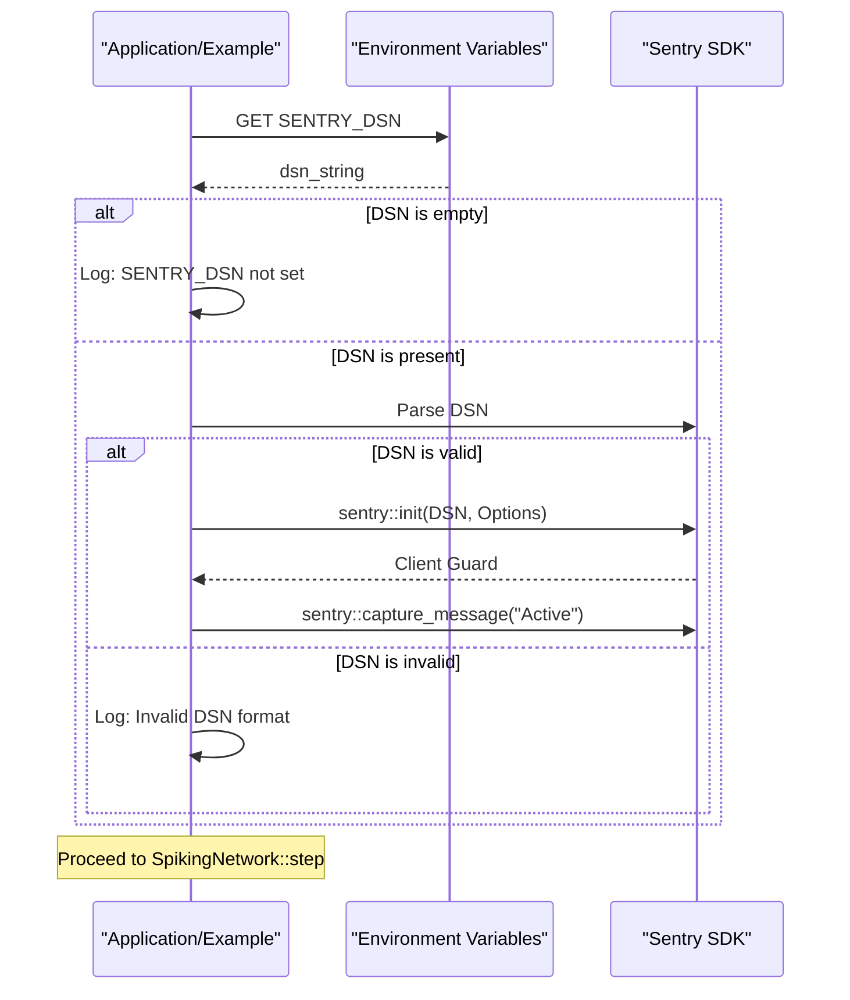

<details>
<summary>Relevant source files</summary>

The following files were used as context for generating this wiki page:

- [tests/sentry_integration.rs](tests/sentry_integration.rs)
- [examples/sentry.rs](examples/sentry.rs)
- [Cargo.toml](Cargo.toml)
- [README.md](README.md)
- [AGENTS.md](AGENTS.md)
- [CHANGELOG.md](CHANGELOG.md)
</details>

# Sentry Error Tracking

Sentry Error Tracking in the `neuromod` project provides optional, high-fidelity observability and error reporting for spiking neural network simulations. It is implemented as a feature-gated integration, allowing developers to capture panics, backtraces, and custom messages during runtime. The system is designed to be non-intrusive, ensuring that the core simulation engine remains functional even when the tracking feature is disabled or misconfigured.

The integration is primarily used to monitor releases and capture issues in the linked Sentry project, with releases automatically created via GitHub Actions when version tags are pushed. It supports environment-based configuration through a Data Source Name (DSN) and is compatible with the project's biologically grounded neuron models.

Sources: [README.md:143-157](README.md#L143-L157), [AGENTS.md:73-81](AGENTS.md#L73-L81), [examples/sentry.rs:1-8](examples/sentry.rs#L1-L8)

## Feature Activation and Dependencies

The Sentry integration is an optional component controlled by the `sentry` Cargo feature. It is disabled by default to minimize dependencies and overhead for users who do not require error tracking.

### Crate Configuration
To enable Sentry, the `sentry` feature must be explicitly requested in the `Cargo.toml`. This feature pulls in the `sentry` crate with specific sub-features enabled for comprehensive reporting.

| Feature | Description | Enabled Sub-features |
| :--- | :--- | :--- |
| `sentry` | Enables Sentry SDK integration | `backtrace`, `contexts`, `panic`, `rustls`, `transport` |

Sources: [Cargo.toml:25-26](Cargo.toml#L25-L26), [Cargo.toml:50-51](Cargo.toml#L50-L51), [README.md:159-161](README.md#L159-L161)

### System Dependencies
When the `sentry` feature is enabled, the build process requires specific system-level libraries to support secure transport (OpenSSL/Rustls):
- `pkg-config`
- `libssl-dev`

Sources: [AGENTS.md:65-67](AGENTS.md#L65-L67), [AGENTS.md:99-101](AGENTS.md#L99-L101)

## Initialization Logic

The initialization of Sentry follows a guarded pattern to ensure the application does not crash if the configuration is missing or invalid. It relies on the `SENTRY_DSN` environment variable.

The following sequence diagram illustrates the initialization flow used in the system:



*The initialization process validates the DSN string and sets up client options, including the release name.*

Sources: [examples/sentry.rs:10-40](examples/sentry.rs#L10-L40), [tests/sentry_integration.rs:159-180](tests/sentry_integration.rs#L159-L180)

### Release Management
Releases are named using the format `neuromod@{version}`. This metadata is captured automatically during initialization using the `sentry::release_name!()` macro, which links captured errors to specific versions of the library.

Sources: [README.md:152-157](README.md#L152-L157), [examples/sentry.rs:19](examples/sentry.rs#L19)

## Integration and Testing

The Sentry integration is verified through dedicated integration tests that simulate various environment configurations and ensure core API compatibility.

### Integration Patterns
The `neuromod` API remains fully functional regardless of the Sentry feature state. Tests confirm that `SpikingNetwork::step` operates correctly both with and without the feature enabled.

```rust
#[cfg(feature = "sentry")]
#[test]
fn neuromod_usable_with_sentry_feature_enabled() {
    let mut network = SpikingNetwork::new();
    let stimuli = [0.5f32; 16];
    let modulators = NeuroModulators::default();
    let spikes = network.step(&stimuli, &modulators).expect("step failed");
    assert!(spikes.len() <= network.neurons.len());
}
```

Sources: [tests/sentry_integration.rs:141-150](tests/sentry_integration.rs#L141-L150), [examples/sentry.rs:48-55](examples/sentry.rs#L48-L55)

### Automated Release Workflow
The project uses a GitHub Actions workflow (`sentry-release.yml`) to manage Sentry releases. This workflow is triggered by:
1. Pushing a tag starting with `v*`.
2. Manual `workflow_dispatch` trigger.

Sources: [README.md:152-155](README.md#L152-L155), [CHANGELOG.md:16-20](CHANGELOG.md#L16-L20)

## Component Summary

| Component | Responsibility | Relevant File |
| :--- | :--- | :--- |
| `SENTRY_DSN` | Environment variable providing the endpoint for error reports. | `examples/sentry.rs` |
| `sentry::init` | Configures the SDK with transport and release metadata. | `examples/sentry.rs` |
| `sentry::capture_message` | Sends manual informational events to Sentry. | `examples/sentry.rs` |
| `temp-env` | Dev-dependency used to test Sentry environment variable logic. | `Cargo.toml`, `tests/sentry_integration.rs` |

Sources: [Cargo.toml:29](Cargo.toml#L29), [examples/sentry.rs:1-55](examples/sentry.rs#L1-L55), [tests/sentry_integration.rs:106-128](tests/sentry_integration.rs#L106-L128)

Sentry Error Tracking provides a robust safety net for the `neuromod` library, ensuring that runtime anomalies in neural dynamics or reward-modulated learning are captured and attributed to specific releases without compromising the core simulation performance.
