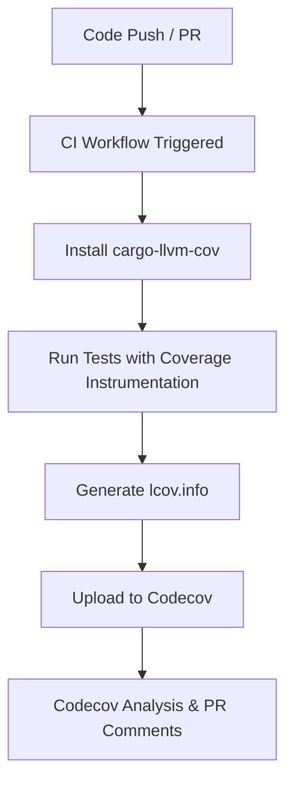

<details>
<summary>Relevant source files</summary>

The following files were used as context for generating this wiki page:

- [codecov.yml](codecov.yml)
- [README.md](README.md)
- [REVIEW.md](REVIEW.md)
- [AGENTS.md](AGENTS.md)
- [azure-templates/buildtest.yml](azure-templates/buildtest.yml)
- [tests/sentry_integration.rs](tests/sentry_integration.rs)
</details>

# Test Coverage (Codecov)

Test coverage is a critical observability metric for the `neuromod` project, ensuring that biologically grounded neuron dynamics and plasticity primitives are thoroughly verified. The repository integrates with [Codecov](https://codecov.io/gh/Limen-Neural/neuromod) to track, report, and enforce code coverage standards across all Pull Requests and merges to the main branch. This system provides developers with visibility into the effectiveness of the test suite, which includes unit tests, integration tests, and doc tests.

Sources: [README.md:144-149](README.md#L144-L149), [AGENTS.md:73-77](AGENTS.md#L73-L77)

## Coverage Infrastructure and Tooling

The project utilizes `cargo-llvm-cov` as the primary engine for generating coverage reports. This tool provides LLVM-source-based code coverage for Rust projects. In continuous integration (CI) environments, coverage is generated using the `--lcov` format to produce an `lcov.info` file, which is then uploaded to Codecov.

### Toolchain and Commands

Developers can replicate the CI coverage environment locally using specific cargo commands.

```bash
# Install the necessary coverage tool
cargo install cargo-llvm-cov

# Generate LCOV report for Codecov
cargo llvm-cov --all-features --lcov --output-path lcov.info

# Generate a local HTML report for manual inspection
cargo llvm-cov --all-features --html
```

Sources: [README.md:129-131](README.md#L129-L131), [REVIEW.md:28-31](REVIEW.md#L28-L31)

### CI/CD Integration

The coverage workflow is automated through GitHub Actions (`.github/workflows/coverage.yml`) and Azure Pipelines templates. The pipeline ensures that tests are executed with all features enabled to capture the widest possible execution path.



The diagram shows the automated flow from code submission to the final coverage report appearing on a Pull Request.
Sources: [README.md:148-154](README.md#L148-L154), [azure-templates/buildtest.yml:79-87](azure-templates/buildtest.yml#L79-L87)

## Configuration (codecov.yml)

The Codecov behavior is governed by a configuration file that defines success thresholds and the layout of the feedback provided in Pull Requests.

### Coverage Targets and Thresholds

The project enforces a "target auto" policy with a permissible threshold for slight regressions.

| Category | Target | Threshold | Description |
| :--- | :--- | :--- | :--- |
| Project | Auto | 1% | Global coverage must remain stable within a 1% margin. |
| Patch | Auto | 1% | New code introduced in PRs must meet the auto-detected coverage target. |

Sources: [codecov.yml:4-11](codecov.yml#L4-L11)

### Excluded Directories

To ensure metrics reflect the core logic of the library, certain directories containing non-production code are ignored by the Codecov reporter:
- `benches/**`: Performance benchmarks.
- `examples/**`: Demonstration binaries.
- `target/**`: Build artifacts.

Sources: [codecov.yml:19-22](codecov.yml#L19-L22)

## Test Suite Components

Coverage is derived from a multi-layered testing strategy designed to validate the SNN primitives.

### Coverage Sources
1. **Unit Tests**: Inline `#[cfg(test)]` modules within source files (e.g., approximately 48 tests identified in recent audits).
2. **Integration Tests**: Located in `tests/`, such as `tests/sentry_integration.rs`, which validates the optional Sentry telemetry feature.
3. **Doc Tests**: Verified via `cargo test` to ensure crate-level examples remain functional.

Sources: [AGENTS.md:73-77](AGENTS.md#L73-L77), [REVIEW.md:71-73](REVIEW.md#L71-L73)

### Integration Test Example: Sentry
The integration tests specifically target feature-gated code that might otherwise be missed by standard unit tests.

```rust
#[cfg(feature = "sentry")]
#[test]
fn neuromod_usable_with_sentry_feature_enabled() {
    let mut network = SpikingNetwork::new();
    let stimuli = [0.5f32; 16];
    let modulators = NeuroModulators::default();
    let spikes = network
        .step(&stimuli, &modulators)
        .expect("step failed with sentry feature enabled");
    assert!(spikes.len() <= network.neurons.len());
}
```

Sources: [tests/sentry_integration.rs:136-146](tests/sentry_integration.rs#L136-L146)

## Summary of Quality Gates

The project uses Codecov comments to provide immediate feedback on PRs, displaying a summary of the "reach" (total coverage), "diff" (impact of the change), and relevant "flags" or "files". Before a PR is considered ready for merge, it must satisfy the coverage requirements defined in `codecov.yml`, ensuring that no significant untested logic is introduced into the `neuromod` core.

Sources: [codecov.yml:12-17](codecov.yml#L12-L17), [REVIEW.md:83-93](REVIEW.md#L83-L93)
