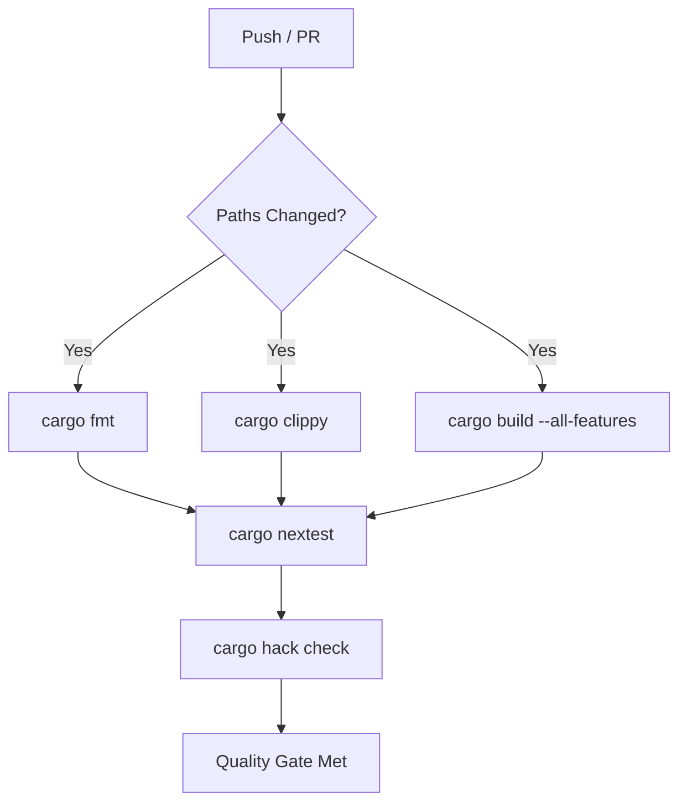
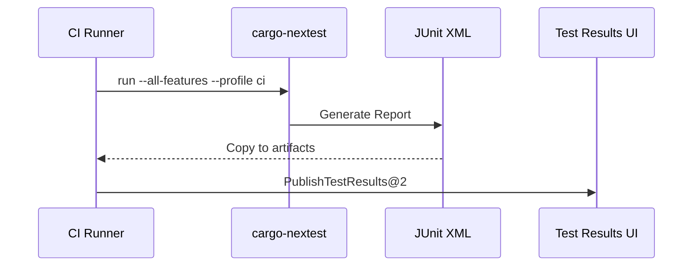
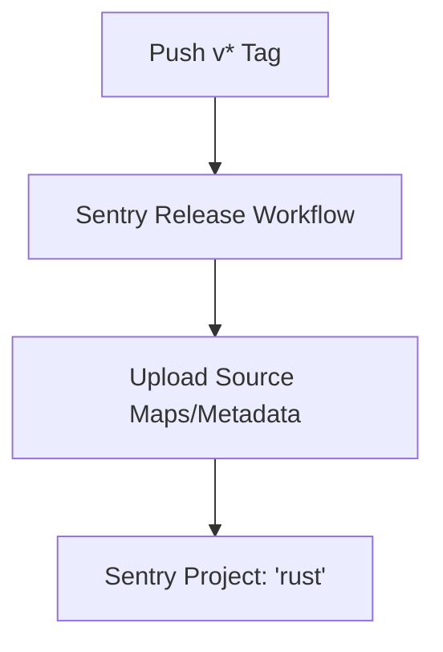

<details>
<summary>Relevant source files</summary>

The following files were used as context for generating this wiki page:

- [README.md](README.md)
- [AGENTS.md](AGENTS.md)
- [REVIEW.md](REVIEW.md)
- [qodana.yaml](qodana.yaml)
- [codecov.yml](codecov.yml)
- [azure-templates/buildtest.yml](azure-templates/buildtest.yml)
</details>

# CI/CD & Automated Scanning

The `neuromod` project employs a multi-layered Continuous Integration and Continuous Deployment (CI/CD) strategy to ensure code quality, security, and performance. The system integrates automated testing, static analysis, security auditing, and observability tools to maintain the integrity of the spiking neural network core library.

The automation stack is designed for speed and reliability, utilizing caching mechanisms and path filters to provide fast feedback on Pull Requests. It encompasses standard Rust tooling (clippy, fmt) alongside advanced scanning platforms like Qodana and CodeQL.

Sources: [README.md:154-165](README.md#L154-L165), [AGENTS.md:37-45](AGENTS.md#L37-L45)

## Pipeline Architecture

The project utilizes GitHub Actions as the primary orchestration engine, supported by Azure templates for cross-platform validation. The pipeline is divided into core verification, quality gates, and specialized scanning modules.

### Core CI Workflow
The core CI pipeline handles the fundamental Rust lifecycle: formatting checks, linting, and multi-feature testing.



The pipeline uses `cargo-nextest` for faster parallel execution and JUnit report generation.
Sources: [README.md:154-157](README.md#L154-L157), [azure-templates/buildtest.yml:1-35](azure-templates/buildtest.yml#L1-L35)

### Quality Gates and Scanning
The project integrates several specialized scanners to maintain high standards:

| Tool | Purpose | Configuration |
| :--- | :--- | :--- |
| **Qodana** | JetBrains code-quality and license scanning | `qodana.yaml` |
| **reviewdog** | Inline PR comments for clippy and rustfmt | `.github/workflows/reviewdog.yml` |
| **CodeQL** | Semantic code analysis for security vulnerabilities | `.github/workflows/codeql.yml` |
| **Trivy / Audit** | Dependency vulnerability scanning and RustSec checks | `.github/workflows/audit.yml` |

Sources: [README.md:158-168](README.md#L158-L168), [qodana.yaml:8-12](qodana.yaml#L8-L12)

## Testing and Coverage

### Automated Test Suites
Tests are executed using `cargo-nextest` to generate stable JUnit reports, which are then published for visibility in the CI dashboard.



Sources: [azure-templates/buildtest.yml:45-75](azure-templates/buildtest.yml#L45-L75)

### Coverage Reporting
Code coverage is tracked via `cargo-llvm-cov`. Results are exported in LCOV format and uploaded to Codecov.

*  **Target:** `auto` (detects base)
*  **Threshold:** 1% allowed drop before failure.
*  **Exclusions:** Benchmarks, examples, and build artifacts are ignored to prevent skewed metrics.

Sources: [codecov.yml:4-16](codecov.yml#L4-L16), [README.md:143-150](README.md#L143-L150)

## Release Automation and Observability

The project automates releases and integrates runtime observability through Sentry.

### Sentry Release Flow
A Sentry release is triggered automatically when a version tag (`v*`) is pushed. The release name follows the pattern `neuromod@{version}`.



Sources: [README.md:120-128](README.md#L120-L128)

### Automated Dependency Management
Dependabot is configured to monitor and update:
*  Cargo crates (Rust dependencies)
*  GitHub Actions (Pinned to immutable commit SHAs for security)
*  Docker base images

Sources: [README.md:169-170](README.md#L169-L170), [AGENTS.md:73-73](AGENTS.md#L73)

## Local Quality Gates
Before code reaches the remote CI, developers are encouraged to run a "Local Review Quality Gate." This mimics the CI environment to ensure high success rates on the server.

```bash
# Core validation
cargo fmt --check
cargo clippy --all-targets --all-features -- -D warnings
cargo build --all-features
cargo test --all-features

# Extended matrix (CI-equivalent)
cargo hack check --feature-powerset --exclude-no-default-features --keep-going
cargo llvm-cov --all-features --lcov --output-path lcov.info
```

Sources: [REVIEW.md:10-33](REVIEW.md#L10-L33)

## Summary
The `neuromod` CI/CD infrastructure provides a robust framework for biological neural network development. By combining strict Rust toolchain enforcement (pinned to `1.97.1`) with comprehensive automated scanning and performance benchmarking, the system ensures that every contribution adheres to the project's quality and security standards.

Sources: [AGENTS.md:58-59](AGENTS.md#L58-L59), [README.md:154-180](README.md#L154-L180)
