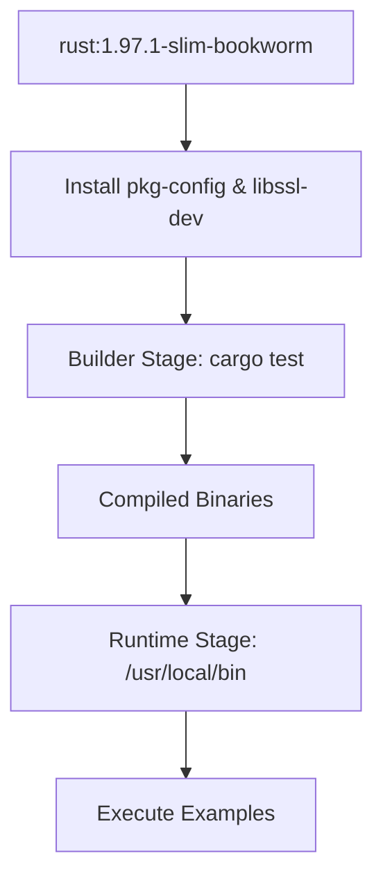
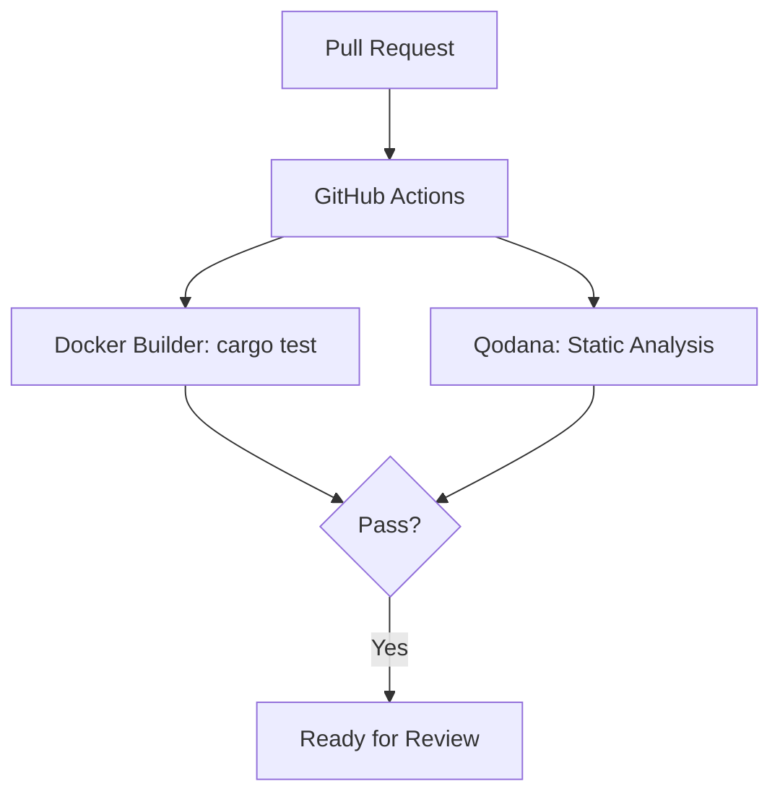

<details>
<summary>Relevant source files</summary>

The following files were used as context for generating this wiki page:

- [README.md](README.md)
- [REVIEW.md](REVIEW.md)
- [AGENTS.md](AGENTS.md)
- [azure-templates/buildtest.yml](azure-templates/buildtest.yml)
- [qodana.yaml](qodana.yaml)
- [Cargo.toml](Cargo.toml)
</details>

# Docker Infrastructure

The Docker infrastructure in the `neuromod` project provides a robust, reproducible environment for building, testing, and deploying the library. It is designed to ensure consistency across different development environments and CI/CD pipelines, abstracting away system-level dependencies such as `pkg-config` and `libssl-dev` required for specific features like Sentry integration.

The infrastructure supports multiple use cases, including a specialized **builder** stage for running the full test suite and a lean **runtime** image for executing example binaries. This modular approach minimizes image size for deployment while providing a full-featured toolchain for validation.

Sources: [README.md:204-208](README.md#L204-L208), [AGENTS.md:65-72](AGENTS.md#L65-L72)

## Multi-Stage Architecture

The Docker implementation utilizes a multi-stage build process. This separates the heavy build-time dependencies and source code from the final executable environment.

### Builder Stage
The `builder` stage is based on the `rust:1.97.1-slim-bookworm` image. It includes the full Rust toolchain and necessary system libraries to compile the crate with all features enabled. It is primarily used within CI to run `cargo test` and `cargo clippy` in a controlled environment.

### Runtime Stage
The `runtime` image is optimized for deployment. It excludes the Cargo toolchain and source code, containing only the compiled example binaries. This reduces the attack surface and storage requirements for the final container.



The diagram shows the transition from a heavy build environment to a slimmed-down execution environment.
Sources: [README.md:209-216](README.md#L209-L216), [AGENTS.md:76-83](AGENTS.md#L76-L83), [REVIEW.md:58-63](REVIEW.md#L58-L63)

## Component Configuration

The infrastructure relies on specific system dependencies and toolchain versions to ensure compatibility with the `neuromod` library and its optional features.

### System Dependencies
The container environment must provide specific packages to support the optional `sentry` feature. These are automatically included in the dev container and the Docker builder stage.

| Dependency | Purpose | Requirement Type |
|------------|---------|------------------|
| `pkg-config` | Manages compile/link flags for libraries | Required for `sentry` feature |
| `libssl-dev` | SSL/TLS support | Required for `sentry` feature |
| `rustup` | Manages Rust toolchains | Development/Build only |
| `cargo-llvm-cov` | Generates code coverage reports | Optional/CI only |

Sources: [AGENTS.md:52-54](AGENTS.md#L52-L54), [AGENTS.md:79-81](AGENTS.md#L79-L81), [azure-templates/buildtest.yml:105-112](azure-templates/buildtest.yml#L105-L112)

### Environment and Tooling
The Docker environment pins the Rust toolchain to version `1.97.1` to maintain stability across builds.

```bash
# Example usage of Docker targets
# Build runtime image
docker build -t neuromod:runtime .

# Build and run tests in the builder stage
docker build --target builder -t neuromod:builder .
docker run --rm neuromod:builder cargo test --all-features --quiet
```

Sources: [README.md:210-216](README.md#L210-L216), [AGENTS.md:76-78](AGENTS.md#L76-L78)

## Integrated Development and CI

Beyond standalone Dockerfiles, the project utilizes Docker-based configurations for local development and automated quality gates.

### Dev Containers
For VS Code users, the project provides a `.devcontainer/` configuration. This environment uses `rust:1.97.1-slim-bookworm` as its base and pre-configures the `vscode` user with full ownership of the toolchain, allowing for immediate execution of `cargo` commands without manual setup.

### Quality Gate (Qodana)
The infrastructure integrates with JetBrains Qodana via `qodana.yaml` and a dedicated linter `qodana-rust`. This runs within the Dockerized CI pipeline to perform static analysis and dependency license checks.



The diagram illustrates how Docker-based testing and Qodana analysis serve as mandatory checkpoints before merging code.
Sources: [AGENTS.md:76-83](AGENTS.md#L76-L83), [qodana.yaml:7-11](qodana.yaml#L7-L11), [REVIEW.md:58-63](REVIEW.md#L58-L63)

## Summary

The Docker infrastructure of `neuromod` ensures that the biologically grounded SNN simulations remain consistent regardless of the underlying host OS. By leveraging multi-stage builds and pinned toolchains, the project guarantees that complex dependencies like those required for Sentry integration are handled transparently, while maintaining a lightweight footprint for runtime execution.
