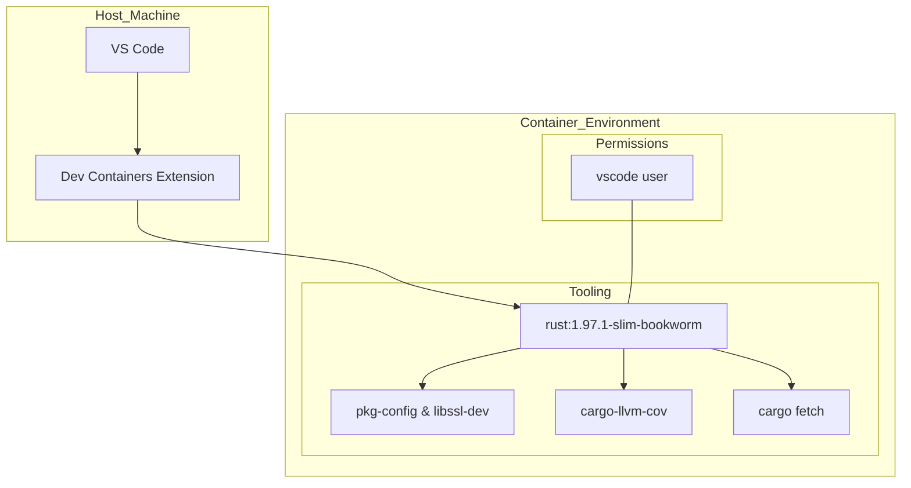
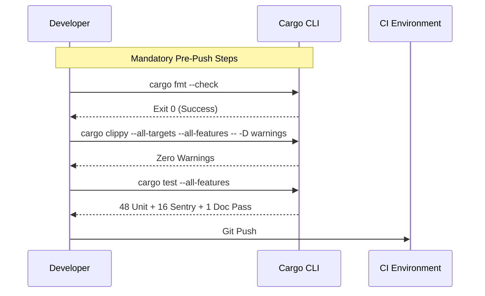

<details>
<summary>Relevant source files</summary>

The following files were used as context for generating this wiki page:

- [rust-toolchain.toml](rust-toolchain.toml)
- [AGENTS.md](AGENTS.md)
- [README.md](README.md)
- [REVIEW.md](REVIEW.md)
- [azure-templates/buildtest.yml](azure-templates/buildtest.yml)
- [Cargo.toml](Cargo.toml)
</details>

# Developer Setup & Dev Container

The developer setup for the `neuromod` project is designed to provide a consistent, high-performance environment for researching and implementing spiking neural network (SNN) neuron dynamics. The ecosystem relies on a specific Rust toolchain version and a suite of quality assurance tools to maintain biophysically grounded primitives and foundational plasticity building blocks.

The environment is available through a pre-configured VS Code Dev Container, which encapsulates all system dependencies, particularly those required for optional features like `sentry` integration. This setup ensures that contributors can execute the full suite of builds, tests, benchmarks, and coverage reports without local environment drift.

Sources: [AGENTS.md:16-24](AGENTS.md#L16-L24), [README.md:1-12](README.md#L1-L12)

## Core Toolchain and Dependencies

The project is built using the Rust 2024 edition and requires a specific pinned toolchain version to ensure reproducibility across local development and CI/CD pipelines.

### Rust Environment
The environment must be configured with the following specifications:

| Component | Specification | Description |
|-----------|---------------|-------------|
| **Rust Edition** | 2024 | Language edition for the crate. |
| **Toolchain** | 1.97.1 | Pinned version defined in `rust-toolchain.toml`. |
| **Components** | `rustfmt`, `clippy`, `llvm-tools-preview` | Required for formatting, linting, and coverage. |
| **Profile** | default | Standard toolchain profile. |

Sources: [rust-toolchain.toml:1-5](rust-toolchain.toml#L1-L5), [AGENTS.md:52-54](AGENTS.md#L52-L54), [Cargo.toml:4](Cargo.toml#L4)

### System Dependencies
While the core library is lightweight, certain features require specific system-level libraries. This is primarily relevant for the `sentry` feature, which is used for release metadata and issue tracking.

*  `pkg-config`
*  `libssl-dev`

Sources: [AGENTS.md:55-56](AGENTS.md#L55-L56), [AGENTS.md:99-101](AGENTS.md#L99-L101)

## Dev Container Configuration

The project includes an optional `.devcontainer/` setup for use with VS Code. This environment automates the installation of all necessary tools and dependencies.

### Architecture Overview



The diagram shows the relationship between the host VS Code instance and the containerized Rust environment, including internal tooling and user permissions.

Sources: [AGENTS.md:98-105](AGENTS.md#L98-L105)

### Key Container Features
*  **Base Image:** `rust:1.97.1-slim-bookworm`.
*  **User Ownership:** The `vscode` user owns the toolchain, allowing `cargo` commands and component installations directly from the terminal.
*  **Initialization:** `cargo fetch` is automatically executed during the initial container creation.
*  **Direct Execution:** The container can be started via VS Code or by running `devcontainer up --workspace-folder .` in the terminal.

Sources: [AGENTS.md:95-105](AGENTS.md#L95-L105)

## Mandatory Quality Gate

Before pushing changes to `src/`, `Cargo.toml`, or public APIs, developers must pass the "Local Review Quality Gate." This ensures adherence to the project's code style and technical invariants.



The sequence diagram illustrates the workflow required to satisfy the project's quality standards before code is submitted for review.

Sources: [REVIEW.md:5-24](REVIEW.md#L5-L24), [AGENTS.md:73-81](AGENTS.md#L73-L81)

### Tooling for Validation
In addition to standard `cargo` commands, several specialized tools are required for CI-equivalent validation:
*  `cargo-nextest`: Used for fast, parallelized test execution and JUnit reporting.
*  `cargo-hack`: Used to verify the feature-powerset (e.g., checking that the crate builds with and without the `sentry` feature).
*  `cargo-llvm-cov`: Used to generate LCOV or HTML coverage reports.

Sources: [REVIEW.md:28-40](REVIEW.md#L28-L40), [azure-templates/buildtest.yml:37-41](azure-templates/buildtest.yml#L37-L41)

## Feature-Specific Configuration

The `neuromod` crate supports an optional `sentry` feature. Enabling this feature changes the requirements for the development environment.

### Sentry Integration
To develop or test with Sentry, the feature must be explicitly enabled during compilation, and an environment variable must be provided for runtime testing:

```bash
# Compile and run sentry example
SENTRY_DSN=https://...@... cargo run --example sentry --features sentry
```

Sources: [README.md:144-155](README.md#L144-L155), [AGENTS.md:68-70](AGENTS.md#L68-L70)

### Build Configuration
Release builds are optimized for high performance, which is critical for neuron simulations like Hodgkin-Huxley dynamics. The following profile is applied:

```toml
[profile.release]
opt-level = 3
lto = true
codegen-units = 1
```

Sources: [Cargo.toml:47-51](Cargo.toml#L47-L51)

## Conclusion
The developer setup for `neuromod` prioritizes a predictable, containerized environment that enforces strict quality checks. By utilizing the pinned toolchain in `rust-toolchain.toml` and the provided Dev Container, developers can ensure that their contributions meet the biophysical and technical standards of the Limen-Neural ecosystem.
