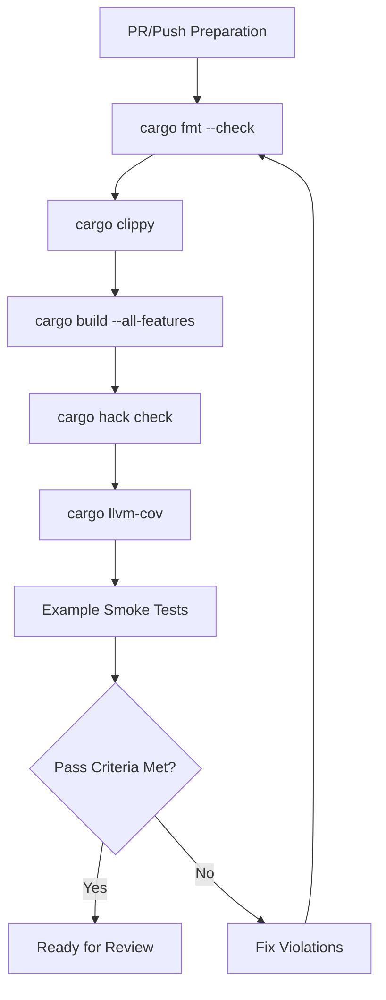

<details>
<summary>Relevant source files</summary>

The following files were used as context for generating this wiki page:

- [REVIEW.md](REVIEW.md)
- [AGENTS.md](AGENTS.md)
- [README.md](README.md)
- [azure-templates/buildtest.yml](azure-templates/buildtest.yml)
- [codecov.yml](codecov.yml)
- [qodana.yaml](qodana.yaml)
</details>

# Review Quality Gate

The **Review Quality Gate** is a mandatory set of procedures and automated checks designed to ensure the integrity, performance, and domain hygiene of the `neuromod` crate. It acts as a final validation layer that contributors must execute before pushing changes to the repository or claiming a Pull Request (PR) is ready for review. The gate covers code formatting, linting, build stability, comprehensive testing (including unit, integration, and doc tests), and adherence to architectural boundaries.

Sources: [REVIEW.md:1-5](REVIEW.md#L1-L5), [AGENTS.md:86-90](AGENTS.md#L86-L90)

## Validation Workflow

The quality gate is structured as a multi-stage process that moves from basic code health to complex behavioral validation and regression guards.

### Mandatory Pre-push Commands
Contributors are required to run a specific suite of Cargo commands to ensure the codebase remains "clean" according to project standards.

| Command | Purpose | Expected Outcome |
| :--- | :--- | :--- |
| `cargo fmt --check` | Formatting validation | Exit 0 with no output |
| `cargo clippy --all-targets --all-features -- -D warnings` | Static analysis/Linting | Zero warnings/errors |
| `cargo build --all-features` | Compilation check | Successful build with all features (e.g., `sentry`) |
| `cargo test --all-features` | Logic validation | All unit, integration, and doctests pass |

Sources: [REVIEW.md:11-23](REVIEW.md#L11-L23), [AGENTS.md:52-58](AGENTS.md#L52-L58)

### Automated CI Equivalence
To ensure local environments match the CI/CD pipeline, the quality gate utilizes a matrix of optional but highly recommended tools for feature-powerset checking and coverage reporting.



The diagram above illustrates the logical flow a developer follows to satisfy the quality gate requirements.
Sources: [REVIEW.md:27-41](REVIEW.md#L27-L41), [README.md:162-171](README.md#L162-L171)

## Testing and Smoke Checks

### Test Suite Composition
The project maintains a rigorous test hierarchy that includes:
- **Unit Tests:** 48 inline `#[cfg(test)]` modules for internal logic.
- **Integration Tests:** 16 tests in `tests/sentry_integration.rs` specifically for the optional `sentry` feature.
- **Doc Tests:** Verified via `cargo test` to ensure crate-level examples remain functional.

Sources: [AGENTS.md:64-70](AGENTS.md#L64-L70), [REVIEW.md:110-113](REVIEW.md#L110-L113)

### Example and Benchmark Smoke Tests
Before merge, examples and benchmarks must be compiled to ensure API changes haven't broken downstream usage.
- **Examples:** `basic`, `basic_lif`, `hebbian_learning`, and `rstdp_demo` must run without panicking.
- **Benchmarks:** `cargo bench --no-run --all-features` ensures all Criterion benchmarks in `benches/` compile correctly.

Sources: [REVIEW.md:43-54](REVIEW.md#L43-L54), [AGENTS.md:52-58](AGENTS.md#L52-L58)

## Architectural Guards

### Domain Hygiene
A critical part of the quality gate is ensuring the `neuromod` crate remains domain-agnostic. The library is strictly forbidden from containing logic related to mining, HFT, crypto, or specific hardware like `eagle-lander`. This is enforced via grep-based checks on generated documentation.

```bash
# Verify docs remain domain-agnostic
cargo doc --all-features --no-deps
! grep -riE 'spikenaut|\bhft\b|\bmining\b|\bcrypto\b|eagle-lander' target/doc/neuromod/
```

Sources: [REVIEW.md:56-61](REVIEW.md#L56-L61), [AGENTS.md:81-85](AGENTS.md#L81-L85)

### Regression Guards
Manual verification of the public API surface is performed to ensure core structures and traits are not silently removed or modified in breaking ways. This includes checking for:
- **Neuron Models:** `LifNeuron`, `GifNeuron`, `IzhikevichNeuron`, etc.
- **Core Engine:** `SpikingNetwork`, `StepError`.
- **Modulators:** `NeuroModulators`, `SignalProfile`.

Sources: [REVIEW.md:73-81](REVIEW.md#L73-L81), [README.md:87-104](README.md#L87-L104)

## Toolchain and Environment Standards

The quality gate assumes a specific environment to guarantee consistent results across different contributor machines.

| Component | Requirement |
| :--- | :--- |
| **Rust Edition** | 2024 |
| **Pinned Toolchain** | 1.97.1 |
| **Linter Profile** | `qodana.recommended` (JetBrains Qodana) |
| **Coverage Threshold** | 1% (Codecov target) |

Sources: [AGENTS.md:46-49](AGENTS.md#L46-L49), [qodana.yaml:6-8](qodana.yaml#L6-L8), [codecov.yml:6-12](codecov.yml#L6-L12)

### Docker Validation
The quality gate includes Docker smoke tests to verify the reproducibility of the build and runtime environments:
- **Runtime Image:** Only contains example binaries.
- **Builder Stage:** Contains the full Rust toolchain and must pass the complete test suite.

Sources: [REVIEW.md:63-71](REVIEW.md#L63-L71), [README.md:195-207](README.md#L195-L207)

## Pass Criteria Summary
A PR is considered to have cleared the Review Quality Gate only if:
1. `cargo fmt` and `cargo clippy` are silent.
2. The full test suite (unit + integration + doctests) passes.
3. All examples run without panic.
4. `cargo doc` is free of forbidden domain terms.
5. `git diff origin/main...HEAD` contains no unintentional changes or IDE/local tool directories (e.g., `.idea`, `.kilo`).

Sources: [REVIEW.md:83-118](REVIEW.md#L83-L118), [AGENTS.md:92-96](AGENTS.md#L92-L96)
